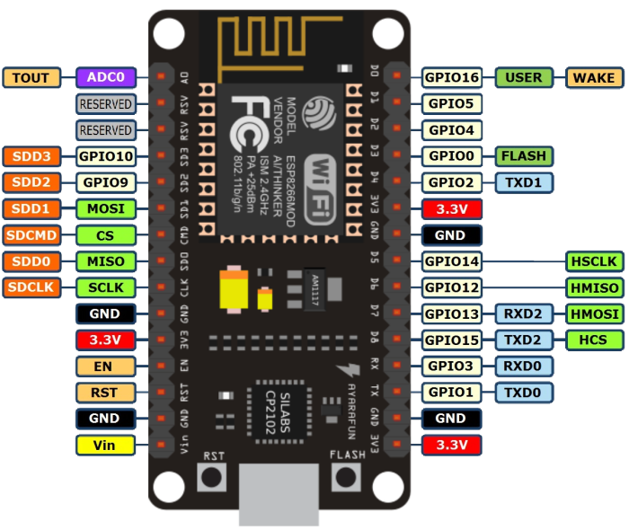
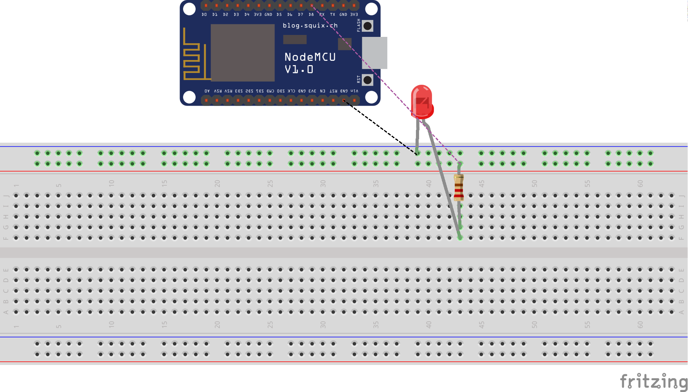
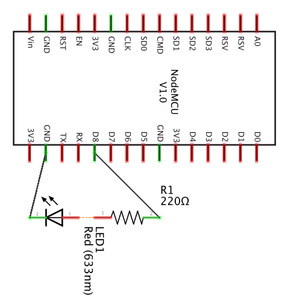

ESP8266
=======

When working with a external hardware such as the NodeMCU you will find
a lot of information on the internet about it. It is a bit difficult at
times to assess what you need to program it. You are exposed to many
choices. A NodeMCU typically comes with Lua. However you have many other
choices. Such choices include multiple programming languages such as
Lua, MicroPython, Arduino/C, Go and others.

As all of them are slightly different you need to identify which works
best for you. In addition you need to install images, programs and
libraries that support your specific language choice.

For our first experiments we will be using MicroPython. This choice is
motivated by the fact that Python is a well established and easy to
learn programming language. Recently many educational institutions are
offering Python as an introductory programming language making this
choice even mor compelling

To simplify the setup and use of the esp8266 for MicroPython we
developed an easy to use commandline tool that allows users to set up
their computer and interact more easily with the board. We believe that
the interface is so simple that it can also be used in STEM activities
and not just in the university or by advanced hobbyists.

### Installation

In this section we discuss the various ways on how to set up the esp8266
`cloudmesh.robot` development environment. You have several options to
install it.

1.  Option A: OSX with scripts hosted on github (recommended)

2.  Option B: OSX from source

3.  OPtion C: Explore your own

While we provide here a detailed option for OSX, you are free to explore
other operating systems. We know that it can for example be installed on
Ubuntu 16.04. We have not tested any of this on a Windows machine.

We like to get feedback and instalation instructions.

#### Option A: OSX install from a Script

For OSX we have created two scripts that you will need

-   [system.sh](http://cloudmesh.github.io/get/robot/osx/system/), that
    installs pip, ansible, homebrew, xcode, virtualenv, readline, wget,
    lua, picocom, mosquito, aquaemacs, pycharm, numpy, matplotlib,
    libusb, USB drivers for selkected esp8266 (ch34x chip)

-   [user.sh](http://cloudmesh.github.io/get/robot/osx/user), that
    installs matplotlib, virtualenv, and the cloudmesh source in
    \~/github

We recommend that you review these scripts carfully before you use them
and check if they fit your needs. If they do not, please just download t
hem and adapt them to your needs. The **system** script must be ran on
an **Administrator** account as it requires sudo priviledges. The
**user** script must be ran on a **User** account. We do not recommend
to run the IoT software in an administrative account due to security
best practices. To execute the **system** script, type in the
*Administrator account* terminal

```bash
$ curl -fsSL http://cloudmesh.github.io/get/robot/osx/system | sh
```

As earlier versions of pip may have some issues, this script will also
update pip and setuptools to a neweer version

To execute the **user** script, type in the User account terminal

```bash
$ curl -fsSL http://cloudmesh.github.io/get/robot/osx/user | sh
```

Together these scripts allow you to install in a simple way development
tools for our IoT activities.

The following steps are to be executed in the user environment.

**Warning**: *the scripts do not update pip and setuptool, which may be
required due to a bug in setuptools prior to version 34 for setuptools.
You may have to repeat the update on any pyenv environment that you use.
How to do thi sis documented in a later section.*

To simplify use, we recommend that you make the following additions to
your `~/.bash_profile` file so that python 3 is automatically activated,
but does not interfere with the system installed python. Use the command

```bash
$ emacs ~/.bash_profile
```
    
or your favourite editor to edit the file and add the following lines at
the end.

```bash
####################################################################### 
# PYENV
######################################################################
open_emacs() {
    # open -na Aquamacs $*
    open -a Aquamacs $*    
}
alias e=open_emacs

########################################################
# PYENV
########################################################
export PYENV_VIRTUALENV_DISABLE_PROMPT=0
eval "$(pyenv init -)"
eval "$(pyenv virtualenv-init -)"
__pyenv_version_ps1() {
    local ret=$?;
    output=$(pyenv version-name)
    if [[ ! -z $output ]]; then
        echo -n "($output)"
    fi
    return $ret;
}
PS1="\$(__pyenv_version_ps1) ${PS1}"
alias ENV3="pyenv activate ENV3"
ENV3
```
    
Once you start a new terminal you can edit files via aquaemacs by typing

```bash
$ e FILENAME
```

where FILENAME is the name of the file you like to edit. However the
file must exists, which you can simply do with

```bash
touch FILENAME
```

Add the following lines at the end of the file

To learn more about how to you automate the setup of an OSX machine, you
may be inspired by

-   <https://github.com/ricbra/dotfiles/blob/master/bin/setup_osx>

-   <https://blog.vandenbrand.org/2016/01/04/how-to-automate-your-mac-os-x-setup-with-ansible/>

#### Setting Up Git

Sooner or later you will be using git. We recommend that you set your
identity on all computers that you will be using. To do this adapt the
following example according to your github.com identity that you have.
IF you do not, its time to greater one at github.com and follow the
directions.

```bash
$ git config --global user.name "Gregor von Laszewski"
$ git config --global user.email laszewski@gmail.com
$ git config --global core.editor emacs
$ git config --global push.default matching
```

### Option B: setup from pip

We have removed the pip setup instructions as they do not include
installing the drivers.

#### Option B: Install Cloudmesh Robot from source

Developers that already have a development environment (e.g. xcode is
installed) can install cloudmesh robot also from the terminal while
downloading the source. You will need to first obtain the source and
compile it with the following commands:

```bash
$ mkdir github
$ cd github
$ git clone https://github.com/cloudmesh/cloudmesh.common.git
$ git clone https://github.com/cloudmesh/cloudmesh.cmd5.git
$ git clone https://github.com/cloudmesh/cloudmesh.robot.git
$ cd cloudmesh.robot
$ make source
```

To test out if the command has been installed, type

```bash
$ cms robot welcome
```

If everything works you should see an ASCII image of R2D2 and C3PO.
Next, we still have to install some additional programs before you can
use other commands.

Once you have installed cloudmesh robots you well be able to install a
number of tools automatically with the command

```bash
$ cms robot osx install
```

This will install services and tools including xcode, homebrew, macdown,
pycharm, and aquaemacs. If you have some these tools already installed
it will skip the instalation process for a particular tool. Please note
that some of the tools require root access and thus you must be able to
have access to sudo to run them from our tool. In addition you will need
to install the OSX driver for the USB interface to the esp8266. This is
achieved with (only to be done if you follow the install from source
option)

```bash
$ cms robot osx driver
```

Now please change your account to be again a standard account.

Now you **MUST REBOOT** the machine. Without rebooting you will not be
able to use the USB drivers.

### Option C: A possible setup for Linux

On a linux computer we recommend that you install emacs, cmake and
configure your git. Replace the user name and e-mail with the once that
you used to register your account in git:

```bash
$ mkdir github
$ cd github
$ git clone https://github.com/cloudmesh/cloudmesh.robot.git
$ ssh-keygen
$ sudo apt-get install -y emacs
$ sudo apt-get install -y cmake
$ sudo apt-get install -y libqt4-dev
$ git config --global user.name "Gregor von Laszewski"
$ git config --global user.email laszewski@gmail.com
$ git config --global core.editor emacs
$ git config --global push.default matching
```

This setup is highly incomplete and does not include the setup of the
USB drivers. Please help us completing the documentation.

#### Option C: A possible setup for Windows

We do not have tried to set this up on Windows or a virtualbox running
Linux under windows. If you have tried it, please let us know. If you
have difficulties just use a raspberry PI and skip the IoT projects

#### Option C: Installation of the cloudmesh.robot Interface via Pip

.. warning:: this option does not include installing the USB drivers.
You have to install them first. See examples on how to do that in our
install scripts. Generally what we do in our user.sh script is the same
way, but also includes the setup of python 3.6.1.

To more easily interface with the robot we have developed a convenient
program that is installed as part of a command tool called cloudmesh.

#### Install Cloudmesh Robot with Pip (not working)

Note that pip may not include the newest version of cloudmesh.robot and
we recommend you use the source install instead.

```bash
$ pip install cloudmesh.robot 
```

This will install a program `cms` on your computer that allows you to
easily communicate with the robot.

### Using cloudmesh robot

Once you have successfully installed the drivers and the commands you
can look at the manual page of the robot command with

```bash
$ cms robot help
```

You will see a manual page like this:

```
Usage:
   robot welcome
   robot osx install
   robot osx driver
   robot image fetch
   robot probe [--format=FORMAT]
   robot flash erase [--dryrun]
   robot flash python [--dryrun]
   robot test
   robot run PROGRAM
   robot credentials set SSID USERNAME PASSWORD
   robot credentials put
   robot credentials list
   robot login
   robot set PORT NOT IMPLEMENTED
   robot ls [PATH]
   robot put [-o] SOURCE [DESTINATION]
   robot get PATH
   robot rm PATH
   robot rmdir PATH
   robot dance FILE IPS
   robot inventory list [--cat] [--path=PATH] [ID]
```
       
#### Testing the board

Before you can use you ESP8266, you must have the appropriate drivers
installed on your computer. Click on [this
link](https://github.com/cloudmesh/cloudmesh.robot/blob/7859b395fd15e4d6ced679b05893c9a91957c956/documentation/source/espdrivers.md)
and follow the instructions on how to install these drivers.

Next is to connect a esp8266 with a USB cable to the computer. The
ESP8266 should look similar to this.

After you connected it, press the reset button. Before doing anything on
the board, we must test it. Once you have plugged it in, execute the
following command:

```bash
$ cms robot probe
```

This command takes about ten seconds to execute. The ESP8266's led
should flash irregularly as it is probed. When the probe is finished, an
image similar to the following should appear in your terminal:

```
    +-----------+---------------------------+
    | Attribute | Value                     |
    +-----------+---------------------------+
    | chipid    | b' 0x00d0f9ec'            |
    | mac       | b' 00:10:FA:6E:38:4A'     |
    | tty       | /dev/tty.wchusbserial1410 |
    +-----------+---------------------------+
```

Please note that you should only have one board attached to your
computer.

#### Flashing the image onto the robot board

Next we need to flash the image on the robot board. Naturally we need to
fetch the image first from the internet. We do this with the command

```bash
$ cms robot image fetch
```

This will fetch an image that contains MicroPython into your local
directory.

Next we need to *flash* the image on the board.

Before you begin, make sure that the ESP8266 is connected to your
computer. The board may come with a preinstalled image such as Lua or
some custom image from the vendor. In order to write programs in python,
we need to the chips to run micropython. To get micropython on our
ESP8266's, a number of steps are required.

#### Erase the chip

First we need to erase the chip.

Run the following command in your terminal terminal, and then **stop.**

```bash
$ cms robot flash erase
```

Your terminal should respond with the following query:

```bash
/dev/tty.SLAB_USBtoUART
Please press the right buttons
continue? (Y/n)
```

Before taking any further steps, press both buttons on the ESP8266 at
the same time. Once you have done this, type `Y` and press `enter`. The
process should take under ten seconds to complete.

#### Putting Python on the chip

Before proceeding, you must once again press both of the buttons on the
ESP8266. Once this is done, you are ready to flash the chip with python
with the following command:

```bash
$ cms robot flash python 
```

#### Testing if it works

To test running a python program execute

```bash
$ cms robot test
```

Be careful as it overwrites the file `test.py`. If the ESP8266 is set up
properly, it should return this in your terminal:

```
Count to 3
1
2
3
```
    
#### Execute an arbitrary program

Lets assume you have placed a program in the file `prg.py` with the
command

```bash
$ cms robot put prg.py
```

You must reboot the ESP8266 before using a new program. This can be done
manually by pressing the reset button on the chip, or in terminal with
the command

```bash
$ cms robot reset
```

Once the chip is reset, you can run `prg.py` with the following command:

```bash
$ cms robot run prg.py
```

#### Interactive Python shell on the board

To get into the interactive python shell on the board you need to reset
the ESP8266 and run the following command:

```bash
$ cms robot login
```

#### Cleaning an reinstalling a development version

IN case you are a developer and you need to modify the source code, we
found that it is sometimes necessary to clean your development directory
and libraries. The easiest way to do this is to go to the repository
that you like to reinstall. Let us assume it is *cloudmesh.robot*. Than
the following commands will clean the repository

```bash
$ cd cloudmesh.robot
$ pip uninstall cloudmesh.robot
```

Do the pip unisntall as many times till you see an error that no more
cloudmesh.robot versions can be found. Than execute

```bash
$ make clean
```

After this you can reinstall it with

```bash
$ python setup.py install; pip install -e .
```

the -e flag is optional, but allows you to change the code without the
need of recompiling. A very useful feature in python.

#### NodeMCU ESP12 Dev Kit Pin Definition

For V1.0

{width="50%"}

The GPIO numbers of teh NodeMCU, do not correspond with the actual
numbers used in micropythons pin library. The numbers are as follows:

  Pin/GPIO   NodeMCU
  ---------- ---------
  15         D8

#### LED

##### Program

```python
import machine
led = machine.Pin(15,machine.Pin.OUT)
led.high()
led.low()


import machine
led = machine.Pin(15,machine.Pin.OUT)
while True:
    led.high()
    time.sleep(0.5)
    led.low()
    time.sleep(0.5)

{width="50%"}

{width="50%"}

##### Real Time Clock

Get the library urtc.py:


```bash
$ wget https://raw.githubusercontent.com/adafruit/Adafruit-uRTC/master/urtc.py
```
Place it on the esp8266

```bash
$ cms robot put urtc.py
```

Connect the board the following pins

```
SDA to pin 5 = D1
SCL to pin 4 = D2
```

Login to the board

```bash
$ cms robot login
```

Execute the following code

```python
import machine
i2c = machine.I2C(sda=machine.Pin(5), scl=machine.Pin(4))
i2c.scan()

>       [87, 104]

from urtc import DS3231
t = DS3231(i2c)
t.datetime()

>               DateTimeTuple(year=2000, month=1, day=1, 
>                                                weekday=1, hour=0, minute=15,
>                                                second=53, millisecond=None)
```

Assignment: Create an object oriented class and fill out the details
while using code from `urtc.py`

```python
class Clock (object):
    def __init__(self, sda=5, scl=4):
        pass
    def get(self):
        pass
    def __str__(self):
        pass
        
c = Clock()
print (c.get())
print (c)
```

### Resources

```bash
$ https://github.com/adafruit/Adafruit-uRTC/blob/master/urtc.py
$ git clone https://github.com/adafruit/Adafruit-uRTC.git
```

### Alternative boards

#### HUZZAH Feather esp8266

Many different 8266 based alternative boards exist. One of these boards
is the HUZZAH Feather. IT behaves the same as the other boards, but ay
be using different drivers and USB ports. The *cms robot* command line
tool is clever enough to identify automatically if it is attached and
uses the appropriate settings. More documentation about this board can
be found at

-   [doc](https://learn.adafruit.com/adafruit-feather-huzzah-esp8266/using-nodemcu-lua)

This site has also many other examples and you can search for them with
keywords such as feather, esp8266, micropython.

An example on how to use the LED on the *feather* is documented at

-   [Feather HUZZAH
    ESP8266](https://learn.adafruit.com/micropython-basics-blink-a-led/blink-led)

To place micropython on the feather you can plug in the to th eusb port.
The good thing about this board is that you do not need to press any
buttons as it detects the upload nicely. If not make sure to reset it or
for flashing press both buttons. You can do the following:

Probe the board with:

```bash
$ cms robot probe
```

Erasing the feather is simple as it has a build in mechanism to detect if
it is going to be erased. Hence no reset button needs to be pressed:

```bash
$ cms robot flash erase
```

Get the python image:

```bash
$ cms robot fetch python
```

Flashing is conducted with 460800 baud, it will take about 15 seconds.
After flashing you should try to login:

```bash
$ cms robot login
```

Set the boudrate to 115200:

```
    CTRL-A CTRL-B>

    *** baud: 
    ```
    
type in:

```
    115200 <ENTER>
```
    
Make sure that echo is switched to OFF:

```
    CTRL-A CTRL-C
    ```
    
toggles it. Now you should see:

```
    >>>
```
    
Try typing in:

```
    print("Hello")
```
    
### Appendix

### Installing ESP8266 USB drivers

We provide here a section to explain which drivers we have tested on
various esp8266. Please note that if you have different versions you may
need different drivers. On OSX we found that we get good results with
the following commands

```bash
$ brew tap mengbo/ch340g-ch34g-ch34x-mac-os-x-driver https://github.com/mengbo/ch340g-ch34g-ch34x-mac-os-x-driver
$ brew cask install wch-ch34x-usb-serial-driver
```

Start a new terminal after the driver has finished installing.

```bash
$ wget http://www.silabs.com/Support%20Documents/Software/Mac_OSX_VCP_Driver.zip
$ unzip Mac_OSX_VCP_Driver.zip
```

Click on the driver install file contained inside the zip file and the
driver should start installing. Once the driver has finished installing,
make sure to start a new terminal.

Please remember that you need to close all terminals, as well as reboot
the computer to use the drivers. They will typically not work if you
have not rebooted.

For other boards that also use the CH340G chip the following page may
help:

-   <http://kig.re/2014/12/31/how-to-use-arduino-nano-mini-pro-with-CH340G-on-mac-osx-yosemite.html>
