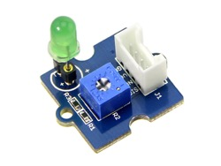

# GrovePi Modules

Introduction
------------

-   [Electronics](http://www.instructables.com/id/Basic-Electronics): An
    introduction to the basic principals of electronics.
-   [Voltage](https://learn.sparkfun.com/tutorials/voltage-current-resistance-and-ohms-law):
    An introduction to the physics of electricity.
-   [Unix](https://info-ee.eps.surrey.ac.uk/Teaching/Unix/index.html):
    An introduction to the Unix os.
-   [grove
    examples](https://github.com/DexterInd/GrovePi/tree/master/Software/Python):
    A list of Dexter Industries example code for GrovePi modules.
-   [GrovePi module
    classes](https://github.com/cloudmesh/cloudmesh.pi/tree/master/cloudmesh/pi):
    A repository for the GrovePi module classes.

LED
---

An LED is the simplest possible module for a raspberry pi, as it is
responsive only to the provided power. For an LED to emit light, it must
be exposed to a voltage greater than a certain threshold value. Above
this voltage, the conductivity of the diode increases exponentially and
its brightness increases likewise. If the current through the LED
becomes too high, the LED will burn out. The following link leads to a
tutorial from Dexter Industries for the LED module.

-   [Dexter LED
    tutorial](https://www.dexterindustries.com/GrovePi/projects-for-the-raspberry-pi/raspberry-pi-led-tutorial/)

Connect the LED to a digital port (see +@fig:grove-led). The following code describes an LED
class. Since it is connected to a digital output, the voltage has only
two states, on and off. The default port for the LED class is D3. The
code for the `LED` class can be found here:

-   [LED
    Class](https://github.com/cloudmesh/cloudmesh.pi/blob/master/cloudmesh/pi/led.py)

{#fig:grove-led}

Buzzer
------

The buzzer is shown in +@fig:grove-buzzer.  Connect the buzzer to a
digital port. The default port for the Buzzer class is D3. You will
notice that the Buzzer class and the LED class are
interchangeable. This is because they work on the same digital
principal. Their two values are on and off. The code for the `Buzzer`
class can be found here:

-   [Buzzer
    Class](https://github.com/cloudmesh/cloudmesh.pi/blob/master/cloudmesh/pi/buzzer.py)

{#fig:grove-buzzer}

Relay
-----

The relay is shown in +@fig:grove-relay.  The relay acts as a switch
in a circuit. When the value on the relay is 1, it allows current to
flow through it. When the value is 0, the relay breaks the circuit and
the current stops. Connect the relay to a digital port. The default
digital port is D4. The `Relay` class can be found here:

-   [Relay
    Class](https://github.com/cloudmesh/cloudmesh.pi/blob/master/cloudmesh/pi/relay.py)

{#fig:grove-relay}

Light Sensor
------------

The light sensor is shown in +@fig:grove-light-sensor.  The light
sensor measures light intensity and returns a value between 0
and 1023. Connect the light sensor to an analog port. The default port
is A0. The analog port allows the light sensor to return a range of
values. The `LightSensor` class can be found here:

-   [LightSensor
    Class](https://github.com/cloudmesh/cloudmesh.pi/blob/master/cloudmesh/pi/light.py)

{#fig:grove-light-sensor}

Rotary Angle Sensor
-------------------

The rotary angle sensor is shown in +@fig:grove-rotary-angle-sensor.
The rotary angle sensor measures the angle to which it is turned.
Connect the sensor to an analog port. Port A0 is the default. The
`RotarySensor` class can be found here:

-   [RotarySensor
    Class](https://github.com/cloudmesh/cloudmesh.pi/blob/master/cloudmesh/pi/rotary.py)

{#fig:grove-rotary-angle-sensor}

Barometer
---------

The barometer is shown in +@fig:grove-barometer.  Connect the
barometer to an I2C port. In addition to pressure, the GrovePi
barometer measures temperature in Fahrenheit and Celsius. The
`Barometer` class can be found here.

-   [Barometer
    Class](https://github.com/cloudmesh/cloudmesh.pi/blob/master/cloudmesh/pi/barometer.py)

{#fig:grove-barometer}

Distance Sensor
---------------

The distance sensor is shown in +@fig:grove-distance-sensor.  Connect
the distance sensor to a digital port. The grovepi module has a
built-in function to read the distance from the distance sensor, but
it is improperly calibrated, so this DistanceSensor class has a
calibration based on experimental data. The `DistanceSensor` class can
be found here:

-   [DistanceSensor
    Class](https://github.com/cloudmesh/cloudmesh.pi/blob/master/cloudmesh/pi/distance.py)

{#fig:grove-distance-sensor}

Temperature Sensor
------------------

The temperature sensor is shown in +@fig:grove-temperature-sensor.
The temperature sensor measures both temperature and humidity. Connect
the temperature sensor to a digital port. D7 is the default port. The
`TemperatureSensor` class can be found here:

-   [TemperatureSensor
    Class](https://github.com/cloudmesh/cloudmesh.pi/blob/master/cloudmesh/pi/temperature.py)

{#fig:grove-temperature-sensor}

Heartbeat Sensor
----------------

the heartbeat sensor is shown in +@fig:grove-heartbeat.  Connect the
heartbeat sensor to an I2C port. The heartbeat sensor returns the
heart rate of the wearer. The `HeartbeatSensor` class can be found
here:

-   [HeartbeatSensor
    Class](https://github.com/cloudmesh/cloudmesh.pi/blob/master/cloudmesh/pi/heartbeat.py)

{#fig:grove-heartbeat}

Joystick
--------

The joystick is shown in +@fig:grove-joystick.  Connect the joystick
to an analog port. A0 is the default port. The joystick has an x, y,
and click status based on the current state of the module. The
`Joystick` class can be found here:

-   [Joystick
    Class](https://github.com/cloudmesh/cloudmesh.pi/blob/master/cloudmesh/pi/joystick.py)

{#fig:grove-joystick}

LCD Screen
----------

The LCD screen is shown in +@fig:grove-lcd.  The LCD screen can be
used to display text and colors. In order to use it, plug it into one
of the I2C ports. The `LCD` class can be found here:

-   [LCD
    Class](https://github.com/cloudmesh/cloudmesh.pi/blob/master/cloudmesh/pi/lcd.py)

{#fig:grove-lcd}

Moisture Sensor
---------------

The moisture sensor is shown in +@fig:grove-moisture-sensor.  Connect
the moisture sensor to an analog port. The default port is A0.  The
`MoistureSensor` class can be found here:

-   [MoistureSensor
    Class](https://github.com/cloudmesh/cloudmesh.pi/blob/master/cloudmesh/pi/moisture.py)

{#fig:grove-moisture-sensor}

An example of the implementation of the moisture sensor from Dexter
Industries can be found
[here](https://github.com/DexterInd/GrovePi/blob/master/Projects/plant_monitor/plant_project.py).
The program is meant to measure the environmental conditions that affect
plant growth.

Water Sensor
------------

The water sensor is shown in +@fig:grove-water-sensor.  The water
sensor measures the amount of water in the environment of the
sensor. Connect the sensor to a digital point. D2 is the default port.
The `WaterSensor` class can be found here:

-   [WaterSensor
    Class](https://github.com/cloudmesh/cloudmesh.pi/blob/master/cloudmesh/pi/water.py)

{#fig:grove-water-sensor}
