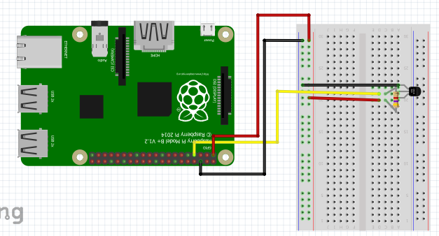
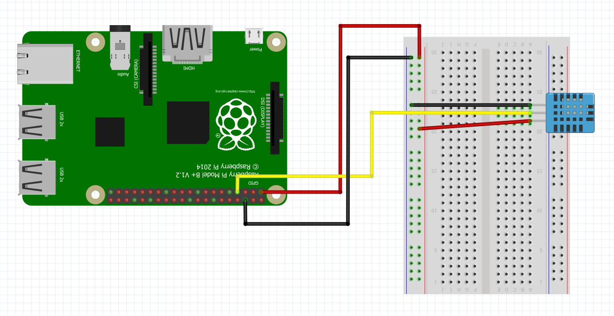
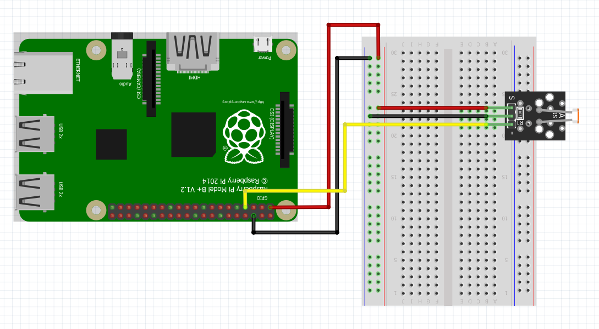
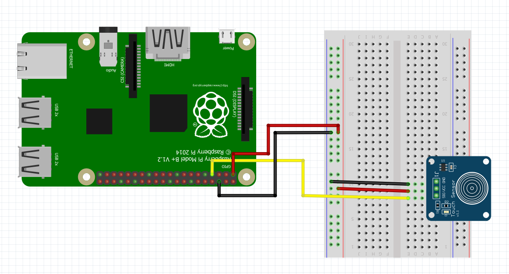
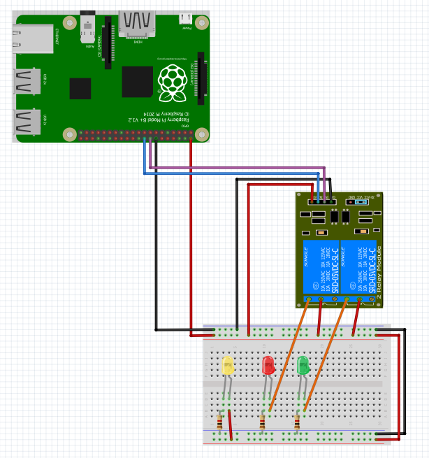
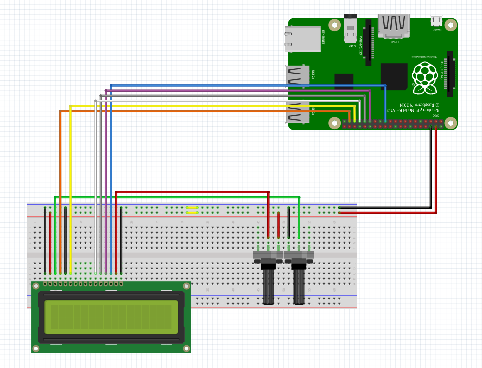
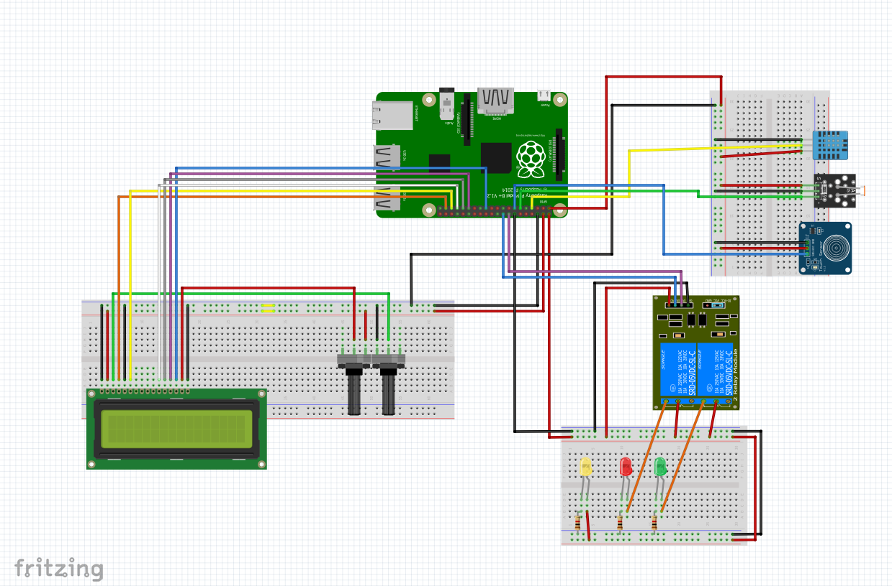
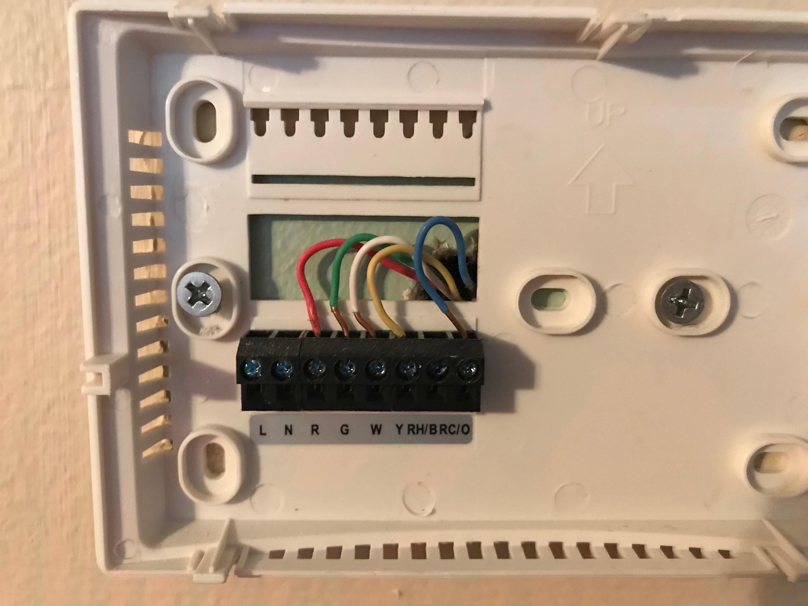
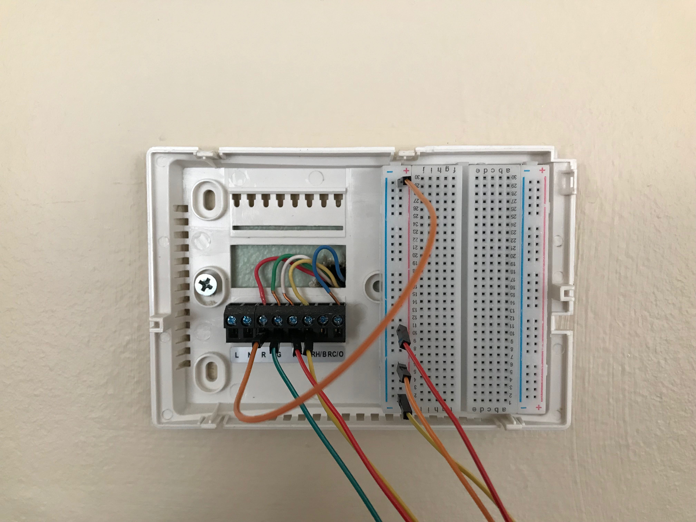
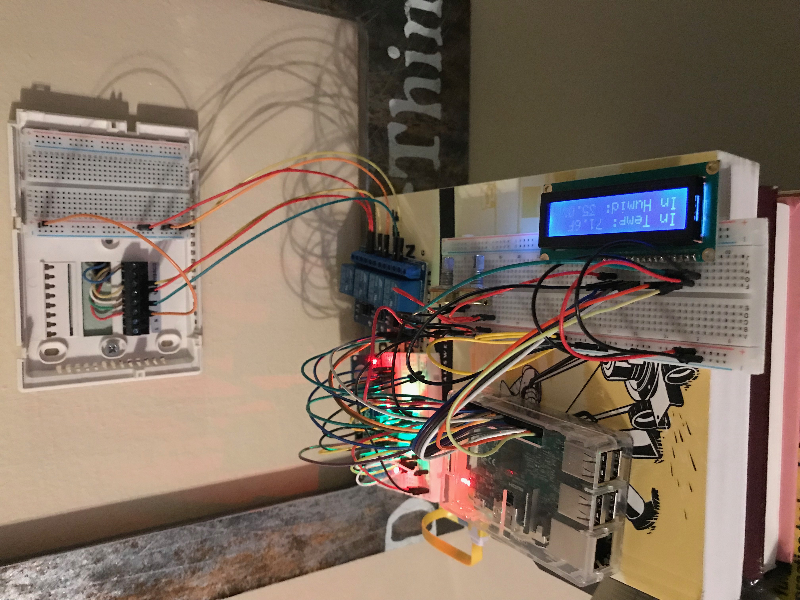

Sensors :smiley: fa18-523-84
=======

This section contains the wiring diagrams and associated classes for sensors that can be used with the Raspberry Pi.  In addition to the individual sensors an example project is also included.  Before getting started with sensors for the Raspberry Pi you will need to ensure that the Pi is set up with python3 and has the latest version of Raspbian installed.  Instructions for setting up the Raspberry Pi can be found [here.](https://github.com/cloudmesh-community/book/blob/master/chapters/iot/pi.md)  

DS18B20 Temperature Sensor
--------------------------

The DS18B20 is a thermoresistive temperature sensor and can be found in many of the sensor kits referenced in this book.  To set up the DS18B20 connect the jumper wires as shown in +@fig:ds18b20_setup.  If you have an individual sensor instead of a sensor module you will need to use a 4.7k ohm resistor as shown in the diagram.  The resistor allows the one wire interface to work properly and should be used to avoid damage to the sensor [@DS18B20_resistor].  If you have a DS18B20 module it may already include a resistor and you will not need to add another.  Be sure to check before setting up your sensor. 

{#fig:ds18b20_setup}

Once you have set up the wiring of the DS18B20 you will need to set up the one wire interface.  This can be done with the following steps [@DS18B20_code_setup].  

1. In a terminal enter:  ``` sudo nano /boot/config.txt ```
2. Scroll to the bottom of this text file and enter ``` dtoverlay=w1–gpio ```

Once the set up is complete you can use the DS18B20 code provided to output the temperature to the terminal.

[DS18B20 Class](https://github.com/cloudmesh-community/fa18-523-84/blob/master/paper/code/ds18b20.py)

Temperature and Humidity Sensor Module
--------------------------------------

The temperature and humidity sensor used in this example is the DHT11 sensor which can be purchased as a part of the [Kookye Smart Home Sensor kit](https://www.amazon.com/gp/product/B01J9GD3DG/ref=oh_aui_detailpage_o03_s01?ie=UTF8&psc=1) or the [Elegoo Uno Kit.](https://www.amazon.com/ELEGOO-Project-Starter-Tutorial-Arduino/dp/B01D8KOZF4/ref=sr_1_6?s=electronics&ie=UTF8&qid=1542065611&sr=1-6&keywords=dht11+temperature+and+humidity+module).  The humidity compontent of the DHT11 works by measuring the conductivity between two electrodes. Between these electrodes there is a substrate that holds moisture and as the moisture changes the conductivity changes [@How_DHT11_Works]. The temperature sensor of the DHT11 works in the same way as the DS18B20.

To set up the DHT11 sensor connect jumper wires to the Raspberry Pi as shown in +@fig:dht11_setup.  Ensure that the ground wire of the DHT11 is connected to the ground rail of the breadboard or a ground pin on the Raspberry Pi.  The VCC wire of the DHT11 should be connected to 3.3v from the Raspberry Pi.  To recieve data the middle pin should be connected to one of the GPIO pins on the Raspberry Pi.  In this example and associated code we connect the data wire to GPIO 4 on the Raspberry Pi as shown in +@fig:dht11_setup.

{#fig:dht11_setup}  

Once you have checked that the DHT11 is set up correctly you will need to set up the Adafruit_DHT module for python.  The sample python class utilizes the Adafruit_DHT module which can be set up by executing the following code in a terminal on your Raspberry Pi [@Adafruit_setup].  

```bash
git clone https://github.com/adafruit/Adafruit_Python_DHT.git
cd Adafruit_Python_DHT
sudo apt-get update
sudo apt-get install build-essential python-dev
sudo python setup.py install
```

Once you have set up the Adafruit_DHT module you can use the python class to display the temperature and humidity reading to the terminal.  

[Temperature & Humididy Sensor Class](https://github.com/cloudmesh-community/fa18-523-84/blob/master/paper/code/temp_humid.py)

Photosensetive Light Sensor Module
----------------------------------

The light sensor used in this example can be purchased [individually](https://www.amazon.com/Gowoops-Digital-Intensity-Detection-Photosensitive/dp/B01N1FKS4L/ref=sr_1_3?ie=UTF8&qid=1543528066&sr=8-3&keywords=arduino+light+sensor+module) or as part of a sensor kit.  To set up the light sensor module connect the wires to the Raspberry Pi as shown in +@fig:light_setup.  The sensor shown in this example has three pins.  However, some sensor modules may have four pins.  In most cases the extra pin is not necessary.

{#fig:light_setup}

Once you have set up the light sensor you can use the light_sensor class to retrieve data from the light sensor.  The light sensor will return "1" if light is not detected and a "0" if the sensor detects light.  Some sensor modules also include a potentiometer which can be adjusted to change the sensitivity of the light sensor.

[Light Sensor Class](https://github.com/cloudmesh-community/fa18-523-84/blob/master/paper/code/light_sensor.py)

Capacitive Touch Sensor Module
------------------------------

In this example we are using a [momentary capacitive touch sensor](https://www.adafruit.com/product/1374).  The sensor kits mentioned in this book will also contain this sensor.  To set up the touch sensor connect the wires to the Raspberrry Pi as shown in +@fig:touch_setup.  

{#fig:touch_setup}

Once you have set up the sensor you can use the touch_sensor class to execute another function when the sensor is touched.

[Touch Sensor Class](https://github.com/cloudmesh-community/fa18-523-84/blob/master/paper/code/touch_sensor.py)

Relay Module
----------------------

The relay module can be used as a switch to complete a circut.  The module can be purchased as an individual component or may be included on a board with 2, 4 or more relay switches.  In this example we will be using a two channel relay module. To set up the relay module connect the wires to the Raspberrry Pi as shown in +@fig:relay_setup.  

{#fig:relay_setup}

Once the module is set up you can use the relay_switch class to turn the relays on and off.

[Relay Class](https://github.com/cloudmesh-community/fa18-523-84/blob/master/paper/code/relay_switch.py)

16 x 2 LCD Screen
-----------------

The 16x2 LCD screen can be used as a display for the Raspberry Pi.  To set up the LCD screen connect the wires as shown in +@fig:LCD_setup.  You will also need two potentiometers in order to adjust the contrast and the brightness.

{#fig:lcd_setup}

Once everything is correctly wired up the LCD class can be used to print text to the LCD display.

[LCD Class](https://github.com/cloudmesh-community/fa18-523-84/blob/master/paper/code/LCD.py)

Compass :o:
-----------

TODO: which compass sensor

The default pins are defined in variants/nodemcu/pins_arduino.h as GPIO

```
    SDA=4 
    SCL=5
    D1=5 
    D2=4.
```

You can also choose the pins yourself using the I2C constructor
Wire.begin(int sda, int scl);


Project: Smart Thermostat
-------------------------

In this example we will combine some of the sensors discussed in this section to create a smart thermostat.  The first step of this project is to make sure that you have a Raspberry Pi which has Raspbian installed and is configured appropreately.  Instructions for how to complete the basic set up of your Raspberry Pi can be found in the [Setting up a Single Raspberry PI](https://github.com/ahilgenkamp/book/blob/master/chapters/pi/setup-ultimate.md) section of this book.

Prerequsites:

 * Raspberry Pi 3 with Raspbian installed
 * DHT11 Temperature and Humidity Sensor
 * Photosensetive Light Sensor
 * Capacitive Touch Sensor
 * 2 Channel Relay Module
 * 16x2 LCD display
 * Three bread boards
 * Two potentiometers
 * 4 female to female jumper wires
 * 24 male to male jumper wires
 * 12 male to female jumper wires
 
If using the LED's you will want the additional components listed below:

  * Three 4.7k ohm resistors
  * Three LED's
  * 3 additional male to male jumper wires
  * 4 additional male to female jumper wires

Once you have the necessary components you will need to connect the wires as shown in +@fig:smart_therm.  The LED lights in this example represent the connections to the actual thermostat. It is suggested that you test the set up using the LED's to ensure that everything is wired correctly and that you are getting the expected results.  We will cover how to connect the smart thermostat to your HVAC system later in this example. For this project three seperate breadboards are used to hold different components.  The first one will hold the LCD and potentiometers used to adjust contrast and brightness.  The second will hold all of the sensors and the third will be used to either hold the LED's or distribute power from the HVAC system.

{#fig:smart_therm}

Once all of the components are connected as shown in +@fig:smart_therm we need to test each of the sensors.  To do this we will first need to set up the raspberry pi.  This can be done by running the thermostat_setup.sh shell script.  To run this open a terminal and type ```nano thermostat_setup.sh``` then copy the code from [thermostat_setup.sh](https://github.com/cloudmesh-community/fa18-523-84/blob/master/paper/code/thermostat_setup.sh).  Once you have copied the code, close the editor and run ```chmod u+x thermostat_setup.sh```.  Then run ```./thermostat_setup.sh``` to run the code to add the code and dependancies needed for this project.

Once the thermostat_setup.sh script has finished running there will be a new directory containing the code for this project.  Navigate to this directory with ```cd ~/git-repos/fa18-523-84/paper/code```.  We will now test each of the components by running the following commands.

  * ```python3 LCD.py``` This should show the output "Hello World!" on the LCD screen.
  * ```python3 temp_humid.py``` Should show the current temp and humidity.
  * ```python3 ds18b20.py``` Should show temp. (using this sensor as well because temp is more accurate)
  * ```python3 light_sensor.py``` Should show either 1 or 0 depending on if light is detected.
  * ```python3 relay_switch.py``` Connected to the LED's this should turn the LED's on and off.
  * ```python3 touch_sensor.py``` When the sensor is touched "Hey!" should be printed to the terminal.
  
Once you have tested the components and have ensured that they work you can run ```python3 smart_therm_not_connected.py``` to start the smart thermostat.  The code should print the current system status to the terminal.

[Smart Thermostat Code](https://github.com/cloudmesh-community/fa18-523-84/blob/master/paper/code/smart_therm_not_connected.py)

Now that we have tested each of the components and have tested the smart thermostat code using the LED's we can connect to the HVAC system. Each HVAC system is different so be sure to do some research on how your specific system works.  Generally there will be a power wire that you can connect to the relay switch and then connect the other wires to the appropreate terminals [@Smart_therm_example].  Based on the readings from the other sensors the code will determine which relay to turn on, which will complete the circut sending a signal to the HVAC system.  The system used in this example is shown in +@fig:wiring_start.  For this system the red wire is 24v power, green connects to the fan, white connects to the heat, yellow connects to the AC compressor and blue is ground [@Smart_therm_example].

{#fig:wiring_start}

To connect the Raspberry Pi smart thermostat to the system we need a way to supply power to each of the signal wires.  To do this we can use a breadboard to supply power to each of the three relay switches as shown in +@fig:wiring_final.  When the relay switch is activated the signal will be supplied to the appropreate wire.

{#fig:wiring_final}

Once the system is wired correctly we can test the code again now that it is wired to the HVAC system.  Running ```python3 smart_therm_not_connected.py``` will start the program but to run the program in the background use ```nohup python3 smart_therm_not_connected.py &```.  When running the program in the background the output will be saved to the nohup.out file.  Now you can adjust settings in the program to make your HVAC system more efficient.  The final result is shown in +@fig:smart_therm_final2.  Also in this book you can find [an example]() which connects the smart thermostat to a database to store data and also allows anyone on the local network to change settings.

{#fig:smart_therm_final2}

## Sources for this section:

need to integrate into https://github.com/cloudmesh-community/book/blob/master/chapters/SECTION/SECTION-REFERENCES.md

  * DS18B20_resistor: https://arduino.stackexchange.com/questions/30822/the-use-of-4-7kohm-resistor-with-ds18b20-temperature-sensor
  * DS18B20_code_setup: http://www.circuitbasics.com/raspberry-pi-ds18b20-temperature-sensor-tutorial/
  * Adafruit_setup: https://stackoverflow.com/questions/28913592/python-gpio-code-for-dht-11-temperature-sensor-fails-in-pi-2
  * How_DHT11_Works: https://howtomechatronics.com/tutorials/arduino/dht11-dht22-sensors-temperature-and-humidity-tutorial-using-arduino/
  * Smart_therm_example: https://dzone.com/articles/how-to-build-your-own-arduino-thermostat
