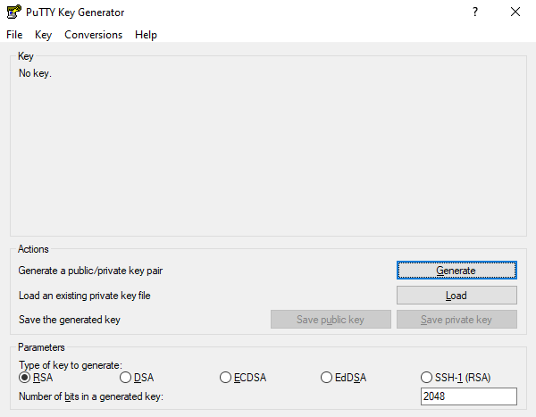
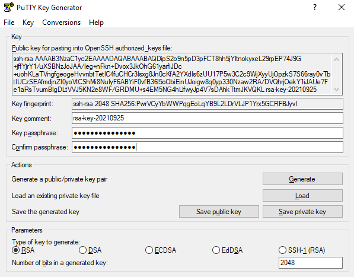

# SSH and Bash on Windows 

For this class we recommend that you use a virtual machine via virtual
box and use the Linux ssh instructions. The information here is just
provided for completeness and no support will be offered for native
windows support.

Windows users need to have some special software to be able to use the
SSH commands. If you have one that you are comfortable with and know how
to setup key pairs and access the contents of your public key, please
feel free to use it.

On Windows you have a couple of options on running Linux commands such
as ssh. At this time it may be worth while to try the OpenSSH Client
available for Windows, although it is in beta. If you like to use other
methods we have included alternatives.


## OpenSSH Client on Windows

software to be able to run it directly from the Windows commandline
including PowerShell.

However it is as far as we know not activated by default so you need to
follow some setup scripts. Also this software is considered beta and its
development and issues can be found at

* <https://github.com/PowerShell/openssh-portable>

Fortunately, the software is already distributed with Winodws 10, but
may not yet been activated. What you have to do is to install it by
going to `Settings > Apps` and click `Manage optional features` under
`Apps & features`.

Next, Click on the `Add feature`. You will be presented with a list in
which you scroll down, till you find `OpenSSH Client (Beta)`. Click on
it and invoke `Install`.

After the install has completed, you can use the `ssh` command. Just
type it in the commandshell or PowerShell

```
PS C:\Users\gregor> ssh
```

Naturally you can now use it just as on Linux or macOS. and use it to
login to other resources

```
PS C:\Users\gregor> ssh myname@computer.example.com
```

see also the 
[MS SSH Guide](https://docs.microsoft.com/en-us/windows-server/administration/openssh/openssh_install_firstuse)
for the newest up dates.

Due to the availability of SSH on Windows 10, we no longer recommend
using Cygwin SSH, PuTTY or Chocolatey. However we kept thise sections
here for completness.

## GitBash

A realy great tool for Windows is made avalable via 

* <https://gitforwindows.org/>

Here you can find gitbash that provides you with a terminal in which you
can natively execute linux commands such as `cd`, `ls` and many more. It
also includes `ssh` and `ssh-keygen`. which you will need if you want o
interface with Linux machines hosted in a cloud.

You can also enable the Git GUI as you may be used to doing things form
GUI's. However soon you will find out why in this class we typicaly do
not much via GUIs. However if you like them you can also integrate git
in the Windows Explorer. This could be beneficial fo you during
development of your project or keep up with what others do on git.

### Makefiles on Windows

Makefiles can easily be accessed also on windows while installing
gitbash. Please reed to the internet or search in this handbook for more
information about gitbash. 

:o2: Please contribute to this section on how to install make on wondows
natively. Here is some information to start with 
[Make on Windows](https://stackoverflow.com/questions/32127524/how-to-install-and-use-make-in-windows)

## Using SSH from Cygwin

One established way of using ssh is from using cygwin.

<http://cygwin.com/install.html>
Cygwin contains a collection of GNU and Open Source tools providing
Linux like functionality on Windows. A DLL is available that exposes the
POSIX API functionality.

A list of supported commands is available at

<https://cygwin.com/packages/package_list.html>
Please be minded that in order for cygwin to function easily the Windows
user name should not include spaces. However, as the setup in windows
encourages to use the full name when you buy and setup a machine it may
not be convenient to use. However, we just recommend that you create
yourself a new username and use this if you like to use cygwin.

You can selectively install from the cygwin setup terminal which
software you like to use, obviously you may want to use ssh

## SSH from putty

As you will see the process is somewhat cumbersome and when you compare
it with the commandline tools available, we do recommend using them
instead.

PuTTY allows you to access the SSH, Telnet and Rlogin network protocols
from windows.

<https://www.chiark.greenend.org.uk/~sgtatham/putty/latest.html>
Although PuTTY has been out there for many years and served the
community well, it is not following the standard ssh command line syntax
when invoked from a command shell.

```
putty -ssh user@host.name
```

In addition to using ssh, it also provides a copy command.

```
pscp user@host.name:"\"remote filename with spaces\"" local_filename
```

Putty is best known for its GUI configuration application to manage
several machines as demonstrated next. Once you have downloaded it and
opened PuTTYgen, you will be presented with a a key generator window
(see
Figure @fig:puttykey).

{#fig:puttykey width=50%}


To generate a key you click the *Generate* button which is blue. The
PuTTY Key Generator (see
Figure @fig:puttypass will then ask you to move your mouse around
the program's blank space to generate "randomness" for your key. You
must enter a "Key passphrase" and then confirm the passphrase.

{#fig:puttypass width=50%}

Next you need to save both the public and private keys into a file of
your choice using the "Save public key" and "Save private key" buttons.
We suggest you name something obvious like "public_key.pub" and
"private_key" so that you can distinguish between the two.

Before closing this window, select the entire public key and copy it
with "Control-C". Please note that everything should be copied,
including "ssh-rsa". This will be used when importing the key pair to
Openstack.

At this time, the public key has been created and copied. Now you can
use the public key and upload it to systems you like to login to.

## Chocolatey

Another approach is to use it in Powershell with the help of chocolatey.
Other options may be better suited for you and we leave it up to you to
make this decision.

Chocolatey is a software management tool that mimics the install
experience that you have on Linux and macOS. It has a repository with many
packages. The packages are maintained by the community and you need to
evaluate security implications when installing packages hosted on
chocolatey just as you have to do if you install software on Linux and
macOS from their repositories. Please be aware that there could be
malicious code offered in the chocolatey repository although the
distributors try to remove them.

The installation is sufficiently explained at

<https://chocolatey.org/install>
Once installed you have a command choco and you should make sure you
have the newest version with:

```
choco upgrade chocolatey
```

Now you can browse packages at

<https://chocolatey.org/packages>
Search for openssh and see the results. You may find different versions.
Select the one that most suits you and satisfies your security
requirements as well as your architecture. Lets assume you chose the
Microsoft port, than you can install it with:

```
choco install openssh
```

Naturally, you can also install cygwin and ptty over chocolatey. A list
of packages can be found at

<https://chocolatey.org/packages>
Packages of interest include

* emacs: choco install emacs
* pandoc: choco install pandoc
* LaTeX: choco install miktex
* jabref: choco install jabref
* pycharm: choco install pycharm-community
* lyx: choco install lyx
* python 3: choco install python
* pip: choco install pip
* virtualbox: choco install virtualbox
* vagrant: choco install vagrant

Before installing any of them evaluate if you need them and identify
security risks.

