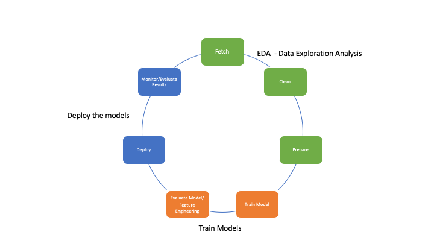
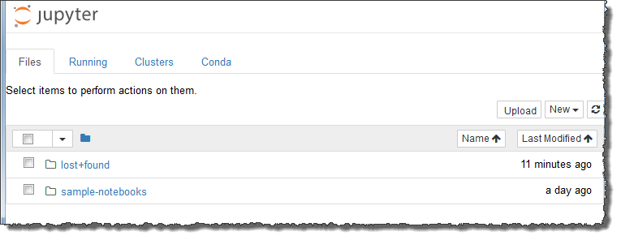

# AWS SageMaker :o: sp19-616-111 ✋

Amazon SageMaker is a fully managed machine learning service. Using Amazon SageMaker, data scientists and developers can quickly and easily build and train machine learning models, and then directly deploy them into a production-ready hosted environment. 

Amazon SageMaker provides following advantages:

- An integrated Jupyter authoring notebook instance for easy access to your data sources 
  for exploration and analysis, so you do not have to manage servers
- Common machine learning algorithms that are optimized to run efficiently against 
  extremely large data in a distributed environment
- Native support for bring-your-own-algorithms and frameworks, Amazon SageMaker 
  offers flexible distributed training options that adjust to your specific workflows
- Deploy a model into a secure and scalable environment by launching it with a one 
  click from the Amazon SageMaker console
- Training and hosting are billed by minutes of usage, with 
  no minimum fees and no upfront commitments.

## Machine Learning with Amazon SageMaker

We explained a typical machine learning workflow and summarizes how you accomplish those tasks with Amazon SageMaker.

In general, machine learning is all about you *teach* a computer to make predictions, or inferences. As a first step, you use an algorithm and example data to train a model. Then you integrate your model into your application to generate inferences in real time and at scale. In a production environment, a model typically learns from millions of example data items and produces inferences in hundreds to less than 20 milliseconds.

The following :o: use proper image notation with caption and citation as discussed in notation.md 
diagram illustrates the typical workflow for creating a machine learning model:



As the above diagram illustrates, you typically perform the following activities:

Generate example data—To train a model, you need example data. The type of data that you need depends on the business problem that you want the model to solve (the inferences that you want the model to generate). For example, suppose that you want to create a model to predict a number given an input image of a handwritten digit. To train such a model, you need example images of handwritten numbers.

Data scientists: often spend a lot of time exploring and preprocessing, or "wrangling," example data before using it for model training. To preprocess data, you typically do the following:

- Fetch the data: You might have in-house example data repositories, or you might use datasets that are publicly available. Typically, you pull the dataset or datasets into a single repository.

- Clean: the data—To improve model training, inspect the data and clean it up as needed. For example, if your data has a country name attribute with values United States and US, you might want to edit the data to be consistent.

- Prepare or transform: the data—To improve performance, you might perform additional data transformations. For example, you might choose to combine attributes. If your model predicts the conditions that require de-icing an aircraft instead of using temperature and humidity attributes separately, you might combine those attributes into a new attribute to get a better model.

In Amazon SageMaker, you preprocess example data in a Jupyter notebook on your notebook instance. You use your notebook to fetch your dataset, explore it and prepare it for model training. 

Train a model—Model training includes both training and evaluating the model, as follows:

- Training the model: To train a model, you need an algorithm. The algorithm you choose depends on a number of factors. For a quick, out-of-the-box solution, you might be able to use one of the algorithms that Amazon SageMaker provides.


You also need compute resources for training. Depending on the size of your training dataset and how quickly you need the results, you can use resources ranging from a single, small general-purpose instance to a distributed cluster of GPU instances. For more information, refer the sub-section Train a Model with Amazon SageMaker.

 
Evaluating the model—After you've trained your model, you evaluate it to determine whether the accuracy of the inferences is acceptable. In Amazon SageMaker, you use either the AWS SDK for Python (Boto) or the high-level Python library that Amazon SageMaker provides to send requests to the model for inferences.

You use a Jupyter notebook in your Amazon SageMaker notebook instance to train and evaluate your model.

- Deploy the model: You traditionally re-engineer a model before you integrate it with your application and deploy it. With Amazon SageMaker hosting services, you can deploy your model independently, decoupling it from your application code. For more information, see Deploy a Model on Amazon SageMaker Hosting Services.

Machine learning is a continuous cycle. After deploying a model, you monitor the inferences, then collect "ground truth," and evaluate the model to identify drift. You then increase the accuracy of your inferences by updating your training data to include the newly collected ground truth, by retraining the model with the new dataset. As more and more example data becomes available, you continue retraining your model to increase accuracy.


## Get Start with SageMaker

In this section, we will explain on how you create your first Amazon SageMaker notebook instance, and train a model. You train the model using an algorithm provided by Amazon SageMaker, deploy it, and validate it by sending inference requests to the model's endpoint.

You use this notebook instance for all kind of machine learning models that are available as part of AWS SageMaker notebook instance or customer machine learning libraries.

### Train a Model with Amazon SageMaker

To train a model in Amazon SageMakar, you can Download the MNIST dataset to your Amazon SageMaker notebook instance, then review the data and preprocess it. For efficient training, you convert the dataset from the numpy.array format to the RecordIO protobuf format. A numpy.array is an n-dimensional array object that the NumPy scientific computing library uses. RecordIO protobuf is a binary data format that the Amazon SageMaker K-Means algorithm expects as input.

- Start an Amazon SageMaker training job.

- Deploy the model in Amazon SageMaker.

- Validate the model by sending inference requests to the model's endpoint. You send images of handwritten, single-digit numbers. The model returns the number of the cluster (0 through 9) that the images belong to.

Important to note that, for model training, deployment, and validation, you can use either of the following:

- The high-level Python library provided by Amazon SageMaker

- The AWS SDK for Python (Boto)

The high-level library abstracts several implementation details, and is easy to use. This exercise provides separate code examples using both libraries. If you're a first-time Amazon SageMaker user, we recommend that you use the high-level Python library.

Basically, there are two ways to practice this exercise:

Follow the steps to create, deploy, and validate the model. You create a Jupyter notebook in your Amazon SageMaker notebook instance, and copy code, paste it into the notebook, and run it.

If you're familiar with using sample notebooks, open and run the following example notebooks that Amazon SageMaker provides in the SageMaker Python SDK section of the SageMaker Examples tab of your notebook instance:

1. kmeans_mnist.ipynb

2. kmeans_mnist_lowlevel.ipynb

### Create a Jupyter Notebook and Initialize Variables

Now, create a Jupyter notebook in your Amazon SageMaker notebook instance and initialize variables.

To create a Jupyter notebook ,sign in to the Amazon SageMaker console at https://console.aws.amazon.com/sagemaker/.

Open the notebook instance, by choosing Open next to its name. The Jupyter notebook server page appears:



* To create a notebook, in the Files tab, choose New, and conda_python3. This pre-installed environment includes the default Anaconda installation and Python 3.

* In the Jupyter notebook, under File, choose Save as, and name the notebook.

Copy the following Python code and paste it into your notebook. Add the name of the S3 bucket that you created in Set Up Amazon SageMaker, and run the code. The get_execution_role function retrieves the IAM role you created when you created your notebook instance.


```python
from sagemaker import get_execution_role
role = get_execution_role()
bucket = 'bucket-name' # Use the name of your s3 bucket here
```

### Download, Explore, and Transform the Training Data

Now download the MNIST dataset to your notebook instance. Then review the data, transform it, and upload it to your S3 bucket.

You transform the data by changing its format from numpy.array to RecordIO. The RecordIO format is more efficient for the algorithms provided by Amazon SageMaker. 

#### MNIST dataset

To download the MNIST dataset, copy and paste the following code into the notebook and run it:

%%time
import pickle, gzip, numpy, urllib.request, json
``` python
# Load the dataset
urllib.request.urlretrieve("http://deeplearning.net/data/mnist/mnist.pkl.gz", "mnist.pkl.gz")
with gzip.open('mnist.pkl.gz', 'rb') as f:
    train_set, valid_set, test_set = pickle.load(f, encoding='latin1')
```
The above code does the following:

* Downloads the MNIST dataset (mnist.pkl.gz) from the deeplearning.net website to your Amazon SageMaker notebook instance.

* Unzips the file and reads the following three datasets into the notebook's memory:

- train_set—You use these images of handwritten numbers to train a model.

- valid_set—After you train the model, you validate it using the images in this dataset.

- test_set—You don't use this dataset in this exercise.

#### Training Dataset

Typically, you explore training data to determine what you need to clean up and which transformations to apply to improve model training. For this exercise, you don't need to clean up the MNIST dataset. Simply display one of the images in the train_set dataset.

```
%matplotlib inline
import matplotlib.pyplot as plt
plt.rcParams["figure.figsize"] = (2,10)


def show_digit(img, caption='', subplot=None):
    if subplot == None:
        _, (subplot) = plt.subplots(1,1)
    imgr = img.reshape((28,28))
    subplot.axis('off')
    subplot.imshow(imgr, cmap='gray')
    plt.title(caption)

show_digit(train_set[0][30], 'This is a {}'.format(train_set[1][30]))

```

The code uses the matplotlib library to get and display the 31st image from the training dataset.

# Amazon SageMaker Examples

This repository contains example notebooks that show how to apply machine learning and deep learning in [Amazon SageMaker](https://aws.amazon.com/sagemaker)

## Examples

### Introduction to Ground Truth Labeling Jobs

These examples provide quick walkthroughs to get you up and running with the labeling job workflow for Amazon SageMaker Ground Truth.

- [From Unlabeled Data to a Deployed Machine Learning Model: A SageMaker Ground Truth Demonstration for Image Classification](ground_truth_labeling_jobs/from_unlabeled_data_to_deployed_machine_learning_model_ground_truth_demo_image_classification) is an end-to-end example that starts with an unlabeled dataset, labels it using the Ground Truth API, analyzes the results, trains an image classification neural net using the annotated dataset, and finally uses the trained model to perform batch and online inference.
- [Ground Truth Object Detection Tutorial](ground_truth_labeling_jobs/ground_truth_object_detection_tutorial) is a similar end-to-end example but for an object detection task.
- [Basic Data Analysis of an Image Classification Output Manifest](ground_truth_labeling_jobs/data_analysis_of_ground_truth_image_classification_output) presents charts to visualize the number of annotations for each class, differentiating between human annotations and automatic labels (if your job used auto-labeling). It also displays sample images in each class, and creates a pdf which concisely displays the full results.
- [Training a Machine Learning Model Using an Output Manifest](ground_truth_labeling_jobs/object_detection_augmented_manifest_training) introduces the concept of an "augmented manifest" and demonstrates that the output file of a labeling job can be immediately used as the input file to train a SageMaker machine learning model.


### Introduction to Applying Machine Learning

These examples provide a gentle introduction to machine learning concepts as they are applied in practical use cases across a variety of sectors.

- [Targeted Direct Marketing](introduction_to_applying_machine_learning/xgboost_direct_marketing) predicts potential customers that are most likely to convert based on customer and aggregate level metrics, using Amazon SageMaker's implementation of [XGBoost](https://github.com/dmlc/xgboost).
- [Predicting Customer Churn](introduction_to_applying_machine_learning/xgboost_customer_churn) uses customer interaction and service usage data to find those most likely to churn, and then walks through the cost/benefit trade-offs of providing retention incentives.  This uses Amazon SageMaker's implementation of [XGBoost](https://github.com/dmlc/xgboost) to create a highly predictive model.
- [Time-series Forecasting](introduction_to_applying_machine_learning/linear_time_series_forecast) generates a forecast for topline product demand using Amazon SageMaker's Linear Learner algorithm.
- [Cancer Prediction](introduction_to_applying_machine_learning/breast_cancer_prediction) predicts Breast Cancer based on features derived from images, using SageMaker's Linear Learner.
- [Ensembling](introduction_to_applying_machine_learning/ensemble_modeling) predicts income using two Amazon SageMaker models to show the advantages in ensembling.
- [Video Game Sales](introduction_to_applying_machine_learning/video_game_sales) develops a binary prediction model for the success of video games based on review scores.
- [MXNet Gluon Recommender System](introduction_to_applying_machine_learning/gluon_recommender_system) uses neural network embeddings for non-linear matrix factorization to predict user movie ratings on Amazon digital reviews.
- [Fair Linear Learner](introduction_to_applying_machine_learning/fair_linear_learner) is an example of an effective way to create fair linear models with respect to sensitive features.
- [Population Segmentation of US Census Data using PCA and Kmeans](introduction_to_applying_machine_learning/US-census_population_segmentation_PCA_Kmeans) analyzes US census data and reduces dimensionality using PCA then clusters US counties using KMeans to identify segments of similar counties.

### SageMaker Automatic Model Tuning

These examples introduce SageMaker's hyperparameter tuning functionality which helps deliver the best possible predictions by running a large number of training jobs to determine which hyperparameter values are the most impactful.

- [XGBoost Tuning](hyperparameter_tuning/xgboost_direct_marketing) shows how to use SageMaker hyperparameter tuning to improve your model fits for the [Targeted Direct Marketing](introduction_to_applying_machine_learning/xgboost_direct_marketing) task.
- [TensorFlow Tuning](hyperparameter_tuning/tensorflow_mnist) shows how to use SageMaker hyperparameter tuning with the pre-built TensorFlow container and MNIST dataset.
- [MXNet Tuning](hyperparameter_tuning/mxnet_mnist) shows how to use SageMaker hyperparameter tuning with the pre-built MXNet container and MNIST dataset.
- [Keras BYO Tuning](hyperparameter_tuning/keras_bring_your_own) shows how to use SageMaker hyperparameter tuning with a custom container running a Keras convolutional network on CIFAR-10 data.
- [R BYO Tuning](hyperparameter_tuning/r_bring_your_own) shows how to use SageMaker hyperparameter tuning with the custom container from the [Bring Your Own R Algorithm](advanced_functionality/r_bring_your_own) example.
- [Analyzing Results](hyperparameter_tuning/analyze_results) is a shared notebook that can be used after each of the above notebooks to provide analysis on how training jobs with different hyperparameters performed.

### Introduction to Amazon Algorithms

These examples provide quick walkthroughs to get you up and running with Amazon SageMaker's custom developed algorithms.  Most of these algorithms can train on distributed hardware, scale incredibly well, and are faster and cheaper than popular alternatives.

- [k-means](sagemaker-python-sdk/1P_kmeans_highlevel) is our introductory example for Amazon SageMaker.  It walks through the process of clustering MNIST images of handwritten digits using Amazon SageMaker k-means.
- [Factorization Machines](introduction_to_amazon_algorithms/factorization_machines_mnist) showcases Amazon SageMaker's implementation of the algorithm to predict whether a handwritten digit from the MNIST dataset is a 0 or not using a binary classifier.
- [Latent Dirichlet Allocation (LDA)](introduction_to_amazon_algorithms/lda_topic_modeling) introduces topic modeling using Amazon SageMaker Latent Dirichlet Allocation (LDA) on a synthetic dataset.
- [Linear Learner](introduction_to_amazon_algorithms/linear_learner_mnist) predicts whether a handwritten digit from the MNIST dataset is a 0 or not using a binary classifier from Amazon SageMaker Linear Learner.
- [Neural Topic Model (NTM)](introduction_to_amazon_algorithms/ntm_synthetic) uses Amazon SageMaker Neural Topic Model (NTM) to uncover topics in documents from a synthetic data source, where topic distributions are known.
- [Principal Components Analysis (PCA)](introduction_to_amazon_algorithms/pca_mnist) uses Amazon SageMaker PCA to calculate eigendigits from MNIST.
- [Seq2Seq](introduction_to_amazon_algorithms/seq2seq_translation_en-de) uses the Amazon SageMaker Seq2Seq algorithm that's built on top of [Sockeye](https://github.com/awslabs/sockeye), which is a sequence-to-sequence framework for Neural Machine Translation based on MXNet.  Seq2Seq implements state-of-the-art encoder-decoder architectures which can also be used for tasks like Abstractive Summarization in addition to Machine Translation.  This notebook shows translation from English to German text.
- [Image Classification](introduction_to_amazon_algorithms/imageclassification_caltech) includes full training and transfer learning examples of Amazon SageMaker's Image Classification algorithm.  This uses a ResNet deep convolutional neural network to classify images from the caltech dataset.
- [XGBoost for regression](introduction_to_amazon_algorithms/xgboost_abalone) predicts the age of abalone ([Abalone dataset](https://www.csie.ntu.edu.tw/~cjlin/libsvmtools/datasets/regression.html)) using regression from Amazon SageMaker's implementation of [XGBoost](https://github.com/dmlc/xgboost).
- [XGBoost for multi-class classification](introduction_to_amazon_algorithms/xgboost_mnist) uses Amazon SageMaker's implementation of [XGBoost](https://github.com/dmlc/xgboost) to classify handwritten digits from the MNIST dataset as one of the ten digits using a multi-class classifier. Both single machine and distributed use-cases are presented.
- [DeepAR for time series forecasting](introduction_to_amazon_algorithms/deepar_synthetic) illustrates how to use the Amazon SageMaker DeepAR algorithm for time series forecasting on a synthetically generated data set.
- [BlazingText Word2Vec](introduction_to_amazon_algorithms/blazingtext_word2vec_text8) generates Word2Vec embeddings from a cleaned text dump of Wikipedia articles using SageMaker's fast and scalable BlazingText implementation.
- [Object Detection](introduction_to_amazon_algorithms/object_detection_pascalvoc_coco) illustrates how to train an object detector using the Amazon SageMaker Object Detection algorithm with different input formats (RecordIO and image).  It uses the Pascal VOC dataset. A third notebook is provided to demonstrate the use of incremental training.
- [Object detection for bird images](introduction_to_amazon_algorithms/object_detection_birds) demonstrates how to use the Amazon SageMaker Object Detection algorithm with a public dataset of Bird images.
- [Object2Vec for movie recommendation](introduction_to_amazon_algorithms/object2vec_movie_recommendation) demonstrates how Object2Vec can be used to model data consisting of pairs of singleton tokens using movie recommendation as a running example.
- [Object2Vec for multi-label classification](introduction_to_amazon_algorithms/object2vec_multilabel_genre_classification) shows how ObjectToVec algorithm can train on data consisting of pairs of sequences and singleton tokens using the setting of genre prediction of movies based on their plot descriptions.
- [Object2Vec for sentence similarity](introduction_to_amazon_algorithms/object2vec_sentence_similarity) explains how to train Object2Vec using sequence pairs as input using sentence similarity analysis as the application.
- [IP Insights for suspicious logins](introduction_to_amazon_algorithms/ipinsights_login) shows how to train IP Insights on a login events for a web server to identify suspicious login attempts.
- [Semantic Segmentation](introduction_to_amazon_algorithms/semantic_segmentation_pascalvoc) shows how to train a semantic segmentation algorithm using the Amazon SageMaker Semantic Segmentation algorithm. It also demonstrates how to host the model and produce segmentaion masks and probability of segmentation.

### Amazon SageMaker RL

The following provide examples demonstrating different capabilities of Amazon SageMaker RL.

- [Cartpole using Coach](reinforcement_learning/rl_cartpole_coach) demonstrates the simplest usecase of Amazon SageMaker RL using Intel's RL Coach.
- [AWS DeepRacer](reinforcement_learning/rl_deepracer_robomaker_coach_gazebo) demonstrates AWS DeepRacer trainig using RL Coach in the Gazebo environment.
- [HVAC using EnergyPlus](reinforcement_learning/rl_hvac_coach_energyplus) demonstrates the training of HVAC systems using the EnergyPlus environment.
- [Knapsack Problem](reinforcement_learning/rl_knapsack_coach_custom) demonstrates how to solve the knapsack problem using a custom environment.
- [Mountain Car](reinforcement_learning/rl_mountain_car_coach_gymEnv) Mountain car is a classic RL problem. This notebook explains how to solve this using the OpenAI Gym environment.
- [Distributed Neural Network Compression](reinforcement_learning/rl_network_compression_ray_custom) This notebook explains how to compress ResNets using RL, using a custom environment and the RLLib toolkit.
- [Turtlebot Tracker](reinforcement_learning/rl_objecttracker_robomaker_coach_gazebo) This notebook demonstrates object tracking using AWS Robomaker and RL Coach in the Gazebo environment.
- [Portfolio Management](reinforcement_learning/rl_portfolio_management_coach_customEnv) This notebook uses a custom Gym environment to manage multiple financial investments.
- [Autoscaling](reinforcement_learning/rl_predictive_autoscaling_coach_customEnv) demonstrates how to adjust load depending on demand. This uses RL Coach and a custom environment.
- [Roboschool](reinforcement_learning/rl_roboschool_ray) is an open source physics simulator that is commonly used to train RL policies for robotic systems. This notebook demonstrates training a few agents using it.
- [Stable Baselines](reinforcement_learning/rl_roboschool_stable_baselines) In this notebook example, we will make the HalfCheetah agent learn to walk using the stable-baselines, which are a set of improved implementations of Reinforcement Learning (RL) algorithms based on OpenAI Baselines.
- [Travelling Salesman](reinforcement_learning/rl_traveling_salesman_vehicle_routing_coach) is a classic NP hard problem, which this notebook solves with AWS SageMaker RL.

### Scientific Details of Algorithms

These examples provide more thorough mathematical treatment on a select group of algorithms.

- [Streaming Median](scientific_details_of_algorithms/streaming_median) sequentially introduces concepts used in streaming algorithms, which many SageMaker algorithms rely on to deliver speed and scalability.
- [Latent Dirichlet Allocation (LDA)](scientific_details_of_algorithms/lda_topic_modeling) dives into Amazon SageMaker's spectral decomposition approach to LDA.
- [Linear Learner features](scientific_details_of_algorithms/linear_learner_class_weights_loss_functions) shows how to use the class weights and loss functions features of the SageMaker Linear Learner algorithm to improve performance on a credit card fraud prediction task

### Advanced Amazon SageMaker Functionality

These examples that showcase unique functionality available in Amazon SageMaker.  They cover a broad range of topics and will utilize a variety of methods, but aim to provide the user with sufficient insight or inspiration to develop within Amazon SageMaker.

- [Data Distribution Types](advanced_functionality/data_distribution_types) showcases the difference between two methods for sending data from S3 to Amazon SageMaker Training instances.  This has particular implication for scalability and accuracy of distributed training.
- [Encrypting Your Data](advanced_functionality/handling_kms_encrypted_data) shows how to use Server Side KMS encrypted data with Amazon SageMaker training. The IAM role used for S3 access needs to have permissions to encrypt and decrypt data with the KMS key.
- [Using Parquet Data](advanced_functionality/parquet_to_recordio_protobuf) shows how to bring [Parquet](https://parquet.apache.org/) data sitting in S3 into an Amazon SageMaker Notebook and convert it into the recordIO-protobuf format that many SageMaker algorithms consume.
- [Connecting to Redshift](advanced_functionality/working_with_redshift_data) demonstrates how to copy data from Redshift to S3 and vice-versa without leaving Amazon SageMaker Notebooks.
- [Bring Your Own XGBoost Model](advanced_functionality/xgboost_bring_your_own_model) shows how to use Amazon SageMaker Algorithms containers to bring a pre-trained model to a realtime hosted endpoint without ever needing to think about REST APIs.
- [Bring Your Own k-means Model](advanced_functionality/kmeans_bring_your_own_model) shows how to take a model that's been fit elsewhere and use Amazon SageMaker Algorithms containers to host it.
- [Bring Your Own R Algorithm](advanced_functionality/r_bring_your_own) shows how to bring your own algorithm container to Amazon SageMaker using the R language.
- [Installing the R Kernel](advanced_functionality/install_r_kernel) shows how to install the R kernel into an Amazon SageMaker Notebook Instance.
- [Bring Your Own scikit Algorithm](advanced_functionality/scikit_bring_your_own) provides a detailed walkthrough on how to package a scikit learn algorithm for training and production-ready hosting.
- [Bring Your Own MXNet Model](advanced_functionality/mxnet_mnist_byom) shows how to bring a model trained anywhere using MXNet into Amazon SageMaker.
- [Bring Your Own TensorFlow Model](advanced_functionality/tensorflow_iris_byom) shows how to bring a model trained anywhere using TensorFlow into Amazon SageMaker.
- [Inference Pipeline with SparkML and XGBoost](advanced_functionality/inference_pipeline_sparkml_xgboost_abalone) shows how to deploy an Inference Pipeline with SparkML for data pre-processing and XGBoost for training on the Abalone dataset. The pre-processing code is written once and used between training and inference.
- [Inference Pipeline with SparkML and BlazingText](advanced_functionality/inference_pipeline_sparkml_blazingtext_dbpedia) shows how to deploy an Inference Pipeline with SparkML for data pre-processing and BlazingText for training on the DBPedia dataset. The pre-processing code is written once and used between training and inference.
- [Experiment Management Capabilities with Search](advanced_functionality/search) shows how to organize Training Jobs into projects, and track relationships between Models, Endpoints, and Training Jobs.
- [Creating Algorithm and Model Package - Listing on AWS Marketplace](advanced_functionality/creating_marketplace_products) provides a detailed walkthrough on how to package a scikit learn algorithm to create SageMaker Algorithm and SageMaker Model Package entities that can be used with the enhanced SageMaker Train/Transform/Hosting/Tuning APIs and listed on AWS Marketplace.
- [Using Algorithm and Model Packages - From AWS Marketplace](advanced_functionality/using_marketplace_products) provides a detailed walkthrough on how to use Algorithm and Model Package entities with the enhanced SageMaker Train/Transform/Hosting/Tuning APIs by choosing a canonical product listed on AWS Marketplace.

### Amazon SageMaker Pre-Built Framework Containers and the Python SDK

#### Pre-Built Deep Learning Framework Containers

These examples show you to write idiomatic TensorFlow or MXNet and then train or host in pre-built containers using SageMaker Python SDK.

- [Chainer CIFAR-10](sagemaker-python-sdk/chainer_cifar10) trains a VGG image classification network on CIFAR-10 using Chainer (both single machine and multi-machine versions are included)
- [Chainer MNIST](sagemaker-python-sdk/chainer_mnist) trains a basic neural network on MNIST using Chainer (shows how to use local mode)
- [Chainer sentiment analysis](sagemaker-python-sdk/chainer_sentiment_analysis) trains a LSTM network with embeddings to predict text sentiment using Chainer
- [IRIS with Scikit-learn](sagemaker-python-sdk/scikit_learn_iris) trains a Scikit-learn classifier on IRIS data
- [CIFAR-10 with MXNet Gluon](sagemaker-python-sdk/mxnet_gluon_cifar10) trains a ResNet-34  image classification model using MXNet Gluon
- [MNIST with MXNet Gluon](sagemaker-python-sdk/mxnet_gluon_mnist) trains a basic neural network on the MNIST handwritten digit dataset using MXNet Gluon
- [MNIST with MXNet](sagemaker-python-sdk/mxnet_mnist) trains a basic neural network on the MNIST handwritten digit data using MXNet's symbolic syntax
- [Sentiment Analysis with MXNet Gluon](sagemaker-python-sdk/mxnet_gluon_sentiment) trains a text classifier using embeddings with MXNet Gluon
- [TensorFlow Neural Networks with Layers](sagemaker-python-sdk/tensorflow_abalone_age_predictor_using_layers) trains a basic neural network on the abalone dataset using TensorFlow layers
- [TensorFlow Networks with Keras](sagemaker-python-sdk/tensorflow_abalone_age_predictor_using_keras) trains a basic neural network on the abalone dataset using TensorFlow and Keras
- [Introduction to Estimators in TensorFlow](sagemaker-python-sdk/tensorflow_iris_dnn_classifier_using_estimators) trains a DNN classifier estimator on the Iris dataset using TensorFlow
- [TensorFlow and TensorBoard](sagemaker-python-sdk/tensorflow_resnet_cifar10_with_tensorboard) trains a ResNet image classification model on CIFAR-10 using TensorFlow and showcases how to track results using TensorBoard
- [Distributed TensorFlow](sagemaker-python-sdk/tensorflow_distributed_mnist) trains a simple convolutional neural network on MNIST using TensorFlow

#### Pre-Built Machine Learning Framework Containers

These examples show you how to build Machine Learning models with frameworks like Apache Spark or Scikit-learn using SageMaker Python SDK.

- [Inference with SparkML Serving](sagemaker-python-sdk/sparkml_serving_emr_mleap_abalone) shows how to build an ML model with Apache Spark using Amazon EMR on Abalone dataset and deploy in SageMaker with SageMaker SparkML Serving.
- [Pipeline Inference with Scikit-learn and LinearLearner](sagemaker-python-sdk/scikit_learn_inference_pipeline) builds a ML pipeline using Scikit-learn preprocessing and LinearLearner algorithm in single endpoint
### Using Amazon SageMaker with Apache Spark

These examples show how to use Amazon SageMaker for model training, hosting, and inference through Apache Spark using [SageMaker Spark](https://github.com/aws/sagemaker-spark). SageMaker Spark allows you to interleave Spark Pipeline stages with Pipeline stages that interact with Amazon SageMaker.

- [MNIST with SageMaker PySpark](sagemaker-spark/pyspark_mnist)

### Additional Resources

*What do I need in order to get started?*

- The quickest setup to run example notebooks includes:
  - An [AWS account](http://docs.aws.amazon.com/sagemaker/latest/dg/gs-account.html)
  - Proper [IAM User and Role](http://docs.aws.amazon.com/sagemaker/latest/dg/authentication-and-access-control.html) setup
  - An [Amazon SageMaker Notebook Instance](http://docs.aws.amazon.com/sagemaker/latest/dg/gs-setup-working-env.html)
  - An [S3 bucket](http://docs.aws.amazon.com/sagemaker/latest/dg/gs-config-permissions.html)

*Will these examples work outside of Amazon SageMaker Notebook Instances?*

- Although most examples utilize key Amazon SageMaker functionality like distributed, managed training or real-time hosted endpoints, these notebooks can be run outside of Amazon SageMaker Notebook Instances with minimal modification (updating IAM role definition and installing the necessary libraries).

