# Amazon EMR (Elastic Map Reduce):o:

Amazon EMR facilitates you to analyze and process vast(huge) amounts of
data by distributing the computational work across a cluster of virtual
servers running in the AWS Cloud. The EMR cluster is managed using an
open-source framework called Hadoop. Amazon EMR lets you focus on
crunching or analyzing your data without having to worry about
time-consuming setup, management, and tuning of Hadoop clusters or the
compute capacity they rely on unlike other Hadoop distributors like
Cloudera,Hortonworks etc.,

- Easy: To maintain on demand basis
- Fast: Auto shrinking of cluster and dynamically increase memory based on the need
- Cost-effective: Scala out and in anytime based on the business requirement or models

EMR Supports other distributed framework such as Apache Spark, HBase,
Presto, Flink and etc. Interact with data in AWS data stores such as
Amazon S3, DynamoDB and etc.

Components Of EMR:

- Storage
- EC2 instance
- Clusters
- Security 
- KMS

## Why EMR?

The following ar reasons given by Amazone for using EMR

* Easy to Use: Launch cluster in a 5 to 10 minutes time as many
  cluster of nodes as you need
* Pay as you go: Pay an hourly rate (with AWS latest pricing model,
  customers can choose to pay in minutes)
* Flexible: Easily Add/ Remove capacity(Auto scale out and in anytime)
* Reliable: Spend less time for monitoring and can utilize in-built
  AWS tools which will reduce overhead
* Secure: Manage firewall (VPC both private and subnet)

## Understanding Clusters and Nodes

The component of Amazon EMR is the cluster. A cluster is a collection
of Amazon Elastic Compute Cloud (Amazon EC2) instances. Each instance
in the cluster is called a node. Each node has a role within the
cluster, referred to as the node type. Amazon EMR also installs
different software components on each node type, giving each node a
role in a distributed application like Apache Hadoop.

The node types in Amazon EMR are as follows:

- Master node: A node that manages the cluster by running software
  components to coordinate the distribution of data and tasks among other
  nodes for processing. The master node tracks the status of tasks and
  monitors the health of the cluster. Every cluster has a master node, and
  it is possible to create a single-node cluster with only the master
  node.

- Core node: A node with software components that run tasks and store
  data in the Hadoop Distributed File System (HDFS) on your
  cluster. Multi-node clusters have at least one core node.

- Task node: A node with software components that only runs tasks and
  does not store data in HDFS. Task nodes are optional.

The following diagram represents a cluster with one master node and
four core nodes.

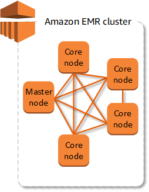

### Submit Work to a Cluster

When you run a cluster on Amazon EMR, you have several options as to how
you specify the work that needs to be done.

Provide the entire definition of the work to be done in functions that
you specify as steps when you create a cluster. This is typically done
for clusters that process a set amount of data and then terminate when
processing is complete.

Create a long-running cluster and use the Amazon EMR console, the Amazon
EMR API, or the AWS CLI to submit steps, which may contain one or more
jobs.

Create a cluster, connect to the master node and other nodes as required
using SSH, and use the interfaces that the installed applications
provide to perform tasks and submit queries, either scripted or
interactively.

### Processing Data

When you launch your cluster, you choose the frameworks and applications
to install for your data processing needs. To process data in your
Amazon EMR cluster, you can submit jobs or queries directly to installed
applications, or you can run steps in the cluster.

- Submitting Jobs Directly to Applications:

  You can submit jobs and interact directly with the software that is
  installed in your Amazon EMR cluster. To do this, you typically
  connect to the master node over a secure connection and access the
  interfaces and tools that are available for the software that runs
  directly on your cluster. For more information, see Connect to the
  Cluster.

- Running Steps to Process Data

  You can submit one or more ordered steps to an Amazon EMR cluster.
  Each step is a unit of work that contains instructions to manipulate
  data for processing by software installed on the cluster.

The following is an example process using four steps:

1. Submit an input dataset for processing.
2. Process the output of the first step by using a Pig program.
3. Process a second input dataset by using a Hive program.
4. Write an output dataset.

Generally, when you process data in Amazon EMR, the input is data stored as files in your chosen underlying file system, such as Amazon S3 or HDFS. This data passes from one step to the next in the processing sequence. The final step writes the output data to a specified location, such as an Amazon S3 bucket.

Steps are run in the following sequence:

1. A request is submitted to begin processing steps.
2. The state of all steps is set to PENDING.
3. When the first step in the sequence starts, its state changes to
   RUNNING. The other steps remain in the PENDING state.
4. After the first step completes, its state changes to COMPLETED.
5. The next step in the sequence starts, and its state changes to
   RUNNING. When it completes, its state changes to COMPLETED.
6. This pattern repeats for each step until they all complete and
   processing ends.

The following diagram represents the step sequence and change of state
for the steps as they are processed.

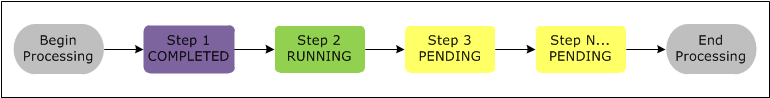

If a step fails during processing, its state changes to
TERMINATED_WITH_ERRORS. You can determine what happens next for each
step. By default, any remaining steps in the sequence are set to
CANCELLED and do not run. You can also choose to ignore the failure and
allow remaining steps to proceed, or to terminate the cluster
immediately.

The following diagram represents the step sequence and default change of
state when a step fails during processing.

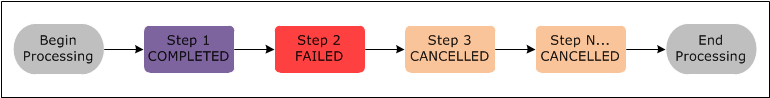

## AWS Storage

S3
- Cloud based storage
- Using EMRFS can directly connects s3 storage
- Accessible from any where

Instance Store
- Local storage
- Data will be lost on start and stop EC2 instances

EBS
- Network attached storage
- Data preserved on start and stop
- Accessible only through EC2 instances

## Create EMR in AWS

### Create the buckets

- Login to AWS console and create the buckets at
  https://aws.amazon.com/console/. To create the buckets, go to
  services (see @fig:aws-console-1, @fig:aws-login), click on S3 under
  Storage, @fig:aws-s3, @fig:aws-s3-bucket, @fig:aws-s3-bucket1. Click
  on Create bucket button and then provide all the details to complete
  bucket creation.
- AWS Console

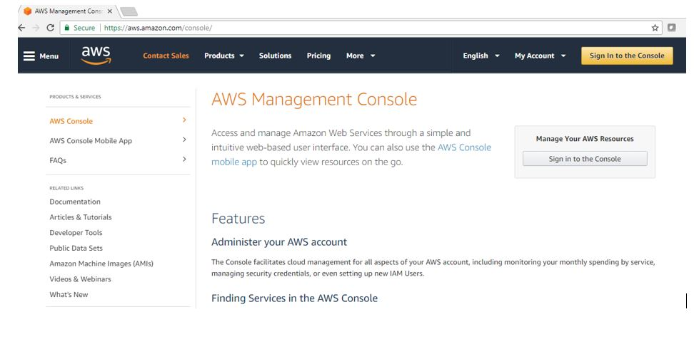{#fig:aws-console-1}

- AWS Login

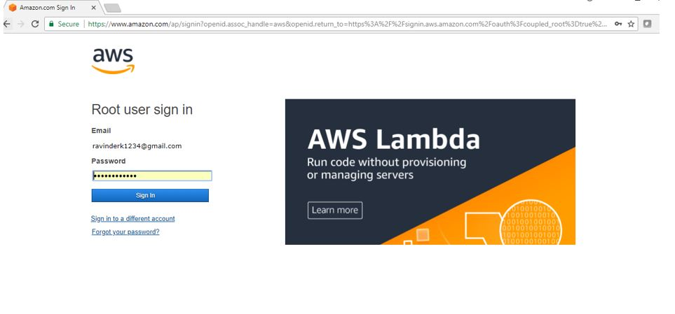{#fig:aws-login}

- S3 – Amazon Storage

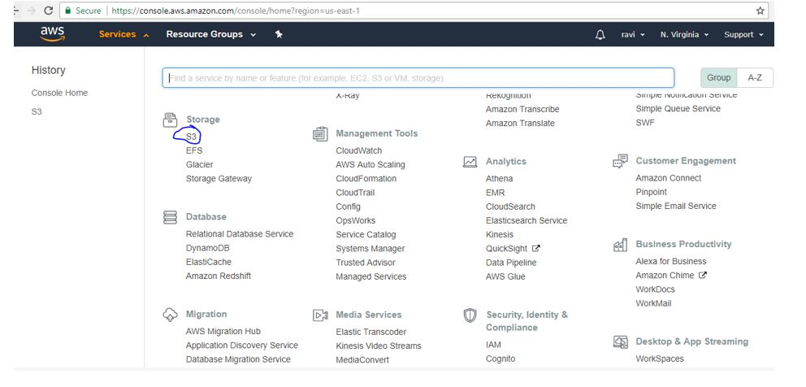{#fig:aws-s3}

- S3 – Create buckets

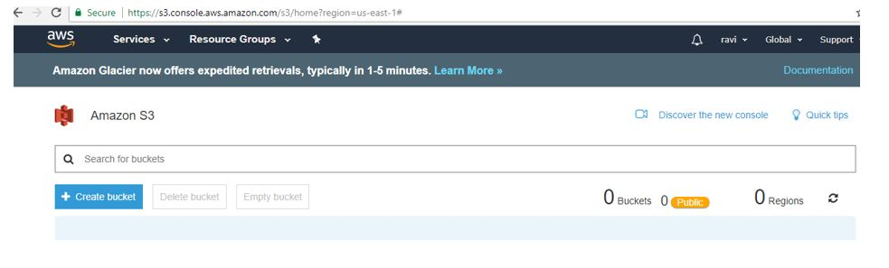{#fig:aws-s3-bucket}

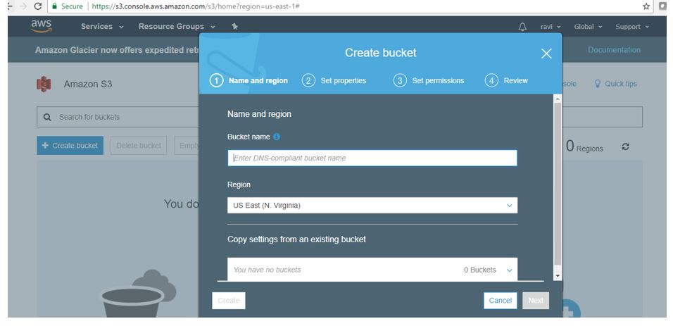{#fig:aws-s3-bucket1}

### Create Key Pairs

- Login to AWS console, go to services, click on EC2 under compute.
  Select the Key pairs resoure, click on Create Key Pair and provide Key
  Pair name to complete the Key pairs creation. See @fig:aws-keypair

- Download the. pem file once Key value pair is created. This is needed
  to access AWS Hadoop environment from client machine. This need to be
  imported in Putty to access your AWS environemnt. See @fig:aws-keypair1

#### Create Key Value Pair Screen shots

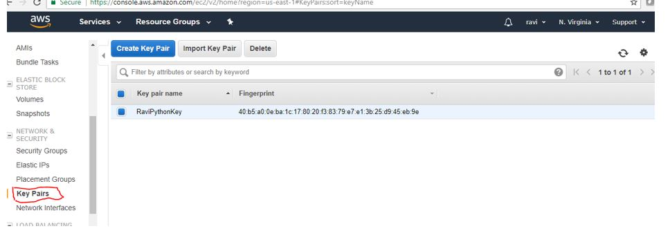{#fig:aws-keypair}

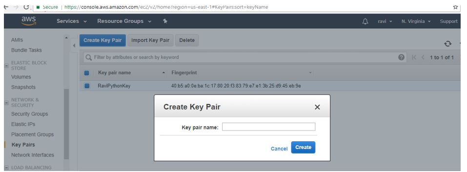{#fig:aws-keypair1}

## Create Step Execution – Hadoop Job

Login to AWS console, go to services and then select EMR. Click on
Create Cluster. The cluster configuration provides details to complete
to complete step execution creation. See: @fig:aws-emr,
@fig:aws-create-emr, @fig:emr-step-exe, @fig:step-cluster,
@fig:step-cluster1

- Cluster name (Example: HadoopJobStepExecutionCluster)
- Select Logging check box and provide S3 folder location
  (Example: s3://bigdata-raviAndOrlyiuproject/logs/)
- Select launch mode as Step execution
- Select the step type and complete the step configuration
- Complete Software Configuration
- Complete Hardware Configuration
- Complete Security and access
- And then click on create cluster button
- Once job started, if there are no errors output file will be created
  in the output directory.

#### Screen shots

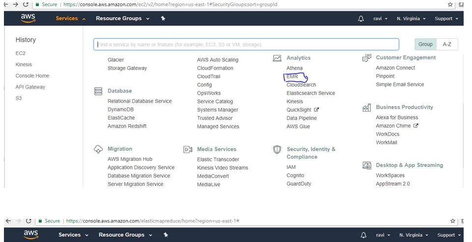{#fig:aws-emr}

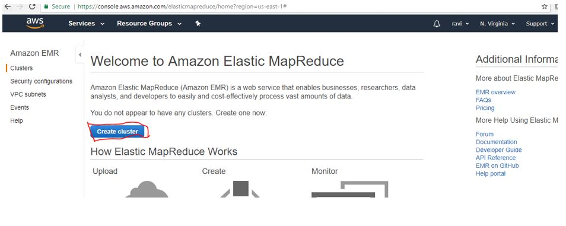{#fig:aws-create-emr}

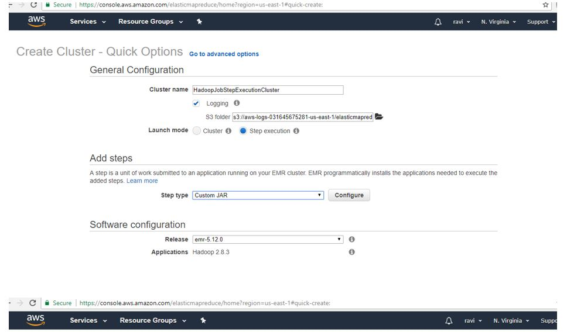{#fig:emr-step-exe}

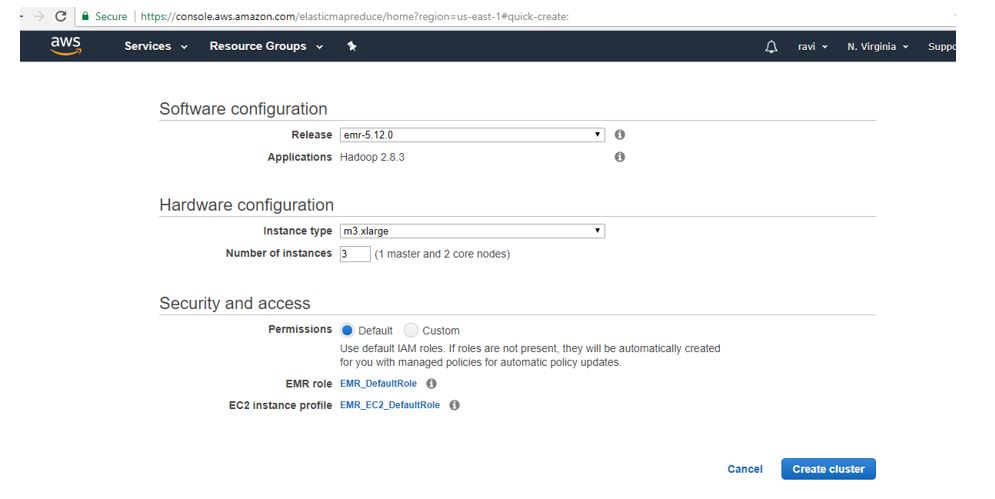{#fig:step-cluster}

{#fig:step-cluster1}

## Create a Hive Cluster

Login to AWS console, go to services and then select EMR. Click on
Create Cluster. The cluster configuration provides details to complete.
See, @fig:hive-cluster1, @fig:hive-cluster2, @fig:hive-cluster3

- Cluster name (Example: MyFirstCluster-Hive)
- Select Logging check box selected and provide S3 folder location
- Select launch mode as Cluster
- Complete software configuration (select hive application)  and click
  on create cluster

### Create a Hive Cluster - Screen shots

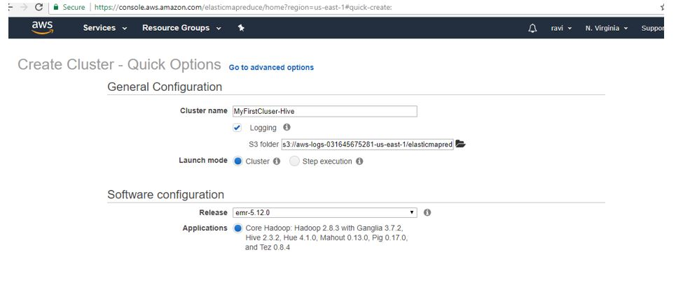{#fig:hive-cluster1}

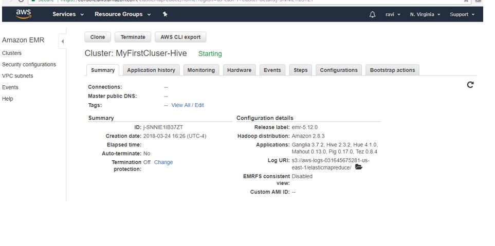{#fig:hive-cluster2}

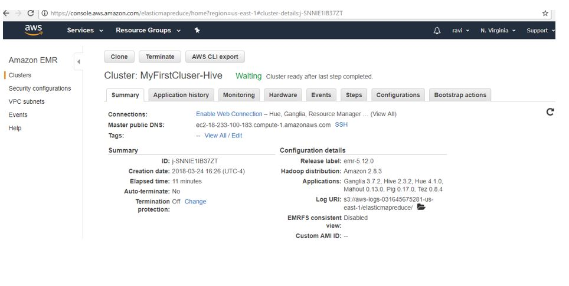{#fig:hive-cluster3}

## Create a Spark Cluster

Login to AWS console, go to services and then select EMR. Click on
Create Cluster. The cluster configuration provides details to complete.
See, @fig:spark-cluster1, @fig:spark-cluster2, @fig:spark-cluster3

- Cluster name (Example: My Cluster - Spark)
- Select Logging check box selected and provide S3 folder location
- Select launch mode as Cluster
- Complete software configuration and click on create cluster
- Select application as Spark

### Create a Spark Cluster - Screenshots

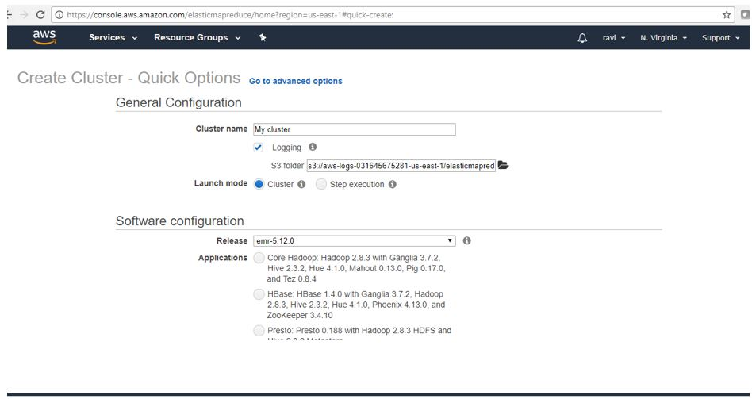{#fig:spark-cluster1}

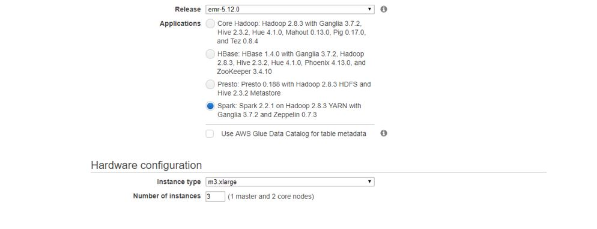{#fig:spark-cluster2}

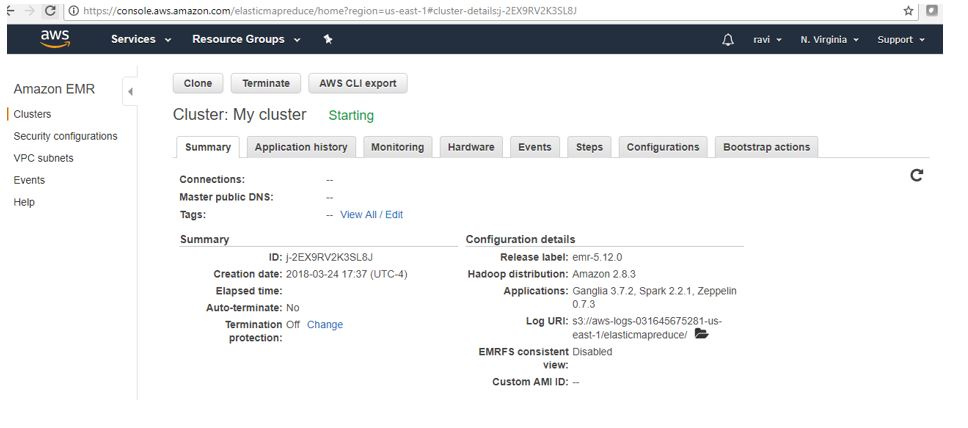{#fig:spark-cluster3}
