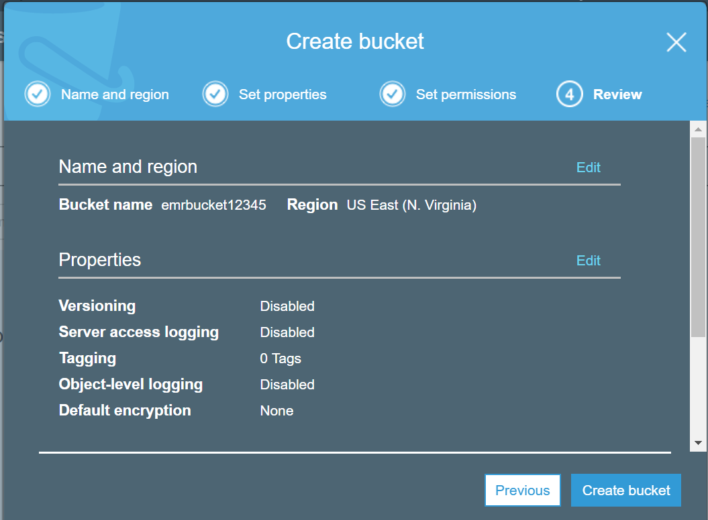
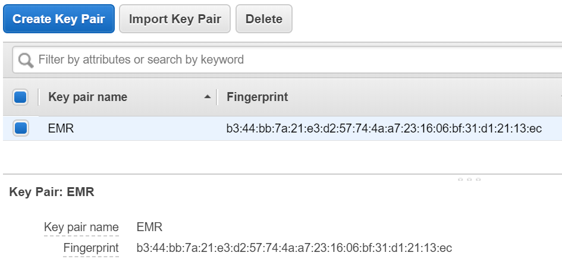
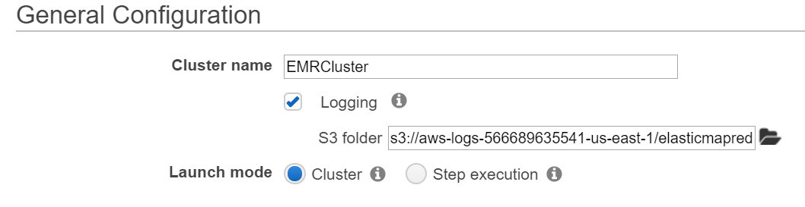
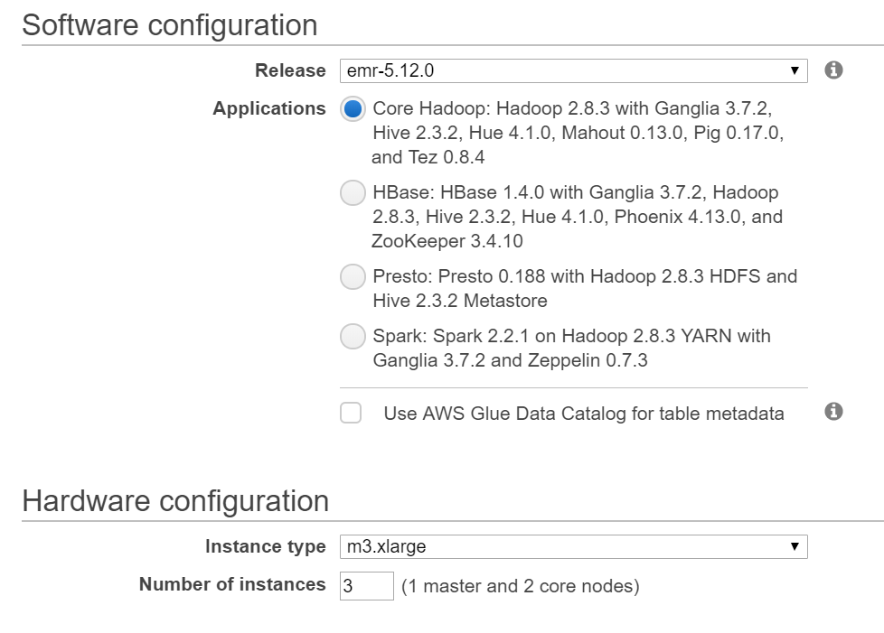
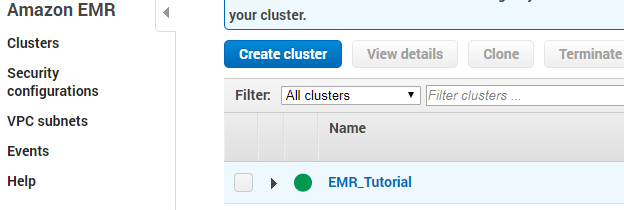
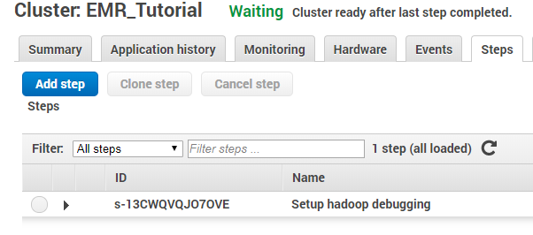
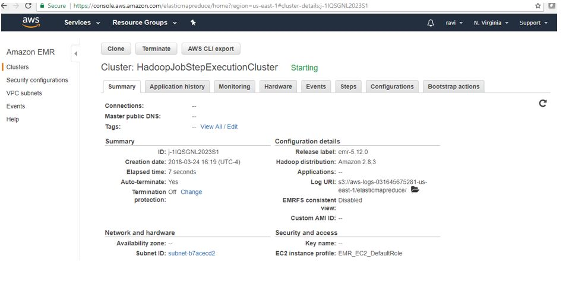

# Amazon EMR (Elastic Map Reduce) :o: sp19-616-111 ✋

Amazon EMR facilitates you to analyze and process vast(huge) amounts of data by distributing the computational work across a cluster of virtual servers running in the AWS Cloud. The EMR cluster is managed using an open-source framework called Hadoop. Amazon EMR lets you focus on crunching or analyzing your data without having to worry about time-consuming setup, management, and tuning of Hadoop clusters or the compute capacity they rely on unlike other Hadoop distributors like Cloudera,Hortonworks etc.,

- Easy: To maintain on demand basis
- Fast: Auto shrinking of cluster and dynamically increase memory based on the need
- Cost-effective : Scala out and in anytime based on the business requirement or models

EMR Supports other distributed framework such as Apache Spark, HBase, Presto, Flink and etc.
Interact with data in AWS data stores such as Amazon S3, DynamoDB and etc.

Components Of EMR:
- Storage
- EC2 instance
- Clusters
- Security 
- KMS

## Why EMR?

Easy to Use
- Launch cluster in a 5 to 10 minutes time as many cluster of nodes as you need

Pay as you go
- Pay an hourly rate (with AWS latest pricing model, customers can choose to pay in minutes)

Flexible
- Easily Add/ Remove capacity(Auto scale out and in anytime)

Reliable
- Spend less time for monitoring and can utilize in-built AWS tools which will reduce overhead

Secure
- Manage firewall (VPC both private and subnet)

## Understanding Clusters and Nodes

The component of Amazon EMR is the cluster. A cluster is a collection of Amazon Elastic Compute Cloud (Amazon EC2) instances. Each instance in the cluster is called a node. Each node has a role within the cluster, referred to as the node type. Amazon EMR also installs different software components on each node type, giving each node a role in a distributed application like Apache Hadoop.

The node types in Amazon EMR are as follows:

- Master node: A node that manages the cluster by running software components to coordinate the distribution of data and tasks among other nodes for processing. The master node tracks the status of tasks and monitors the health of the cluster. Every cluster has a master node, and it's possible to create a single-node cluster with only the master node.

- Core node: A node with software components that run tasks and store data in the Hadoop Distributed File System (HDFS) on your cluster. Multi-node clusters have at least one core node.

- Task node: A node with software components that only runs tasks and does not store data in HDFS. Task nodes are optional.

The following diagram represents a cluster with one master node and four core nodes.

### Submit Work to a Cluster

When you run a cluster on Amazon EMR, you have several options as to how you specify the work that needs to be done.

Provide the entire definition of the work to be done in functions that you specify as steps when you create a cluster. This is typically done for clusters that process a set amount of data and then terminate when processing is complete.

Create a long-running cluster and use the Amazon EMR console, the Amazon EMR API, or the AWS CLI to submit steps, which may contain one or more jobs.

Create a cluster, connect to the master node and other nodes as required using SSH, and use the interfaces that the installed applications provide to perform tasks and submit queries, either scripted or interactively.

### Processing Data
When you launch your cluster, you choose the frameworks and applications to install for your data processing needs. To process data in your Amazon EMR cluster, you can submit jobs or queries directly to installed applications, or you can run steps in the cluster.

- Submitting Jobs Directly to Applications
You can submit jobs and interact directly with the software that is installed in your Amazon EMR cluster. To do this, you typically connect to the master node over a secure connection and access the interfaces and tools that are available for the software that runs directly on your cluster. For more information, see Connect to the Cluster.

- Running Steps to Process Data
You can submit one or more ordered steps to an Amazon EMR cluster. Each step is a unit of work that contains instructions to manipulate data for processing by software installed on the cluster.

The following is an example process using four steps:

1. Submit an input dataset for processing.
2. Process the output of the first step by using a Pig program.
3. Process a second input dataset by using a Hive program.
4. Write an output dataset.

Generally, when you process data in Amazon EMR, the input is data stored as files in your chosen underlying file system, such as Amazon S3 or HDFS. This data passes from one step to the next in the processing sequence. The final step writes the output data to a specified location, such as an Amazon S3 bucket.

Steps are run in the following sequence:

1. A request is submitted to begin processing steps.
2. The state of all steps is set to PENDING.
3. When the first step in the sequence starts, its state changes to RUNNING. The other steps remain in the PENDING state.
4. After the first step completes, its state changes to COMPLETED.
5. The next step in the sequence starts, and its state changes to RUNNING. When it completes, its state changes to COMPLETED.
6. This pattern repeats for each step until they all complete and processing ends.

The following diagram represents the step sequence and change of state for the steps as they are processed.

If a step fails during processing, its state changes to TERMINATED_WITH_ERRORS. You can determine what happens next for each step. By default, any remaining steps in the sequence are set to CANCELLED and do not run. You can also choose to ignore the failure and allow remaining steps to proceed, or to terminate the cluster immediately.

The following diagram represents the step sequence and default change of state when a step fails during processing.

## AWS Storage

S3
- Cloud based storage
- Using EMRFS can directly connects s3 storage
- Accessible from any where

Instance Store
- Local storage
- Data will be lost on start and stop EC2 instances

EBS
- Network attached storage
- Data preserved on start and stop
- Accessible only through EC2 instances

## Create EMR in AWS

### Create the buckets

- Login to AWS console and create the buckets at
  https://aws.amazon.com/console/. To create the buckets, go to
  services (see @fig:aws-console-1, @fig:aws-login), click on S3 under
  Storage, @fig:aws-s3, @fig:aws-s3-bucket, @fig:aws-s3-bucket1. Click
  on Create bucket button and then provide all the details to complete
  bucket creation.
- AWS Console

{#fig:aws-console-1}

- AWS Login

{#fig:aws-login}

- S3 – Amazon Storage

{#fig:aws-s3}

- S3 – Create buckets

{#fig:aws-s3-bucket}

{#fig:aws-s3-bucket1}

### Create Key Pairs

- Login to AWS console, go to services, click on EC2 under compute. Select the Key pairs resoure, click on Create Key Pair and provide Key Pair name to complete the Key pairs creation. See @fig:aws-keypair
- Download the. pem file once Key value pair is created. This is needed to access AWS Hadoop environment from client machine. This need to be imported in Putty to access your AWS environemnt. See @fig:aws-keypair1

#### Create Key Value Pair Screen shots

{#fig:aws-keypair}

{#fig:aws-keypair1}

## Prerequisites

Before proceeding with any steps to create an EMR cluster, you need to
ensure that you have an AWS account setup. If not, you need to have one
created before continuing with this section. Afterwards, sign into the
AWS Management Console. There are two prerequisites that need to be met
before being able to launch an EMR cluster, setup an S3 bucket and an
EC2 key pair. The S3 bucket you create will be used for storing the EMR
logs and any output data produced by your EMR cluster. Bucket names have
several constraints that need to be met due to Hadoop requirements such
as only consisting of lowercase letters, numbers, periods, hyphens and
also cannot end in numbers [@hid-sp18-521-prereq]. In order to create
the S3 bucket, go to S3 section of the AWS Management Console and select
the 'Create bucket' button. Fill in the requested information for bucket
name and region, then proceed to the next two pages to enter in the
bucket properties and permissions. After those sections, a review page
will be presented for your review and if you are satisfied with your
selections, click 'Create bucket' [@hid-sp18-521-s3bucket].

{#fig:s3-bucket}

After the S3 bucket has been created, an EC2 key pair then needs to be
generated which allows you to connect to your EMR cluster over SSH. If
you already have an existing EC2 key pair that can be used for this
section as well. In order to generate an EC2 key pair through the AWS
Management Console, search and navigate to the EC2 section from the
console home page. In the pane on the left side of the screen, look for
the 'Network and Security' section and select the 'Key Pairs' option. On
the next page select 'Create Key Pair' button and type in a name you
want to give this key pair. After you select the key name click 'Create'
and your EC2 key pair wil be automatically downloaded by the browser and
named with a pem extension. Save the key file generated in a safe
location for use later on as this is the only time you will be able to
save this key file. It will need to be used when you need to launch and
connect to the EC2 instances created by EMR [@hid-sp18-521-ec2keypair].

{#fig:key}

## Configuring and Utilizing the Cluster with AWS Management Console

Once all the previous prerequisites have been met, an EMR cluster can now
be created. In the AWS Management Console home page, enter in 'EMR' in
the AWS services search box at the top of the page and select the EMR
option that it returns. You will be taken to the EMR home page. At the
top of this page is a button labeled 'Create cluster'. Click this button
and you will be brought to the screen where you can select cluster
creation options. By default, it brings up the quick options page which
allows you to select basic options needed to setup and configure an EMR
cluster. There is also an option to show advanced options that can be
used for cluster creation at the top of the page. Stay on the quick
options page for now and enter in the cluster name, which is optional.
You then select if you would like to enable logging. If so, you can then
select a location in S3 where you would like the logs to be placed.
There are then two options to choose from for launch mode: cluster or
step execution. The cluster option can be used for EMR clusters that you
want to remain online indefinitely. The step execution option would be
used for when you want to execute a set of predefined steps upon cluster
creation and once those steps complete successfully, shut down the
cluster [@hid-sp18-521-emrlaunch].

{#fig:configuration}

Once launch mode is selected, scroll down to the 'Software
configuration' section and choose an EMR release version. See the following picture: @fig:software-configuration. The most
current version is selected by default. If you chose a cluster launch
mode, then proceed to selecting one of the 4 predefined sets of
applications you want to install based on your use case. If step
execution was selected instead of cluster, then the core Hadoop install
is the only application option you can use here. Now move on to the
'Hardware configuration' and select the EC2 instance type and number of
EC2 instances you would like to utilize for your cluster. he values
selected here will vary on what type of data processing you're looking
to achieve. Then scroll down to the 'Security and access' section of the
page and select the key pair generated in the previous steps in the
drop-down menu, as in figure @fig:security. Below that you can then select which permissions model
to u se: default or custom. The default option sets up permissions for
your EMR cluster that are granted using policies applied to EMR specific
IAM roles. Using the custom option allows you to select existing IAM
roles to apply permissions to instead of creating new roles. Once all of
this information has been selected, the cluster is then ready to be
launched by selecting the 'Create cluster' button at the bottom of the
page. Your cluster will then be launched and ready for
workloads [@hid-sp18-521-emrlaunch].

{#fig:software-configuration}

{#fig:security}

If you've selected cluster launch mode, ad-hoc processing of data can
now occur on cluster. To get started go to the EMR console page. From
here you can then select the 'Clusters' menu on the left side of the
screen which will then show you a list of current EMR clusters you have
setup: @fig:cluster-create. Click on the name of the cluster you would like to run processing
steps on and then navigate over to the 'Steps' tab on the following
page: see @fig:cluster-steps. You show see a button named 'Add step' which you can then select
to setup the type of step you would like to run for data processing. The
step types available to create vary based on the applications that were
installed during the creation of the cluster. In this example, only the
core Hadoop applications were installed, so the step types are limited
to custom JAR, Hive, Pig and streaming programs. Each step type then has
a set of parameters that need to be populated before the step can be
created. After you've decided on a step type and have populated all of
the required step parameters, click the 'Add' button which will then
create and run the step on the cluster, see @fig:additional-steps. This process can be repeated as
needed and there are additional ways to submit up to 256 active steps
that can be explored but is beyond the scope of this
section [@hid-sp18-521-emrprocess].

{#fig:cluster-create}

{#fig:cluster-steps}

](images/emr_cluster_steps2.png){#fig:additional-steps}

## Teardown

Once completing the steps in the section, it is recommended that you
cleanup what you've created in order to avoid high costs of usage. The
S3 bucket you created along with the EMR cluster itself will need to be
removed. Start with the termination of the cluster by going to main EMR
page and selecting the 'Cluster' option on the left. Select the check
box for the name of the cluster you wish to terminate and click the
'Terminate' button as the folowing picture shows: @fig:terminate. It will them prompt you to confirm this clusters
termination which you will verify and continue. This will place the
cluster in a 'Terminating' state and eventually move to a 'Terminated'
state. Terminated clusters will remain viewable in the console for two
months. You can then proceed to the S3 console page. Before you can
delete buckets, you have to delete all of the folders and files
contained within that bucket. To do this, click on the bucket name which
will then show the subfolders contained within the bucket: @fig:bucket. Check the box
next to all of the subfolder names, select the 'More' button in the previous menu
and from that menu select 'Delete'. Once all of the folders and
files are gone, navigate back to the main S3 page, click the row of the
bucket name you wish to delete and select the 'Delete' button. You will
then be prompted to enter the name of the bucket you wish to delete and
select the 'Confirm' button before the deletion occurs. Once your EMR
cluster has been successfully terminated and all buckets created during
the section have been deleted, you can then be certain that no
additional costs will continue to accrue based on the work performed in
this section [@hid-sp18-521-emrreset].

](images/emr_terminate.png){#fig:terminate}

](images/s3_delete_bucket.png){#fig:bucket}

## Create Step Execution – Hadoop Job

Login to AWS console, go to services and then select EMR. Click on Create Cluster. The cluster configuration provides details to complete to complete step execution creation.
See: @fig:aws-emr, @fig:aws-create-emr, @fig:emr-step-exe, @fig:step-cluster, @fig:step-cluster1
- Cluster name (Ex: HadoopJobStepExecutionCluster)
- Select Logging check box and provide S3 folder location (Ex: s3://bigdata-raviAndOrlyiuproject/logs/)
- Select launch mode as Step execution
- Select the step type and complete the step configuration
- Complete Software Configuration
- Complete Hardware Configuration
- Complete Security and access
- And then click on create cluster button
- Once job started, if there are no errors output file will be created in the output directory.

#### Screen shots

{#fig:aws-emr}

{#fig:aws-create-emr}

{#fig:emr-step-exe}

{#fig:step-cluster}

{#fig:step-cluster1}

## Create a Hive Cluster

Login to AWS console, go to services and then select EMR. Click on Create Cluster. The cluster configuration provides details to complete.
See, @fig:hive-cluster1, @fig:hive-cluster2, @fig:hive-cluster3
- Cluster name (Ex: MyFirstCluster-Hive)
- Select Logging check box selected and provide S3 folder location
- Select launch mode as Cluster
- Complete software configuration (select hive application)  and click on create cluster
-
### Create a Hive Cluster - Screen shots

{#fig:hive-cluster1}

{#fig:hive-cluster2}

{#fig:hive-cluster3}

## Create a Spark Cluster
Login to AWS console, go to services and then select EMR. Click on Create Cluster. The cluster configuration provides details to complete.
See, @fig:spark-cluster1, @fig:spark-cluster2, @fig:spark-cluster3
- Cluster name (Ex:My Cluster - Spark)
- Select Logging check box selected and provide S3 folder location
- Select launch mode as Cluster
- Complete software configuration and click on create cluster
- Select application as Spark

### Create a Spark Cluster - Screenshots

{#fig:spark-cluster1}

{#fig:spark-cluster2}

{#fig:spark-cluster3}
