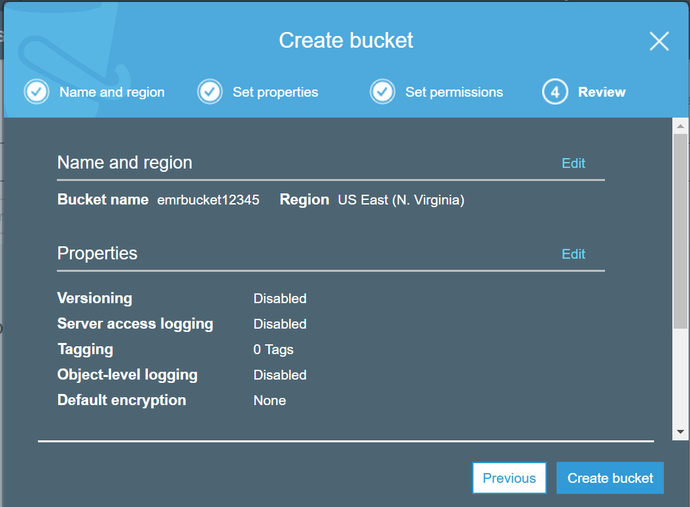
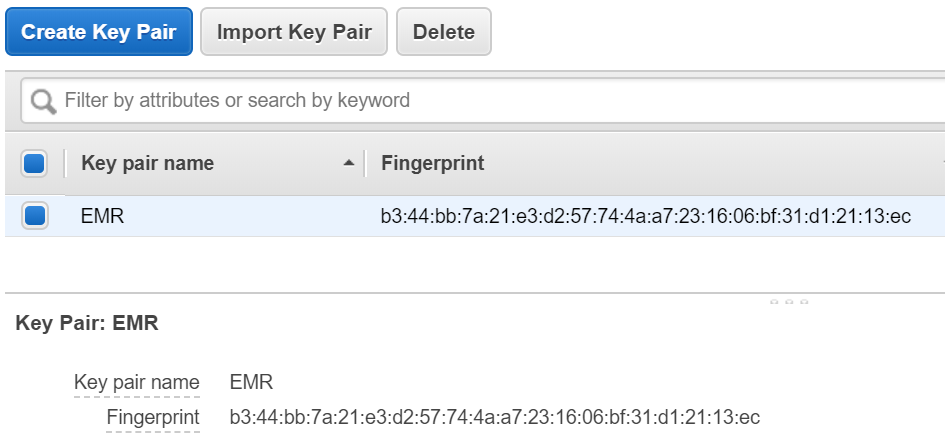
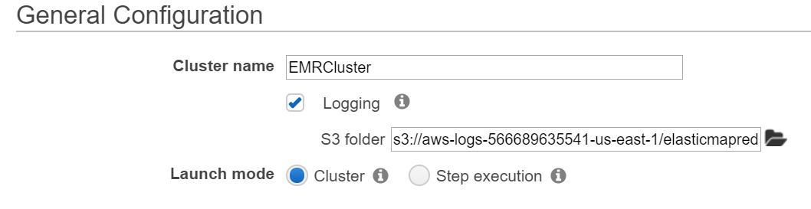
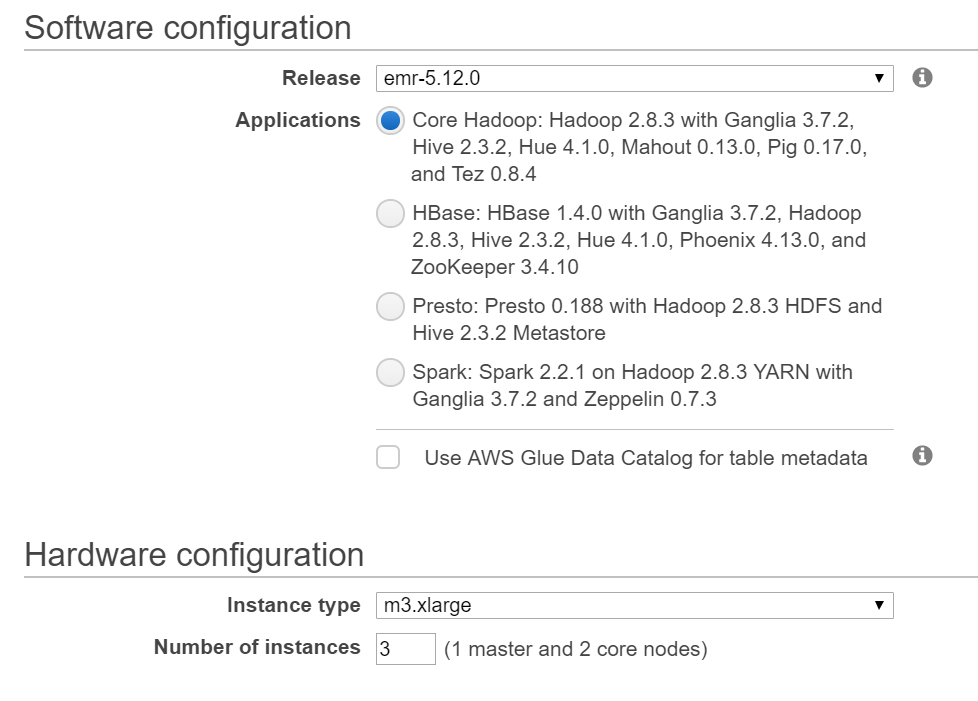
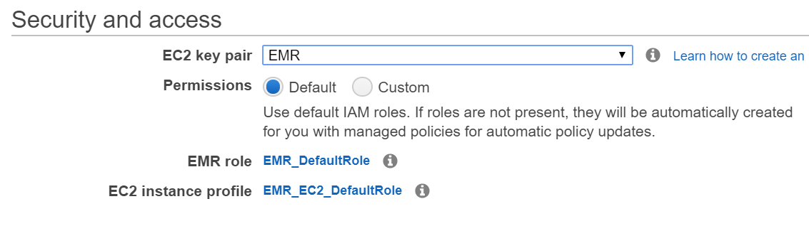
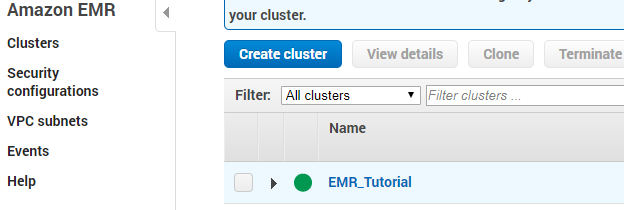
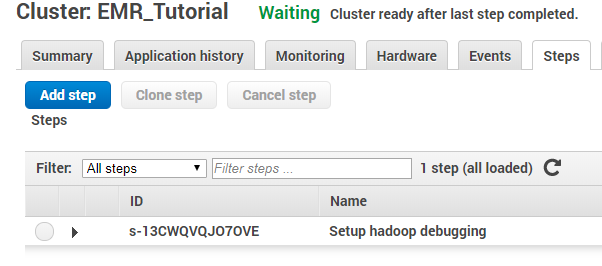
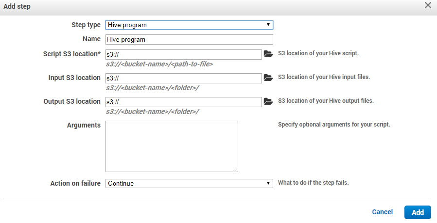
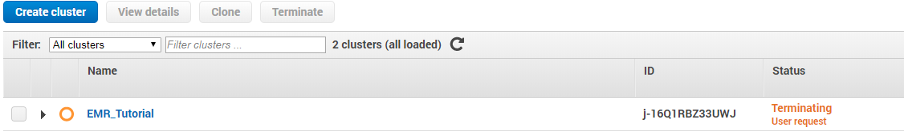
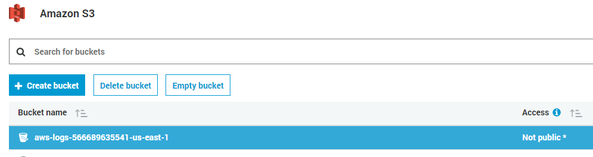

# Amazon EMR :o: :hand: fa-18-516-22

Amazon EMR is a Hadoop framework that allows users to process data on
the AWS platform using their EC2 technology to spread the load across
multiple EC2 instances. Elasticity a major benefit of EMR as it can be
set to auto scale up or down the number of EC2 instances that EMR is
running in a cluster. The user can choose to run additional frameworks
supported on EMR in addition to Hadoop, such as Spark, HBase, Flink and
Presto. The platform allows the user to focus on the processing of the
data and not have to deal with the setup, management or tuning of a
Hadoop cluster. Using EMR allows a user to setup and provision a cluster
quickly and allows for scalability of compute resources up or down and
in or out as needed. Interactions with EMR can occur through a web
service interface or by using the AWS Management Console to launch and
monitor clusters. In this section, setup and configuration of an EMR
cluster will be done through the AWS Management Console.

## Prerequisites

Before proceeding with any steps to create an EMR cluster, you need to
ensure that you have an AWS account setup. If not, you need to have one
created before continuing with this section. Afterwards, sign into the
AWS Management Console. There are two prerequisites that need to be met
before being able to launch an EMR cluster, setup an S3 bucket and an
EC2 key pair. The S3 bucket you create will be used for storing the EMR
logs and any output data produced by your EMR cluster. Bucket names have
several constraints that need to be met due to Hadoop requirements such
as only consisting of lowercase letters, numbers, periods, hyphens and
also cannot end in numbers [@hid-sp18-521-prereq]. In order to create
the S3 bucket, go to S3 section of the AWS Management Console and select
the 'Create bucket' button. Fill in the requested information for bucket
name and region, then proceed to the next two pages to enter in the
bucket properties and permissions. After those sections, a review page
will be presented for your review and if you are satisfied with your
selections, click 'Create bucket' [@hid-sp18-521-s3bucket].

After the S3 bucket has been created, an EC2 key pair then needs to be
generated which allows you to connect to your EMR cluster over SSH. If
you already have an existing EC2 key pair that can be used for this
section as well. In order to generate an EC2 key pair through the AWS
Management Console, search and navigate to the EC2 section from the
console home page. In the pane on the left side of the screen, look for
the 'Network and Security' section and select the 'Key Pairs' option. On
the next page select 'Create Key Pair' button and type in a name you
want to give this key pair. After you select the key name click 'Create'
and your EC2 key pair wil be automatically downloaded by the browser and
named with a pem extension. Save the key file generated in a safe
location for use later on as this is the only time you will be able to
save this key file. It will need to be used when you need to launch and
connect to the EC2 instances created by EMR [@hid-sp18-521-ec2keypair].

## Configuring and Utilizing the Cluster with AWS Management Console

Once all the prerequisites above have been met, an EMR cluster can now
be created. In the AWS Management Console home page, enter in 'EMR' in
the AWS services search box at the top of the page and select the EMR
option that it returns. You will be taken to the EMR home page. At the
top of this page is a button labeled 'Create cluster'. Click this button
and you will be brought to the screen where you can select cluster
creation options. By default, it brings up the quick options page which
allows you to select basic options needed to setup and configure an EMR
cluster. There is also an option to show advanced options that can be
used for cluster creation at the top of the page. Stay on the quick
options page for now and enter in the cluster name, which is optional.
You then select if you would like to enable logging. If so, you can then
select a location in S3 where you would like the logs to be placed.
There are then two options to choose from for launch mode: cluster or
step execution. The cluster option can be used for EMR clusters that you
want to remain online indefinitely. The step execution option would be
used for when you want to execute a set of predefined steps upon cluster
creation and once those steps complete successfully, shut down the
cluster [@hid-sp18-521-emrlaunch].

Once launch mode is selected, scroll down to the 'Software
configuration' section and choose an EMR release version. The most
current version is selected by default. If you chose a cluster launch
mode, then proceed to selecting one of the 4 predefined sets of
applications you want to install based on your use case. If step
execution was selected instead of cluster, then the core Hadoop install
is the only application option you can use here. Now move on to the
'Hardware configuration' and select the EC2 instance type and number of
EC2 instances you would like to utilize for your cluster. he values
selected here will vary on what type of data processing you're looking
to achieve. Then scroll down to the 'Security and access' section of the
page and select the key pair generated in the steps above in the
drop-down menu. Below that you can then select which permissions model
to u se: default or custom. The default option sets up permissions for
your EMR cluster that are granted using policies applied to EMR specific
IAM roles. Using the custom option allows you to select existing IAM
roles to apply permissions to instead of creating new roles. Once all of
this information has been selected, the cluster is then ready to be
launched by selecting the 'Create cluster' button at the bottom of the
page. Your cluster will then be launched and ready for
workloads [@hid-sp18-521-emrlaunch].

If you've selected cluster launch mode, ad-hoc processing of data can
now occur on cluster. To get started go to the EMR console page. From
here you can then select the 'Clusters' menu on the left side of the
screen which will then show you a list of current EMR clusters you have
setup. Click on the name of the cluster you would like to run processing
steps on and then navigate over to the 'Steps' tab on the following
page. You show see a button named 'Add step' which you can then select
to setup the type of step you would like to run for data processing. The
step types available to create vary based on the applications that were
installed during the creation of the cluster. In this example, only the
core Hadoop applications were installed, so the step types are limited
to custom JAR, Hive, Pig and streaming programs. Each step type then has
a set of parameters that need to be populated before the step can be
created. After you've decided on a step type and have populated all of
the required step parameters, click the 'Add' button which will then
create and run the step on the cluster. This process can be repeated as
needed and there are additional ways to submit up to 256 active steps
that can be explored but is beyond the scope of this
section [@hid-sp18-521-emrprocess].

## Teardown

Once completing the steps in the section, it is recommended that you
cleanup what you've created in order to avoid high costs of usage. The
S3 bucket you created along with the EMR cluster itself will need to be
removed. Start with the termination of the cluster by going to main EMR
page and selecting the 'Cluster' option on the left. Select the check
box for the name of the cluster you wish to terminate and click the
'Terminate' button. It will them prompt you to confirm this clusters
termination which you will verify and continue. This will place the
cluster in a 'Terminating' state and eventually move to a 'Terminated'
state. Terminated clusters will remain viewable in the console for two
months. You can then proceed to the S3 console page. Before you can
delete buckets, you have to delete all of the folders and files
contained within that bucket. To do this, click on the bucket name which
will then show the subfolders contained within the bucket. Check the box
next to all of the subfolder names, select the 'More' button in the menu
above and from that menu select 'Delete'. Once all of the folders and
files are gone, navigate back to the main S3 page, click the row of the
bucket name you wish to delete and select the 'Delete' button. You will
then be prompted to enter the name of the bucket you wish to delete and
select the 'Confirm' button before the deletion occurs. Once your EMR
cluster has been successfully terminated and all buckets created during
the section have been deleted, you can then be certain that no
additional costs will continue to accrue based on the work performed in
this section [@hid-sp18-521-emrreset].

