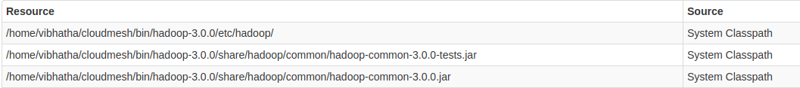

# Installation of Spark

In this section we will discuss how to install Spark 2.3.2 in Ubuntu 18.04.

Prerequisites
------------

We assume that you have ssh, and rsync installed and use emacs as
editor.

    sudo apt-get install ssh
    sudo apt-get install rsync
    sudo apt-get install emacs

Installation of Java
--------------------

First download Java 8.

    mkdir -p ~/cloudmesh/bin
    cd ~/cloudmesh/bin
    wget -c --header "Cookie: oraclelicense=accept-securebackup-cookie" "http://download.oracle.com/otn-pub/java/jdk/8u161-b12/2f38c3b165be4555a1fa6e98c45e0808/jdk-8u161-linux-x64.tar.gz"
    tar xvzf jdk-8u161-linux-x64.tar.gz

Then add the environmental variables to the bashrc file.

    emacs ~/.bashrc

    export JAVA_HOME=~/cloudmesh/bin/jdk1.8.0_161
    export PATH=$JAVA_HOME/bin:$PATH

Source the bashrc file after adding the environmental variables.

      source ~/.bashrc

Install Spark with Hadoop
-------------------------

Here we use Spark packaged with Hadoop. In this package Spark uses
Hadoop 2.7.0 in the packaged version. Note that in
Section [Hadoop Installation](#s:s-hadoop-installation) we use for the vanilla Hadoop
installation Hadoop 3.0.1.

Create the base directories and go to the directory.

    mkdir -p ~/cloudmesh/bin
    cd ~/cloudmesh/bin

Then download Spark 2.3.2 as follows.

    wget https://archive.apache.org/dist/spark/spark-2.3.2/spark-2.3.2-bin-hadoop2.7.tgz

Now extract the file,

    tar xzf spark-2.3.2-bin-hadoop2.7.tgz
    mv spark-2.3.2-bin-hadoop2.7 spark-2.3.2

Spark Environment Variables
---------------------------

Open up bashrc file and add environmental variables as follows.

    emacs ~/.bashrc  

Go to the last line and add the following content.

    export SPARK_HOME=~/cloudmesh/bin/spark-2.3.2
    export PATH=$SPARK_HOME/bin:$PATH

Source the bashrc file.

    source ~/.bashrc

Test Spark Installation
-----------------------

Open up a new terminal and then run the following command.

    spark-shell

If it has been configured properly, it will display the following
content.

```
    Spark context Web UI available at http://192.168.1.66:4041
    Spark context available as 'sc' (master = local[*], app id = local-1521674331361).
    Spark session available as 'spark'.
    Welcome to
          ____              __
         / __/__  ___ _____/ /__
        _\ \/ _ \/ _ `/ __/  '_/
       /___/ .__/\_,_/_/ /_/\_\   version 2.3.2
          /_/

    Using Scala version 2.11.8 (Java HotSpot(TM) 64-Bit Server VM, Java 1.8.0_151)
    Type in expressions to have them evaluated.
    Type :help for more information.
```

Please check the console LOGS and find the port number on which the
Spark Web UI is hosted. It will show something like:

Spark context Web UI available at: \<some url\>

Then take a look the following address in the browser.

    http://localhost:4041

If you see the Spark Dashboard, then you can realize you have installed
Spark successfully.

Install Spark With Custom Hadoop
--------------------------------

Installing Spark with pre-existing Hadoop version is favorable, if you
want to use the latest features from the latest Hadoop version or when
you need a specific Hadoop version depending on the external
dependencies to your project.

First we need to download the Spark packaged without Hadoop.

      mkdir -p ~/cloudmesh/bin
      cd ~/cloudmesh/bin

Then download Spark 2.3.2 as follows.

    wget https://archive.apache.org/dist/spark/spark-2.3.2/spark-2.3.2-bin-without-hadoop.tgz

Now extract the file,

      tar xzf spark-2.3.2-bin-without-hadoop.tgz  

Then add the environmental variables,

If you have already installed Spark with Hadoop by following section
[1.3](#s:s:install-spark-with-hadoop){reference-type="ref"
reference="s:s:install-spark-with-hadoop"} please update the current
SPARK HOME variable with the new path.

      emacs ~/.bashrc  

Go to the last line and add the following content.

    export SPARK_HOME=~/cloudmesh/bin/spark-2.3.2-bin-without-hadoop
    export PATH=$SPARK_HOME/bin:$PATH

Source the bashrc file.

    source ~/.bashrc

Configuring Hadoop
------------------

Now we must add the current Hadoop version that we are using for Spark.
Open up a new terminal and then run the following.

    cd $SPARK_HOME

      cd conf
      cp spark-env.sh.template spark-evn.sh

Now we need to add a new line to show the current path to hadoop
installation. Add the following variable in to the spark-env.sh file.

      emacs spark-env.sh
      export SPARK_DIST_CLASSPATH=$($HADOOP_HOME/bin/hadoop classpath)



Test Spark Installation
-----------------------

Open up a new terminal and then run the following command.

    spark-shell

If it has been configured properly, it will display the following
content.

```
    To adjust logging level use sc.setLogLevel(newLevel). For SparkR, use setLogLevel(newLevel).
    Spark context Web UI available at http://149-160-230-133.dhcp-bl.indiana.edu:4040
    Spark context available as 'sc' (master = local[*], app id = local-1521732740077).
    Spark session available as 'spark'.
    Welcome to
          ____              __
         / __/__  ___ _____/ /__
        _\ \/ _ \/ _ `/ __/  '_/
       /___/ .__/\_,_/_/ /_/\_\   version 2.3.2
          /_/

    Using Scala version 2.11.8 (Java HotSpot(TM) 64-Bit Server VM, Java 1.8.0_151)
    Type in expressions to have them evaluated.
    Type :help for more information.
```

Then take a look the following address in the browser.

    http://localhost:4040

Please check the console LOGS and find the port number on which the
Spark Web UI is hosted. It will show something like: Spark context Web
UI available at the `logs` folder
