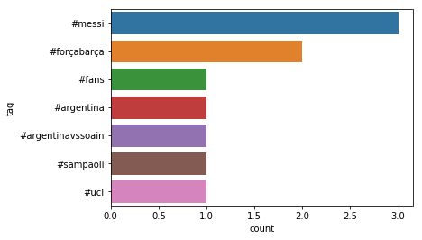
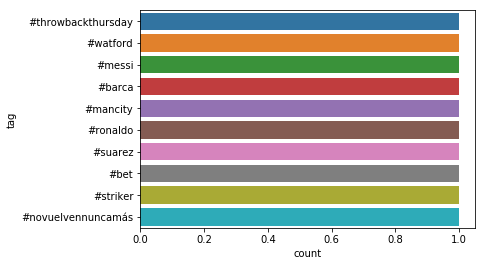

# Spark Streaming

Streaming Concepts
------------------

Spark Streaming is one of the components extending from Core Spark.
Spark streaming provides a scalable fault tolerant system with high
throughput. For streaming data into spark, there are many libraries like
Kafka, Flume, Kinesis, etc.

Simple Streaming Example
------------------------

In this section, we are going to focus on making a simple streaming
application using the network in your computer. Here we are going to
expose a particular port and from that port we are going to continuously
stream data by user entries and the word count is being calculated as
the output.

First, create a Makefile

      mkdir -p ~/cloudmesh/spark/examples/streaming
      cd ~/cloudmesh/spark/examples/streaming
      emacs Makefile

Then add the following content to Makefile.

Please add a tab when adding the corresponding command for a given
instruction in Makefile. In pdf mode the tab is not clearly shown.

      SPARKHOME = ${SPARK_HOME}
      run-streaming:
        ${SPARKHOME}/bin/spark-submit streaming.py localhost 9999

Now we need to create file called streaming.py

      emacs streaming.py

Then add the following content.

```python
    from pyspark import SparkContext
    from pyspark.streaming import StreamingContext

    # Create a local StreamingContext with two working thread and batch interval of 1 second
    sc = SparkContext("local[2]", "NetworkWordCount")

    log4jLogger = sc._jvm.org.apache.log4j
    LOGGER = log4jLogger.LogManager.getLogger(__name__)
    LOGGER.info("Pyspark script logger initialized")

    ssc = StreamingContext(sc, 1)


    # Create a DStream that will connect to hostname:port, like localhost:9999
    lines = ssc.socketTextStream("localhost", 9999)
    # Split each line into words
    words = lines.flatMap(lambda line: line.split(" "))
    # Count each word in each batch
    pairs = words.map(lambda word: (word, 1))
    wordCounts = pairs.reduceByKey(lambda x, y: x + y)

    # Print the first ten elements of each RDD generated in this DStream to the console
    wordCounts.pprint()
    ssc.start()             # Start the computation
    ssc.awaitTermination(100)  # Wait for the computation to terminate
```

To run the code, we need to open up two terminals.

`Terminal 1 :`

First use netstat to open up a port to start communication.

      nc -lk 9999

`Terminal 2 :`

Now run the Spark programme in the second terminal.

      make run-streaming

In this terminal you can see an script running trying to read the stream
coming from the port 9999. You can enter texts in the Terminal 1 and
these texts will be tokenized and the word count is calculated and the
result is shown in the Terminal 2.

Spark Streaming For Twitter Data
--------------------------------

In this section we are going to learn how to use Twitter data as the
streaming data source and use Spark Streaming capabilities to process
the data. As the first step you must install the python packages using
pip.

### Step 1

      sudo pip install tweepy

### Step 2

Then you need to create an account in Twitter Apps. Go to and sign in to
your twitter account or create a new twitter account. Then you need to
create a new application, let's name this application as
`Cloudmesh-Spark-Streaming`.

First you need to create an app with the app name we suggested in this
section. The way to create the app is mentioned in Figure
[\[fig:twitter-app\]](#fig:twitter-app){reference-type="ref"
reference="fig:twitter-app"}.

[\[fig:twitter-app\]]{#fig:twitter-app label="fig:twitter-app"} {width="100%"}

Next we need to to take a look at the dashboard created for the app. You
can see how your dashboard looks like in Figure
[\[fig:twitter-app-dashboard\]](#fig:twitter-app-dashboard){reference-type="ref"
reference="fig:twitter-app-dashboard"}.

[\[fig:twitter-app-dashboard\]]{#fig:twitter-app-dashboard
label="fig:twitter-app-dashboard"} {width="100%"}

Next the application tokens generated must be reviewed and it can be
found in Figure
[\[fig:twitter-app-token\]](#fig:twitter-app-token){reference-type="ref"
reference="fig:twitter-app-token"}, you need to go to the
`Keys and Access Tokens` tab.

[\[fig:twitter-app-token\]]{#fig:twitter-app-token
label="fig:twitter-app-token"} {width="100%"}

Now you need to generate the access tokens for the first time if you
have not generated access tokens and this can be done by clicking the
`Create my access token` button.

[\[fig:twitter-app-access-token\]]{#fig:twitter-app-access-token
label="fig:twitter-app-access-token"} {width="100%"}

The access tokens and keys are blurred in this section for privacy
issues.

### Step 3

Let us build a simple Twitter App to see if everything is okay.

      mkdir -p ~/cloudmesh/spark/streaming
      cd ~/cloudmesh/spark/streaming
      emacs twitterstreaming.py

Add the following content to the file and make sure you update the
corresponding token keys with your token values.

```python
    import tweepy

    CONSUMER_KEY = 'your_consumer_key'
    CONSUMER_SECRET = 'your_consumer_secret'
    ACCESS_TOKEN = 'your_access_token'
    ACCESS_TOKEN_SECRET = 'your_access_token_secret'

    auth = tweepy.OAuthHandler(CONSUMER_KEY, CONSUMER_SECRET)
    auth.set_access_token(ACCESS_TOKEN, ACCESS_TOKEN_SECRET)
    api = tweepy.API(auth)

    status = "Testing!"
    api.update_status(status=status)
```

```
      python twitterstreaming.py
```

### Step 4

Let us start the twitter streaming exercise. We need to create a Tweet
Listener in order to retrieve data from twitter regarding a topic of
your choice. In this exercise, we have tried keywords like
`trump, indiana, messi`.

      mkdir -p ~/cloudmesh/spark/streaming
      cd ~/cloudmesh/spark/streaming
      emacs tweetlistener.py

Make your to replace strings related to secret keys and ip addresses by
replacing these values depending on your machine configuration and
twitter keys.

Now add the following content.

```python
    import tweepy
    from tweepy import OAuthHandler
    from tweepy import Stream
    from tweepy.streaming import StreamListener
    import socket
    import json

    CONSUMER_KEY = 'YOUR_CONSUMER_KEY'
    CONSUMER_SECRET = 'YOUR_CONSUMER_SECRET'
    ACCESS_TOKEN = 'YOUR_ACCESS_TOKEN'
    ACCESS_SECRET = 'YOUR_SECRET_ACCESS'

    class TweetListener(StreamListener):

      def __init__(self, csocket):      
          self.client_socket = csocket

      def on_data(self, data):
          try:
              msg = json.loads( data )
              print( msg['text'].encode('utf-8') )
              self.client_socket.send( msg['text'].encode('utf-8') )
              return True
          except BaseException as e:
              print("Error on_data: %s" % str(e))
          return True

      def on_error(self, status):
          print(status)
          return True

    def sendData(c_socket):
      auth = OAuthHandler(CONSUMER_KEY, CONSUMER_SECRET)
      auth.set_access_token(ACCESS_TOKEN, ACCESS_SECRET)

      twitter_stream = Stream(auth, TweetListener(c_socket))
      twitter_stream.filter(track=['messi']) # you can change this topic

    if __name__ == "__main__":
      s = socket.socket()         
      host = "YOUR_MACHINE_IP"      
      port = 5555              
      s.bind((host, port))     

      print("Listening on port: %s" % str(port))

      s.listen(5)              
      c, addr = s.accept()     

      print( "Received request from: " + str( addr ) )

      sendData( c )
```

### step 5

Please replace the local file paths mentioned in this code with a file
path of your preference depending on your workstation. And also IP
address must be replaced with your ip address. The log folder path must
be pre-created and make sure to replace the `registerTempTable` name with
respect to the entity that you are referring. This will minimize the
conflicts among different topics when you need to plot it in a simple
manner.

Add the following content to the IpythonNote book as follows

Open up a terminal,

      cd ~/cloudmesh/spark/streaming
      jupyter notebook

Then in the browser the jupyter notebook is being loaded. There create a
new IPython notebook called twittersparkstremer.

Then add the following content.

```
    from pyspark import SparkContext
    from pyspark.streaming import StreamingContext
    from pyspark.sql import SQLContext
    from pyspark.sql.functions import desc

    sc = SparkContext('local[2]','twittersparkstreamer')

    ssc = StreamingContext(sc, 10 )
    sqlContext = SQLContext(sc)
    ssc.checkpoint( "file:///home/<your-username>/cloudmesh/spark/streaming/logs/messi")

    socket_stream = ssc.socketTextStream("YOUR_IP_ADDRESS", 5555)

    lines = socket_stream.window( 20 )

    from collections import namedtuple
    fields = ("tag", "count" )
    Tweet = namedtuple( 'Tweet', fields )

    ( lines.flatMap( lambda text: text.split( " " ) )
      .filter( lambda word: word.lower().startswith("#") )
      .map( lambda word: ( word.lower(), 1 ) )
      .reduceByKey( lambda a, b: a + b )
      .map( lambda rec: Tweet( rec[0], rec[1] ) )
      .foreachRDD( lambda rdd: rdd.toDF().sort( desc("count") )
                  .limit(10).registerTempTable("tweetsmessi") ) )#change table name depending on your entity

    sqlContext

    <pyspark.sql.context.SQLContext at 0x7f51922ba350>

    ssc.start()  

    import matplotlib.pyplot as plt
    import seaborn as sn

    import time
    from IPython import display


    count = 0
    while count < 10:
      time.sleep( 20 )
      top_10_tweets = sqlContext.sql( 'Select tag, count from tweetsmessi' ) #change table name according to your entity
      top_10_df = top_10_tweets.toPandas()
      display.clear_output(wait=True)  
      #sn.figure( figsize = ( 10, 8 ) )
      sn.barplot( x="count", y="tag", data=top_10_df)
      plt.show()
      count = count + 1

    ssc.stop()
```

### step 6

Open `Terminal 1`, then do the following

      cd ~/cloudmesh/spark/streaming
      python tweetslistener.py

It will show that:

         Listening on port: 5555

Open `Terminal 2`

Now we must start the Spark app by running the content in the IPython
Notebook by pressing `SHIFT-ENTER` in each box to run each command. Make
sure not to run twice the starting command of the SparkContext or
initialization of SparkContext.

Now you will see streams in the `Terminal 1` and you can see plots after
a while in the IPython Notebook.

Sample outputs can be seen in the Figures
[\[fig:twitter-out-1\]](#fig:twitter-out-1){reference-type="ref"
reference="fig:twitter-out-1"},
[\[fig:twitter-out-2\]](#fig:twitter-out-2){reference-type="ref"
reference="fig:twitter-out-2"},
[\[fig:twitter-out-3\]](#fig:twitter-out-3){reference-type="ref"
reference="fig:twitter-out-3"},
[\[fig:twitter-out-4\]](#fig:twitter-out-4){reference-type="ref"
reference="fig:twitter-out-4"}.

[\[fig:twitter-out-1\]]{#fig:twitter-out-1 label="fig:twitter-out-1"}
{width="100%"}

[\[fig:twitter-out-2\]]{#fig:twitter-out-2 label="fig:twitter-out-2"}
{width="100%"}

[\[fig:twitter-out-3\]]{#fig:twitter-out-3 label="fig:twitter-out-3"}
{width="100%"}

[\[fig:twitter-out-4\]]{#fig:twitter-out-4 label="fig:twitter-out-4"}
{width="100%"}
