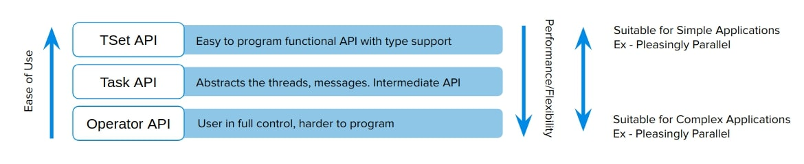

# Twister2

## Introduction

Twister2[@www-twister2-docs] provides a data analytics hosting environment where it supports different data analytics including streaming, 
data pipelines and iterative computations. The functionality of Twister2 is similar to other Big data frameworks
such as Apache Spark and Apache Flink. But there are a few key differences which differentiates Twister2 from other
frameworks. Unlike many other big data systems that are designed around user APIs, Twister2 is built from bottom up to 
support different APIs and workloads. The aim of Twister2 is to develop a complete computing environment for data 
analytics.

One major goal of Twister2 is to provide independent components, that can be used by other big data systems and evolve
separately. To this end Twister2 supports a composable architecture where developers can easily replace a small component
in the system with a new implementation very easily. For example the resource scheduling layer has several implementations
it supports, Kubernetes, Mesos, Slurm, Nomad and a standalone implementation, If a user wants to add support for
another resources scheduler such as Yarn they can easily do so by implementing the well defined interfaces.

Twister2 supports both batch and streaming applications. Unlike other big data frameworks which either support batch or
streaming in the core and develop the other on top of that, Twister2 natively supports both batch and streaming. Which
allows Twister2 to make separate optimizations for each type.

Twister2 project is still less than 2 years old and still in it's early stages and going through rapid development to 
complete its functionality. It is an Open Source project which is licenced under the Apache 2.0[@www-twister2-git]

## Twister2 API's

Twister2 provides users with 3 levels on API's which can be used to write applications. The 3 API levels are shown
in Figure @fig:twister2-apis. 

{#fig:twister2-apis}

As shown in @fig:twister2-apis each API level has different levels of abstraction and programming complexities. TSet API
is the most high level in Twister2 which in someways is simlar to the RDD API in Apache Spark or DataSet API in Apache Flink.
If the user wants more control over the application development they can opt to use a more lower level API's.

### TSet API

TSet API is the most abstract API provided by Twister2. This allows user to develop their programs at the data layer,
similar to the programming model of Apache Spark. Similar to RDD in Spark users can perform operations on top of TSet
objects which will be automatically parallelized by the framework. To get a slight understanding of the Tset API take a 
look at the abstract example given on how TSet API can be used to implement KMeans algorithm.

```java
public class KMeansJob extends TaskWorker {
    //......
    @Override
    public void execute() {
        //.....
        TSet<double[][]> points = TSetBuilder.newBuilder(config).createSource(new Source<double[][]>() {
            //Code for source function to read data points
        }).cache();

        TSet<double[][]> centroids = TSetBuilder.newBuilder(config).createSource(new Source<double[][]>() {
            //Code for source function to read centers (or generate random centers)
        }).cache();

        for (
                int i = 0;
                i < iterations; i++) {
            TSet<double[][]> KmeansTSet = points.map(new MapFunction<double[][], double[][]>() {
                //Code for Kmeans calculation, this will have access to the centroids which are passed in
            });
            KmeansTSet.addInput("centroids", centroids);

            Link<double[][]> allReduced = KmeansTset.allReduce();
            TSet<double[][]> newCentroids = allReduced.map(new MapFunction<double[][], Object>() {
            /* Code that produces the new centers for the next iteration. The allReduce will result in
             a sum or all the centers sent by each worker so this map function simply needs to compute the
             average to get the new centers
             */
            });
            centroids.override(newCentroids);
        }
        //.....
    }
}
```

When programming at the TSet API level the developer does need to handle any information related to task and
communications. 

Note: The TSet API is currently under development and has not been released yet and therefore the API may change from 
what was discussed in this section, anyone who is interested can follow the development progress or contribute to the 
project through the GitHub repo[@www-twister2-git].

### Task API

The Task API allows developers to create their application at the Task level. The developer is responsible of managing 
task level details when developing at this API level, the upside of using the Task API is that it is more flexible than
the TSet API so it allows developers to add custom optimizations to the application code. The TSet API is built on top 
of the Task API therefore the added layer of abstraction is bound to add slightly more overheads to the runtime, which 
you might be able to avoid by directly coding at the Task API level.

To get a better understanding of the Task API take a look at how the classic map reduce problem word count is 
implemented at using the Task API in the following code segment. This is only a portion of the example code, you can
find the complete code for the example at[@www-twister2-task-wordcount]. 


```java
public class WordCountJob extends TaskWorker {
//.....
  @Override
  public void execute() {
    // source and aggregator
    WordSource source = new WordSource();
    WordAggregator counter = new WordAggregator();

    // build the task graph
    TaskGraphBuilder builder = TaskGraphBuilder.newBuilder(config);
    builder.addSource("word-source", source, 4);
    builder.addSink("word-aggregator", counter, 4).keyedReduce("word-source", EDGE,
        new ReduceFn(Op.SUM, DataType.INTEGER), DataType.OBJECT, DataType.INTEGER);
    builder.setMode(OperationMode.BATCH);

    // execute the graph
    DataFlowTaskGraph graph = builder.build();
    ExecutionPlan plan = taskExecutor.plan(graph);
    taskExecutor.execute(graph, plan);
  }
  //.....
}
```

More Task API examples can be found in Twister2 documentations[@www-twister2-task-examples].

## Operator API

The lowest level API provided by Twister2 is the Operator API, this allows developers to develop applications at the
communication level. However since this API only abstracts out communication operations, details such as task management
need to be handled by the application developer. Again similar to the Task API this provides the developer with more
flexibility to create more optimized applications, at the cost of being harder to program. Twister2 supports a variety of
communication patterns, known as collective communications in the HPC world. These communications are highly optimized 
using various routing patterns to reduce the number of communication calls that go through the network to provide users
with a extremely efficient Operator API. The following list show the communication operations that are supported by Twister2.
You can find more information on each or these operations in the Twister2 documentation[@www-twister2-comms-model].

* Reduce
* Gather
* AllReduce
* AllGather
* Partition
* Broadcast
* Keyed Reduce
* Keyed Partition
* Keyed Gather

Initial Performance comparisons that are discussed in[@kamburugamuve2018twister] show how Twister2 out performs
popular frameworks such Apache Flink, Apache Spark and Apache Strom in many areas. For example the @fig:twister-kmeans-perf
shows a comparision between Twister2, MPI and Apache Spark versions of KMeans algorithm, please note that the graph is in
logarithmic scale

![Kmeans Performance Comparison[@twister-kmeans-perf]](images/kmeans_comparison.jpg){#fig:twister-kmeans-perf}

Notation :
* **DFW** refers to Twister2
* **BSP** refers to MPI (OpenMPI)

This shows that Twister2 performs around ~10x faster than Apache Spark for KMeans. And that it is on par with implementations
done using OpenMPI which is a widely used HPC framework. 

### Resources

-   <http://www.iterativemapreduce.org/>

-   <http://www.cs.allegheny.edu/sites/amohan/teaching/CMPSC441/paper10.pdf>

-   <https://twister2.gitbook.io/twister2/>

-   <http://dsc.soic.indiana.edu/publications/Twister2.pdf>

-   <https://www.computer.org/csdl/proceedings/cloud/2018/7235/00/723501a383-abs.html>
