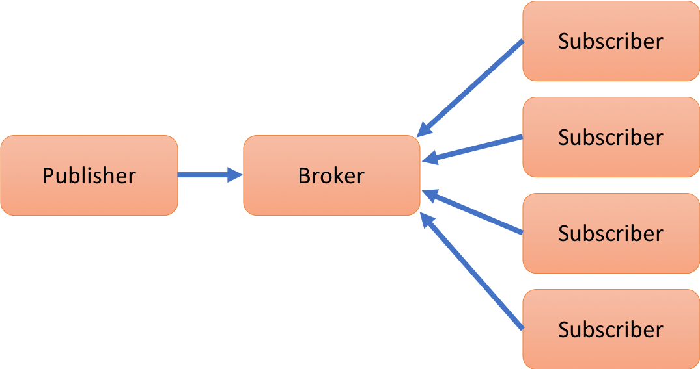

# MQTT


With the increase importance of cloud computing and the increased number
of edge devices and their applications, such as sensor networks, it is
crucial to enable fast communication between the sensing devices and
actuators, which may not be directly connected, as well as cloud
services that analyze the data. To allow services that are built on
different software and hardware platforms to communicate, a data
agnostic, fast and service is needed. In addition to communication, the
data generated by these devices, services, and sensors must be analyzed.
Security aspects to relay this data is highly important. We will
introduce a service called MQTT, which is a common, easy to use, queuing
protocol that helps meet these requirements.

## Introduction

As Cloud Computing and Internet of Things (IoT) applications and sensor
networks become commonplace and more and more devices are being
connected, there is an increased need to allow these devices to
communicate quickly and securely. In many cases these edge devices have
very limited memory and need to conserve power. The computing power on
some of these devices is limited so that the sensory data need to be
analyzed remotely. Furthermore, they may not even have enough computing
capacity to process traditional HTTP web requests
efficiently [@mqtt-vs-http][@hivemq-website] or these traditional
Web-based services are too resource hungry. Monitoring the state of a
remotely located sensor using HTTP would require sending requests and
receiving responses to and from the device frequently, which may not be
efficient on small circuits or embedded chips on edge computing
sensors [@mqtt-vs-http].

*Message Queue Telemetry Transport* (MQTT) is a lightweight machine to
machine (M2M) messaging protocol, based on a client/server
publish-subscribe model. It provides a a simple service allowing us to
communicate between sensors, and services based on a subscription model.

MQTT was first developed in 1999 to connect oil pipelines
[@hivemq-website]. The protocol has been designed to be used on top of
TCP/IP protocol in situations where network bandwidth, and available
memory are limited allowing low power usage. However, as it is
implemented on top of TCP/IP it is reliable in contrast to other
protocols such as UDP. It allows efficient transmission of data to
various devices listening for the same event, and is scalable as the
number of devices increase [@mqtt-wiki][@mqtt-official].

MQTT is becoming more popular than ever before
with the increasing use of mobile device and smartphone applications
such as Facebook's Messenger and Amazon Web Services. This protocol is
used in WIFI or low bandwidth network. MQTT does not require any
connection with the content of the message.

The current support for MQTT is conducted as part of the Eclipse Phao
project [@eclipse-mosquitto]. As MQTT is a protocol many different
clients in various languages exist. This includes languages such as
Python, C, Java, Lua, and many more.

The current standard of MQTT is available at

<http://docs.oasis-open.org/mqtt/mqtt/v3.1.1/os/mqtt-v3.1.1-os.pdf>

## Publish Subscribe Model

MQTT works via a publish-subscribe model that contains 3 entities: (1) aRaspberry Pi
publisher, that sends a message, (2) a broker, that maintains queue of
all messages based on topics and (3) multiple subscribers that subscribe
to various topics they are interested in [@how-mqtt-works].



**Figure:** MQTT publish subscriber model

This allows for decoupling of functionality at various levels. The
publisher and subscriber do not need to be close to each other and do
not need to know each others identity. They need only to know the
broker, as the publisher and the subscribers do not have to be running
either at the same time nor on the same hardware [@hivemq-details].

Ready to use implementation exist to be deployed as brokers in the users
application frameworks. A broker is a service that relays information
between the client and servers. Common brokers include the open source
Mosquito broker [@mqtt-official] and the Eclipse Phao MQTT
Broker [@eclipse-mosquitto].

### Topics

MQTT implements a hierarchy of topics that are relates to all messages.
These topics are recognised by strings separated by a forward-slash (/),
where each part represents a different topic level. This is a common
model introduced in file systems but also in internet URLs.

A topic looks therefore as follows:

```
topic-level0/topic-level1/topic-level2.
```

Subscribers can subscribe to different topics via the broker.
Subscribing to `topic-level0` allows the subscriber to receive all
messages that are associated with topics that start with `topic-level0`.
This allows subscribers to filter what messages to receive based on the
topic hierarchy. Thus, when a publisher publishes a message related to a
topic to the broker, the message is forwarded to all the clients that
have subscribed to the topic of the message or a topic that has a lower
depth of hierarchy [@hivemq-details] [@how-mqtt-works].

This is different from traditional point-to-point message queues as the
message is forwarded to multiple subscribers, and allows for flexibility
of dealing with subscribed topics not only on the server but also on the
subscriber side [@hivemq-details]. The basic steps in a MQTT client
subscriber application include to (1) connect to the broker, (2)
subscribe to some topics, (3) wait for messages and (4) perform the
appropriate action when a certain message is received [@mqtt-wiki].

### Callbacks

One of the advantages of using MQTT is that it supports asynchronous
behaviour with the help of callbacks. Both the publisher and subscriber
can use non-blocking callbacks to act upon message exchanges.
[@hivemq-details][@python-paho-mqtt].

For example, the paho-mqtt package for python provides callbacks methods
including `on-connect()`, `on-message()` and `on-disconnect()`, which
are invoked when the connection to the broker is complete, a message is
received from the broker, and when the client is disconnected from the
broker respectively. These methods are used in conjunction with the
`loop-start()` and `loop-end()` methods which start and end an
asynchronous loop that listens for these events invoking the relevant
callbacks. Hence it frees the services to perform other
tasks [@python-paho-mqtt] when no messages are available, thus reducing
overhead.

### Quality of Service

MQTT has been designed to be flexible allowing for the change of quality
of service (QoS) as desired by the application. Three basic levels of
QoS are supported by the protocol: Atmost-once (QoS level 0),
Atleast-once (QoS level 1) and Atmost-once (QoS level 2)
[@hivemq-qos; @python-paho-mqtt].

QoS level 0:

:   The QoS level of 0 is used in applications where some dropped
    messages may not affect the application. Under this QoS level, the
    broker forwards a message to the subscribers only once and does not
    wait for any acknowledgement [@hivemq-qos][@python-paho-mqtt].

QoS Level 1:

:   The QoS level of 1 is used in situations where the delivery of all
    messages is important and the subscriber can handle duplicate
    messages. Here the broker keeps on resending the message to a
    subscriber after a certain timeout until the first acknowledgement
    is received.

QoS Level 3:

:   A QoS level of 3 is used in cases where all messages must be
    delivered and no duplicate messages should be allowed. In this case
    the broker sets up a handshake with the subscriber to check for its
    availability before sending the
    message [@hivemq-qos; @python-paho-mqtt].

The various levels of quality of service allow the use of this protocol
with different service level expectations.

## Secure MQTT Services

MQTT specification uses TCP/IP to deliver the messaged to the
subscribers, but it does not provide security by default to enable
resource constrained IoT devices. "It allows the use of username and
password for authentication, but by default this information is sent as
plain text over the network, making it susceptible to man-in-the middle
attacks" [@iot-design-mqtt-security; @mqtt-sec-ssl]. Therefore, to
support sensitive applications additional security measures need to be
integrated through other means. This may include for example the use of
Virtual Private Networks (VPNs), Transport Layer Security, or
application layer security [@mqtt-sec-ssl].

### Using TLS/SSL

Transport Layer Security (TLS) and Secure Sockets Layer (SSL) are
cryptographic protocols that establish a the identity of the server and
client with the help of a handshake mechanism which uses trust
certificates to establish identities before encrypted communication can
take place [@ibm-mqtt-security]. If the handshake is not completed for
some reason, the connection is not established and no messages are
exchanged [@mqtt-sec-ssl]. "Most MQTT brokers provide an option to use
TLS instead of plain TCP and port 8883 has been standardized for secured
MQTT connections" [@iot-design-mqtt-security].

Using TLS/SSL security however comes at an additional cost. If the
connections are short-lived then most of the time is spent in verifying
the security of the handshake itself, which in addition to using time
for encryption and decryption, may take up few kilobytes of bandwidth.
In case the connections are short-lived, temporary session IDs and
session tickets can be used as alternative to resume a session instead
of repeating the handshake process. If the connections are long term,
the overhead of the handshake is negligible and TLS/SSL security should
be used [@iot-design-mqtt-security; @mqtt-sec-ssl].

### Using OAuth

OAuth is an open protocol that allows access to a resource without
providing unencrypted credentials to the third party. Although MQTT
protocol itself does not include authorization, many MQTT brokers
include authorization as an additional feature [@ibm-mqtt-security].
OAuth2.0 uses JSON Web Tokens which contain information about the token
ans the user and are signed by a trusted authorization
server [@hivemq-security-oauth].

When connecting to the broker this token can be used to check whether
the client is authorised to connect at this time or not. Additionally
the same validations can be used when publishing or subscribing to the
broker. The broker may use a third party resource such as LDAP
(lightweight directory access protocol) to look up authorizations for
the client [@hivemq-security-oauth]. Since there can be a large number
of clients and it can become impractical to authorize everyone, clients
may be grouped and the authorizations may be checked for each
group [@ibm-mqtt-security].

## Integration with Other Services

As the individual IoT devices perform their respective functions in the
sensor network, a lot of data is generated which needs to be processed.
MQTT allows easy integration with other services, that have been
designed to process this data. Let us provide some examples of MQTT
integration into other Services.

Apache Storm.

:   Apache storm is a distributed processing system that allows real
    time processing of continuous data streams, much like Hadoop works
    for batch processing [@apache-storm]. Apache storm can be easily
    integrated with MQTT as shown in [@apache-storm-mqtt] to get real
    time data streams and allow analytics and online machine learning in
    a fault tolerant manner [@apache-storm-wiki].

ELK stack.

:   ELK stack (elastic-search, logstash and kibana) is an opensource
    project designed for scalability which contains three main software
    packages, the *elastic-search* search and analytics engine,
    *logstash* which is a data collection pipeline and *kibana* which is
    a visualization dashboard [@elk-stack]. Data from an IoT network can
    be collected, analysed and visualized easily with the help of the
    ELK stack as shown in [@mqtt-elasticsearch-setup]
    and [@kibana-mqtt-analysis].

## MQTT in Production


When using optimized MQTT broker services, MQTT can be utilized for
enterprise and production environments. A good example is the use of EMQ
(Erlang MQTT Broker) that provides a highly scalable, distributed and
reliable MQTT broker for enterprise-grade applications
[@erlang-mqtt-broker].

## Installation

The installation of an MQTT server based on paho is very simple.

### MacOS install

On OSX yo need to first install mosquito, which is easiest to install with `brew`

Step 1: Installing Mosquito clients

Open a terminal and use homebrew to install mosquito and than you can install paho with pip

	brew install mosquitto
	pip install paho-mqtt
	
You need to start the mosquito service buy hand to use it.

### MacOS Advanced Service install

:warning: We recommend that this is only be done if you truly need a
production system. For our class you will not need this.
	
You can integrate mosquito service on boot, while adding it via
LaunchAgents. This can be achieved by linking it as follows:


	ln -sfv /usr/local/opt/mosquitto/*.plist ~/Library/LaunchAgents

Next you need to restart the server as follows:

	launchctl load ~/Library/LaunchAgents/homebrew.mxcl.mosquitto.plist

Now you can test the installation and ensure the server is running
successfully.  Open a new command window and start a listener.

	mosquitto_sub -t topic/state

To test teh setup you can in another window, send a message to the listener.

	mosquitto_pub -t topic/state -m "Hello World"

This ensures the server is running.

### Ubuntu install

On ubuntu you need to first install mosquito, than with pip you install `paho-mqt`

```
$ sudo apt-get install mosquitto mosquitto-clients
$ pip install paho-mqtt
```

### Raspberry Pi Setup :o:

#### Broker 

You will need to add the mosquito repository to the known repositories as follows:

    wget http://repo.mosquitto.org/debian/mosquitto-repo.gpg.key
    sudo apt-key add mosquitto-repo.gpg.key
    sudo wget http://repo.mosquitto.org/debian/mosquitto-jessie.list
    apt-get update

Mosquito is installed by implementing the following command:

    apt-get install mosquito


#### Client

The MQTT client needs to be installed on raspberry pi by running the
following command:

    apt-get install mosquitto-clients
    
## Server Usecase

In this example we are demonstrating how to set up a MQTT broker, a
client and a subscriber while just using regular servers and clients. 
The code of this example is located at:

* <https://github.com/bigdata-i523/sample-hid000/tree/master/experiment/mqtt>

A test program that starts a MQTT broker and client showcases how simple the interactions between the publisher and subscribers are while using a higher level
API such as provided through the python client library of Paho.

```
import paho.mqtt.client as mqtt 
import time


def on_message(client, userdata, message):
    print("message received ", 
          str(message.payload.decode("utf-8")))
    print("message topic=", message.topic)
    print("message qos=", message.qos)
    print("message retain flag=", message.retain)

def on_log(client, userdata, level, buf):
    print("log: ",buf)

broker_address="localhost"    
# broker_address="test.mosquitto.org"
# broker_address="broker.hivemq.com"
# broker_address="iot.eclipse.org"

print("creating new instance")
client = mqtt.Client("i523") #create new instance
client.on_log=on_log
client.on_message=on_message #attach function to callback

print("connecting to broker")
client.connect(broker_address) #connect to broker
client.loop_start() #start the loop

print("Subscribing to topic","robot/leds/led1")
client.subscribe("robot/leds/led1")

print("Publishing message to topic","robot/leds/led1")
client.publish("robot/leds/led1","OFF")

time.sleep(4) # wait
client.loop_stop() #stop the loop

```

## IoT Use Case with a Raspberry PI

MQTT can be used in a variety of applications. This section explores a
particular use case of the protocol. A small network was set up with
three devices to simulate an IoT environment, and actuators were
controlled with the help of messages communicated over MQTT.

The code for the project is available at

* <https://github.com/bigdata-i523/hid201/tree/master/experiment/mqtt>

### Requirements and Setup

The setup used three different machines. A laptop or a desktop running
the MQTT broker, and two raspberry pis configured with raspbian
operating system. Eclipse Paho MQTT client was setup on each of the
raspberry pis [@python-paho-mqtt]. Additionally all three devices were
connected to an isolated local network.

GrovePi shields for the raspberry pis, designed by Dexter Industries
were used on each of the raspberry pis to connect the actuators as they
allow easy connections ot the raspberry pi board [@grovepi]. The
actuators used were Grove relays [@grove-relay] and Grove LEDs
[@grove-led] which respond to the messages received via MQTT.

To control the leds and relays, the python library cloudmesh.pi
[@cloudmesh.pi], developed at Indiana University was used. The library
consists of interfaces for various IoT sensors and actuators and can be
easily used with the grove modules.

### Results

The two Raspberry Pis subscribe connect to the broker and subscribe with
different topics. The raspberry pis wait for any messages from the
broker. A publisher program that connects to the broker publishes
messages to the broker for the topics that the two raspberry pis had
registered. Each raspberry pi receives the corresponding message and
turns the LEDs or relays on or off as per the message.

On a local network this process happens in near real time and no delays
were observed. Eclipse IoT MQTT broker (*iot.eclipse.org*) was also
tried which also did not result in any significant delays.

Thus it is observed that two raspberry pis can be easily controlled
using MQTT. This system can be extended to incude arbitrary number of
raspberry pis and other devices that subscribe to the broker. If a
device fails, or the connection from one device is broken, other devices
are not affected and continue to perform the same.

This project can be extended to include various other kinds of sensors
and actuators. The actuators may subscribe to topics to which various
sensors publish their data ans respond accordingly. The data of these
sensors can be captured with the help of a data collector which may
itself be a different subscriber, that performs analytics or
visualizations on this data.

## Conclusion

We see that as the number of connected devices increases and their
applications become commonplace, MQTT allows different devices to
communicate with each other in a data agnostic manner. MQTT uses a
publish-subscribe model and allows various levels of quality of service
requirements to be fulfilled. Although MQTT does not provide data
security by default, most brokers allow the use of TLS/SSL to encrypt
the data. Additional features may be provided by the broker to include
authorization services. MQTT can be easily integrated with other
services to allow collection and analysis of data. A small environment
was simulated that used MQTT broker and clients running on raspberry pis
to control actuators

## Exercises

E.MQTT.1: 

> Develop a temperature broker, that collects the temperature from a
number of machines and clients can subscribe to the data and visualize
it.

E.MQTT.2:

> Develop a CPU load broker, that collects the cpu load from a number of
machines and clients can subscribe to the data and visualize it.

E.MQTT.3:

> Develop a broker with a variety of topics that collects data from a
Raspberry Pi or Raspberry PI cluster and visualize it.

E.MQTT.4:

> Explore hosted services for MQTT while at the same time remembering that
they could pose a security risk. Can any of the online services be used
to monitor a cluster safely?
