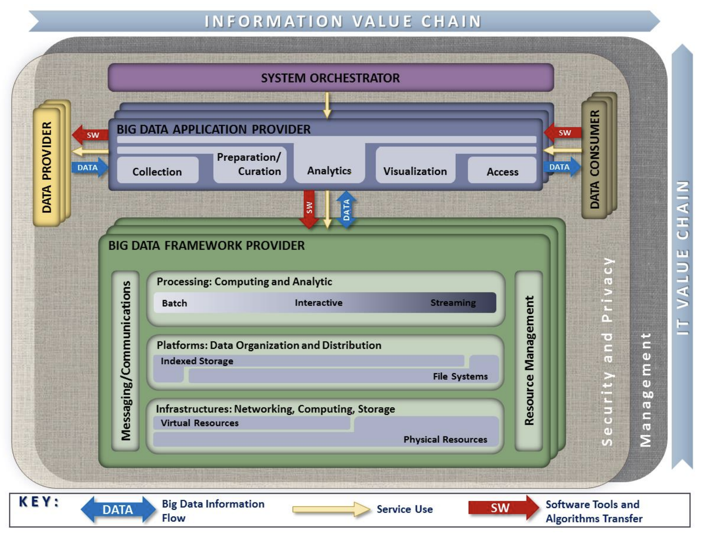
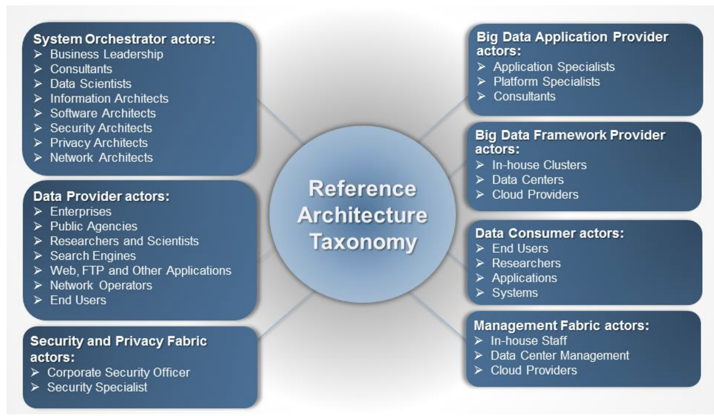

# NIST Big Data Referenece Architecture :o:

One of the major technical areas in the cloud is to define
architectures that can work with Big Data. For this reason NIST has
work now for some time on identifying how to create a data
interoperability framework. The idea here is that at one point
architecture designers can pick services that they can chose to
combine them as part of their data pipeline and integrate in a
convenient fashion into their solution.

Besides just being a high level description NIST also encourages the
verification of the architecture through interface specifications,
especially those that are currently under way in Volume 8 of the
document series. You have the unique opportunity to help shape this
interface and contribute to it. We will provide you not only
mechanisms on how you theoretically can do this, but also how you
practically can contribute.

As part of your projects in 516 you will need to integrate a
significant service that you can contribute to the NIST document in
form of a specification and in form of an implementation.

## Pathway to the NIST-BDRA

The Nist Big Data Public Working Group (NBD-PWG) was established as
collaboration between industry, academia and government "to create a
consensus-based extensible Big Data Interoperability Framework (NBDIF)
which is a vendor-neutral, technology- and infrastructure-independent
ecosystem" [@www-nist-bdra]. It will be helpfule for Big Data
stakeholders such as data architects, data scientists, researchers,
implementers to integrate and utilize "the best available analytics
tools to process and derive knowledge through the use of standard
interfaces between swappable architectural components"
[@www-nist-bdra]. The NBDIF is being developed in three stages:

* Stage 1: "Identify the high-level Big Data reference architecture
key components, which are technology, infrastructure, and vendor
agnostic," [@www-nist-bdra] introduction of the Big Data Reference
Architecture (NBD-RA);
* Stage 2: "Define general interfaces between the NBD-RA components
with the goals to aggregate low-level interactions into high-level
general interfaces and produce set of white papers to demonstrate how
NBD-RA can be used" [@www-nist-bdra];
* Stage 3: "Validate the NBD-RA by building Big Data general
applications through the general interfaces.[@www-nist-bdra]"

Nist has developed the following volumes as liste in *Table: BDRA
volumes* that surround the creation of the NIST-BDRA. We recommend
that you take a closer look at these documents as in this section we
provide a focussed summary with the aspect of cloud computing in mind.

**Table: NIST BDRA Volumes**

. 

| Volumes | Volume | Title |
| :---- | :---- | :--- |
| [NIST SP1500-1r1](https://bigdatawg.nist.gov/_uploadfiles/NIST.SP.1500-1r1.pdf) | Volume 1| Definitions
| [NIST SP1500-2r1](https://bigdatawg.nist.gov/_uploadfiles/NIST.SP.1500-2r1.pdf) | Volume 2 | Taxonomies
| [NIST SP1500-3r1](https://bigdatawg.nist.gov/_uploadfiles/NIST.SP.1500-3r1.pdf) | Volume 3 | Use Cases and Requirements
| [NIST SP1500-4r1](https://bigdatawg.nist.gov/_uploadfiles/NIST.SP.1500-4r1.pdf) | Volume 4 | Security and Privacy
| [NIST SP1500-5](https://bigdatawg.nist.gov/_uploadfiles/NIST.SP.1500-5.pdf)   | Volume 5 | Reference Architectures White Paper Survey
| [NIST SP1500-6r1](https://bigdatawg.nist.gov/_uploadfiles/NIST.SP.1500-6r1.pdf) | Volume 6 | Reference Architecture
| [NIST SP1500-7r1](https://bigdatawg.nist.gov/_uploadfiles/NIST.SP.1500-7r1.pdf) | Volume 7 | Standards Roadmap
| [NIST SP1500-9](https://bigdatawg.nist.gov/_uploadfiles/NIST.SP.1500-9.pdf)   | Volume 8 | Reference Architecture Interface (new)
| [NIST SP1500-10](https://bigdatawg.nist.gov/_uploadfiles/NIST.SP.1500-10.pdf)  | Volume 9 | Adoption and Modernization (new)

## Big Data Characteristics and Definitions

Volume 1 of the series introduces the community to common definitions
that are used as part of the field of Big data. This includes the
analysis of characteristics such as volume, velocity, variety,
variability and the use of structures and unstructured data. As part
of the field of data science and engineering it lists a number of
areas that are to be believed to be essential including that they must
master including data structures, parallelism, metadata, flow rate,
visual communication. In addition we believe that an additional skill
set must be prevalent that allows a data engineer to deploy such
technologies onto actual systems.

We have submitted the following proposal to NIST:

> 3.3.6. Deployments:

> A significant challange exists for data engineers to develop
> architectures and their deployment implications. The volume of data
> and the processing power needed to analysis them may require many
> thousands of distributed compute resources. They can be part of
> private data centers, virtualized with the help of virtual machines
> or containers and even utilize serverless computing to focus
> integration of Big Data Function as a Service based architectures.
> As such architectures are assumed to be large community standards
> such as leveraging DevOps will be necessary for the engineers to
> setup and manage such architectures. This is especially important
> with the swift development of the field that may require rolling
> updates without interruption of the services offered.

This addition reflects the newest insight into what a data scientist
needs to know and the newest job trends that we observed.

To identify what big data is we find the following characteristics

**Volume**: Big for data means lots of bytes. This could be achieved
in many different ways. Typically we look at tha actual size of a data
set, but also how this data set is stored for example in many
thousands of smaller files that are part of the data set. It is clear
that in many of such cases analysis of a large volume of data will
impact the architectural design for storage, but also the workflow on
how this data is processed.

**Velocity**: We see often that big data is associated with high data
flow rates caused by for example streaming data. It can however also
be caused by functions that are applied to large volumes of data and
need to be integrated quickly to return the result as fast as posible.
Needs for real time processing as part of the quality of service
offered contribute also to this. Examples of IoT devices that
integrate not only data in the cloud, but also on the edge need to be
considered.

**Variety**: In todays world we have many different data resources
that motivate sophisticated data mashup strategies. Big data hence not
only deals with information from one source but a variety of sources.
The architectures and services utilized are multiple and needed to
enable automated analysis while incorporating various data source.

Another aspect of variety is that data can be structured or
unstructured. NIST finds this aspect so important that they included
its own section for it.

**Variability**: Any data over time will change. Naturally that is not
an exception in Big data where data may he a time to live or needs to
be updated in order not to be stale or obsolete. Hence one of the
characteristics that big data could exhibit is that its data be
variable and is prone to changes.

In addition to these general observations we also have to adress
important characteristics that are attached with the Data itself. This
includes

**Veracity**: Veracity refers to the accuracy of the data. Accuracy
can be increase by adding metadata.

**Validity**: Refers to data that is valid. While data can be
accurately measured, it could be invalid by the time it is processed.

**Volatility**: Volatility refers to the change in the data values
over time.

**Value**: Naturally we can store lots of information, but if the
information is not valuable then we may not need to store it. This is
recently been seen as a trend as some companies have transitioned data
sets to the community as they do not provide value to the service
provider to justify its prolonged maintenance. (:o: Look for an
example) In other cases the data has become so valuable and that the
services offered have been reduced for example as they provide too
many resource needs by the community. A good example is Google scholar
that used to have much more liberal use and today its services are
significantly scaled back for public users.

## Big Data and the Cloud

WHile looking at the characteristics of Big Data it is obvious that
Big data is on teh one hand a motivator for cloud computing, but on
the other hand existing Big Data frameworks are a motivator for
developing Big Data Architectures a certain way.

Hence we have to always look form both sides towards the creation of
architectures related to a particular application of big data.

This is also motivated by the rich history we have in the field of
parallel and distributed computing. For a long time engineers have
dealt with the issu of *horizontal scaling*, which is defined by
adding more nodes or other resources to a cluster. Such resources may
include

* shared disk file systems
* distributed file systems
* distributed data processing and concurrency frameworks, such as
  Concurrent sequential processes, workflows, MPI, map/reduce, or shared
  memory
* resource negotiation to establish quality of service
* data movement
* and data tiers (as showcased in high energy physics) :o: add ref to
  Ligo and Atlas

In addition to the horizontal scaling issues we also have to worry
about the *vertical scaling* issues, this is how the overall sytem
architecture fits together to adress an end-to-end use case. In such
efforts we look at

* interface designs
* workflows between components and services
* privacy of data and other security issues
* reusability within other use-cases.

Naturally the cloud offers the ability to *cloudify* existing
relational databases as cloud services while leveraging the increased
performance and special hardware and software support that may be
otherwise unaffordable for an individual user. However we see also the
explosive growth of non sql databases because some of them can more
effectively deal with the characteristics of big data than traditional
mostly weel structured data bases. In addition many of these
frameworks are able to introduce advanced capability such as
distributed and reliable service integration.

Although we have been used to the term cloud wile using virtualized
resources and the term Grid by offering a network of supercomputers in
a virtual organization, We should not forget that Cloud service
providers also offer High performance computers resources for some of
their most advanced users. :o: add reference. Naturally such resources
can be used not only for numerical intensif computations but also for
big data applications as the Physics community has demonstrated.

## Big Data, Edge Computing and the Cloud

When looking at the number of devices that are being added daily to
the global IT infrastructure we observe that cellphones and soon
Internet of Things (IoT) devices will produce the bulk of all data.
However not all data will be moved to the cloud and lots of data will
be analyzed locally on the devices or even not being considered to be
uploaded to the cloud either because it project to low or to high
value to be moved. However a considerable portion will put new
constraints on our services we offer in the cloud and any architecture
addressing this must be properly deal with scaling early on in the
architectural design process.

## Reference Architecture

Next we present the Big data reference architecture. It is Depicted
in *Figure: NIST-BDRA*. According to the document (Volume 2) the five
main components representing the central roles include

* System Orchestrator: Defines and integrates the required data
  application activities into an operational vertical system;
* Data Provider: Introduces new data or information feeds into the Big
  Data system;
* Big Data Application Provider: Executes a life cycle to meet
  security and privacy requirements as well as System
  Orchestrator-defined requirements;
* Big Data Framework Provider: Establishes a computing framework in
  which to execute certain transformation applications while protecting
  the privacy and integrity of data; and
* Data Consumer: Includes end users or other systems who use the results of the Big Data
  Application Provider.

In addition we recognize two fabrics layers:

* Security and Privacy Fabric
* Management Fabric

**Figure:** NIST-BDRA (see Volume 2)

WHile looking at the actors depicted in *Figure: NIST Roles* we need
to be aware that in each of the categories a service can be added.
Thisis an important distinction to the original depiction in the
definition as it is clear that an automated service could act in
behalf of the actors listed in each of the categories.

**Figure:** NIST Roles (see Volume 2)

For a detailed definition wich is beyond the scope of this document we refer to the Volume 2 of the documents. 

## Framework Providers

Traditionally cloud computing has started with offering IaaS, followed
by PaaS and SaaS. We see the IaaS reflected in three categories for
big data:

1. Traditional compute and network resources including virtualization frameworks
2. Data Organization and Distribution systems such as offered in Indexed Storage and File Systems
3. Processing engines offering batch, interactive, and streaming services to provide computing and analytics activities

Messaging and communication takes place between these layer while resource management is used to address efficiency. 

Frameworks such as Spark and Hadoop include components form multiple
of these categories to create a vertical integrated system. Often they
are offered by a service provider. However, one needs to be reminded
that such offerings may not be tailored to the individual use-case and
inefficiencies could be prevalent because the service offer is
outdated, or it is not explicitly tuned to the problem at hand.

## Application Providers

The underlaying infrastructure is reused by big data application providers supporting services and task such as

* Data collections
* Data curation
* Data Analytics
* Data Visualization
* Data Access

Through the interplay between these services data consumer sand data producers can be served.

## Fabric

Security and general management are part of the governing fabric in which such an architecture is deployed.
