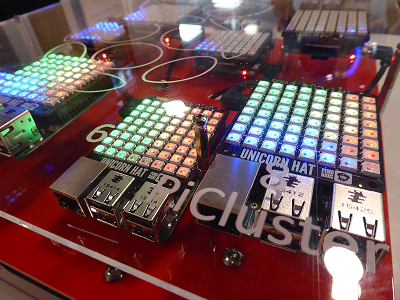
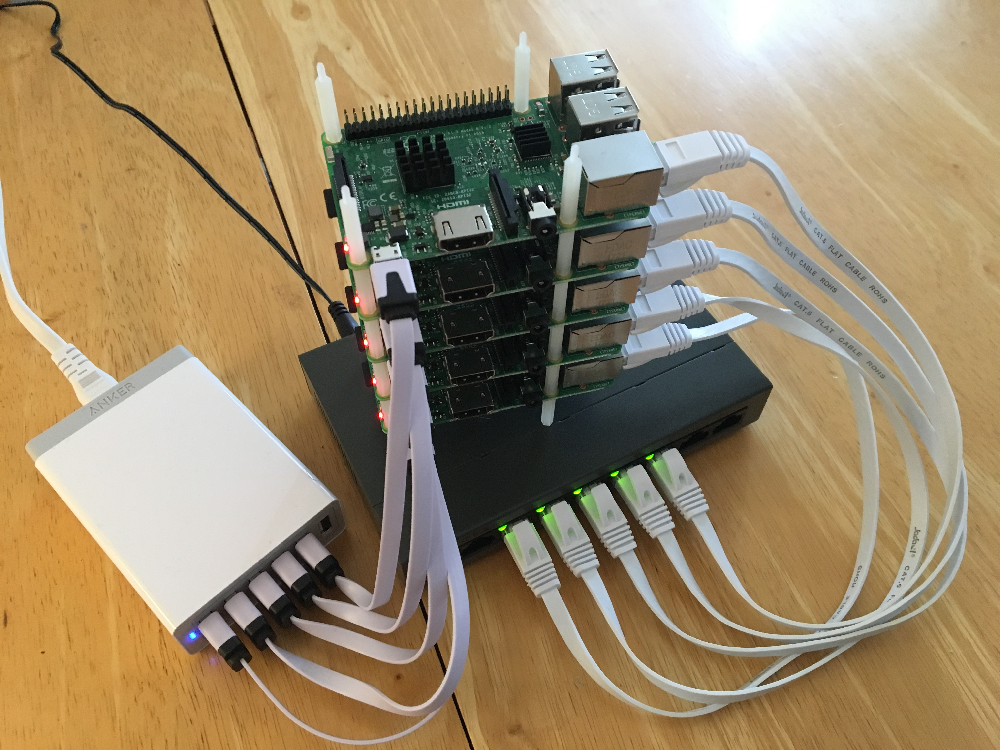

# Pi Cluster Form Factor 

In this chapter we will discuss a number of opportunities to build small
scale compute and cloud cluster resources using Raspberry Pi's.

This includes the following:

* [NAS server with one Raspberry Pi 3](#nas-1-pi)
* [Cluster using 1 Raspberry Pi as master and 4 Raspberry Zeros as
  workers](#clusterhat-4-zero-1-pi)
* [Case With Cooling for 5 Pi)](#Cluster-Case-With-Cooling-5-Pi)
* [Build an Octapi](#s-octapi)
* [Cluster with 40 Raspberry Pi's](#bitscope-case-40-pi)
* [Cluster with 144 Raspberry Pi's](#bitscope-cluster-144-pi)
* [Build Your Own 5 Node Pi Cluster](#build-your-own-5-node-pi-cluster)

## NAS (1 Pi)

Although a NAS is not really a compute cluster the Pi has used many
times to build a Network Attached Storage (NAS) server. In this
configuration a HDD is attached to the Raspberry and the network
features of the Raspberry is used to access the disk drive via software
installed on the PI that make this easily possible. Many tutorials
exists on the Web that help setting op such a device.

We like to hear from you if you have successfully developed such a NAS
and provide us with such links. Links that may help include:

* <https://hackmypi.com/NASpi.php>

## ClusterHat (4 Zero + 1 Pi)

The smallest cluster we came across is actually a hybrid cluster in
which 4 Pi zeros attached to a Raspberry Pi 3. This sis achieved via an
add on board to the Pi 3 allowing to plug in PI=i Zeros:

* <https://clusterhat.com/>

The Cluster HAT (Hardware Attached on Top) allows to attach 4 Raspberry
Pi Zeros via to be attached to a regular Raspberry PI 3 to simulate a
small cluster.

According to the Web Site it supports the following features:

-   USB Gadget Mode: Ethernet and Serial Console.
-   Onboard 4 port USB 2.0 hub.
-   Raspberry Pi Zeros powered via Controller Pi GPIO (USB optional).
-   Individual Raspberry Pi Zero power controlled via the Controller Pi
    GPIO (I2C).
-   Connector for Controller Serial Console (FTDI Basic).
-   Controller Pi can be rebooted without interrupting power to Pi Zeros
    (network recovers on boot).

Although this setup seems rather appealing, the issue is with obtaining
Pi Zeros for the regional price of $5. Typically users can only by one
for that price and must pay shipping. To by more one has to buy a kit
for about $20. However, for that amount of money it may just be worth
while to get Pi 3's instead of zero's. Nevertheless the form factor is
rather appealing.

Additional information can be found at:

* <https://www.raspberrypi.org/magpi/clusterhat-review-cluster-hat-kit/>

## Cluster Case With Cooling (5 Pi) {#temp-cluster}

Many instructions on the Web exist describing how to build clusters with
3 or more Pi's. One of the considerations that we have to think about is
that we may run rather demanding applications on such clusters causing
heat issues. To eliminate them we must provide proper cooling. In some
cluster projects cooling is not adequately addressed. Hence we like to
provide an example that discusses in detail how to add a fan and what
the fan has for an impact on the temperature.

{width="50%"}

* <http://climbers.net/sbc/add-fan-raspberry-pi/>
* <http://climbers.net/sbc/diy-raspberry-pi-3-cluster/>

From the above Web page we find the following information as shown in
the following table. From the data in the table it is clear that we
need to keep the Pi from throttling while being in a case by adding a
fan as obvious from experiment No. 2.

Table: Temperature comparison of fan impact

  No.   Case   Fan   Direction   RPM      Idle    100% Load   Performance
  ----- ------ ----- ----------- -------- ------- ----------- -------------
  1     no     no    -           -        41.0C   75.5C       OK (barely)
  2     yes    no    -           -        45.0C   82.5C       throttles
  3     yes    5V    in          unknown   37.9C   74.5C       OK (barely)
  4     yes    7V    in          800      35.6C   69.5C       OK
  5     yes    12V   in          1400     32.5C   61.1C       OK
  6     yes    7V    out         800      34.5C   66.4C       OK

Interesting is also the design of the case that uses snaps instead of
screws to affix the walls to each other. The case layout can be found at:

* <http://climbers.net/sbc/diy-raspberry-pi-3-cluster-2017/>

## Octapi (8 Pi) {#s-octapi}

A set of instructions on building an is available at

* <https://projects.raspberrypi.org/en/projects/build-an-octapi>

## Bitscope Case (40 Pi)

A company from Australia called BitScope Designs offers a number of
cases that leverage their Pi Blade boards allowing up to four Pis to be
put together and sharing the same power supply. The blades are shown
in the next Figure. The rack to place 10 of them is shown in the
Figure after that.

The cost of the blade rack is $ 795.45 + $60.00 shipping + import tax.
This may originally sound expensive when compared to a single case,
however as we can store 40 Pis in them and they can share the
power-supply and reduce cabling we think this case is quite interesting
overall due to its price-point of $20 per Pi.

## BitScope Cluster (144 Pi)

* <https://www.youtube.com/watch?v=78H-4KqVvrg>

Together with LANL a new cluster module that holds 144 Pis is developed.
This system is targeted to be placed into a rack to create a large Pi
cluster. The cost for such a module is about $15K.

The next Figure shows the module.

{width="50%"}

The next figure shows how multiple modules can be placed into a
single rack.

{width="50%"}

Additional information about this form factor can be found at the
following links:

* <https://cluster.bitscope.com/solutions>
* <https://www.pcper.com/news/General-Tech/BitScope-Unveils-Raspberry-Pi-Cluster-2880-CPU-Cores-LANL-HPC-RD>
* <http://my.bitscope.com/store/>
* <http://my.bitscope.com/store/?p=view\&i=item+7>
* <http://www.newark.com/bitscope/bb04b/quattro-pi-board-raspberry-pi/dp/95Y0643>
* <http://linuxgizmos.com/rpi-expansion-boards-support-up-to-40-pi-clusters/>

## Build Your Own 5 Node Pi Cluster 

To experiment with building an elementary cluster one does not need to
have a big budget. Such clusters are often dedicated to research tasks
and are bound into security protocols that do not allow direct access.
Instead it is possible to build such a cluster based on Raspberry Pi's
yourself if you are willing to spend the money or if you have access to
Pi's that you may loan from your department.

Table [Parts](#T:parts) lists one such possible parts list
that will allow you to build a cluster for up to 5 nodes. However make
sure to buy at least 3 Raspberry Pi's with the appropriate memory. At
minimum we recommend you get the 32GB SD card. We do not recommend any
smaller as otherwise you will run out of memory. Additionally, you can
add memory and disks on the USB ports. If you attach a HDD, make sure it
has an external power supply and do not drive it from the USB power as
otherwise the PI becomes unstable. A fan is at this time not yet
included.

Naturally it is possible to modify the parts list and adapt. If you find
better parts let us know. We have not included any case and you are
welcome to share your suggestions with the class. For a case we are
looking also for a good solution for a fan.

We suggest that when you build the cluster to do it on a table with a
large white paper or board, or a tablecloth and take pictures of the
various stages of the build so we can include it in this document.

Initially we just put Raspbian as Operating system on the SD cards and
test out each PI. To do so you will naturally need an SD card writer
that you can hook up to your computer if it does not have one. As you
will have to potentially do this more than once it is not recommended to
buy an SD card with the OS on it. Buy the SD card writer instead so you
can redo the flashing of the card when needed. In addition to the SD
card you need a USB mouse and keyboard and a monitor or TV with HDMI
port.

Locate setup instructions and write a section in markdown that we will
include here once it is finished. The section is to be managed on
github.

[p-anker]: https://www.amazon.com/Anker-6-Port-Charger-PowerPort-iPhone/dp/B00P933OJC/ref=pd\_sim\_107\_70?\_encoding=UTF8\&psc=1\&refRID=B1S6V5G0CTJ9NH5G0CRT
[p-e-cable]: https://www.amazon.com/Cat-Ethernet-Cable-White-Pack/dp/B01IQWGI0O/ref=sr\_1\_1?s=electronics\&ie=UTF8\&qid=1513699717\&sr=1-1\&keywords=Cat+6+Ethernet+Cable+1+ft+White+\%28+6+Pack+\%29+\%E2\%80\%93+Flat+Internet+Network+Cable+\%E2\%80\%93+Jadaol+Cat+6+Computer+Cable+short+-+Cat6+Ethernet+Patch+Lan+Cable+With\%E2\%80\%A6
[p-sdcard]: https://www.amazon.com/SanDisk-microSDHC-Standard-Packaging-SDSQUNC-032G-GN6MA/dp/B010Q57T02/ref=sr\_1\_10?s=pc\&rps=1\&ie=UTF8\&qid=1498443283\&sr=1-10\&refinements=p\_85:2470955011,p\_n\_feature\_two\_browse-bin:6518304011,p\_n\_feature\_keywords\_two\_browse-bin:5947557011
[p-switch]: https://www.amazon.com/D-link-8-Port-Unmanaged-Gigabit-GO-SW-8G/dp/B008PC1MSO
[p-cam]: https://www.amazon.com/OKRAY-Colorful-Charging-Samsung-Cameras-0-66ft/dp/B00R5GZJR6/ref=sr\_1\_6?s=pc\&ie=UTF8\&qid=1498447476\&sr=1-6\&keywords=micro+usb+cable+1ft
[p-lcd]: https://www.amazon.com/Raspberry-Display-kuman-480x320-Interface/dp/B01CNJVG8K/ref=sr\_1\_1?s=electronics\&ie=UTF8\&qid=1513783748\&sr=1-1\&keywords=pi+3+lcd+screen+3.5in
[p-usb]: https://www.amazon.com/Cat-Ethernet-Cable-White-Pack/dp/B01IQWGI0O/ref=pd\_sim\_147\_2?\_encoding=UTF8\&psc=1\&refRID=FZZ7E36666EJPDTH7B6A
[p-hdmi]: https://www.amazon.com/Cable-Rankie-2-Pack-Latest-Standard/dp/B00Z07XQ4A/ref=sr\_1\_6?s=wireless\&ie=UTF8\&qid=1513782649\&sr=1-6\&keywords=hdmi+cable+6ft
[p-64gb]: https://www.wdc.com/products/wdlabs/wd-pidrive-foundation-edition.html\#WD3750LMCW
[p-heat]: https://www.amazon.com/Easycargo-Raspberry-Heatsink-Aluminum-conductive/dp/B07217N5LS/ref=sr\_1\_3?s=industrial\&ie=UTF8\&qid=1513700498\&sr=1-3\&keywords=raspberry+pi+3
[p-hex]: https://www.amazon.com/20mm-Hexagonal-Threaded-Spacer-Support/dp/B00FH8AB8Q/ref=sr\_1\_9?s=industrial\&ie=UTF8\&qid=1513700337\&sr=1-9\&keywords=hex+spacers+m2+20mm
[p-pi]: https://www.amazon.com/Raspberry-Pi-RASPBERRYPI3-MODB-1GB-Model-Motherboard/dp/B01CD5VC92
[p-drive]: http://wdlabs.wd.com/products/wd-pidrive-berryboot-edition/
[p-usbc]: https://www.amazon.com/AUKEY-Adapter-MacBook-Chromebook-Pixelbook/dp/B072JLRSZ2?th=1

.

| Price | Description | URL |
| --- | ------------------------------------------------------------------------------------------------------- | --- |
| $29.99 | Anker 60W 6-Port USB Wall Charger, PowerPort 6 for iPhone 7 / 6s / Plus, iPad Pro / Air 2 / mini, Galaxy S7 / S6 / Edge / Plus, Note 5 / 4, LG, Nexus, HTC and More | [link][p-anker] |
| $8.90 | Cat 6 Ethernet Cable 1 ft White (6 Pack) - Flat Internet Network Cable - Jadaol Cat 6 Computer Cable short - Cat6 Ethernet Patch Lan Cable With | [link][p-e-cable]|
| $19.99 1 | D-link 8-Port Unmanaged Gigabit Switch (GO-SW-8G) | [link][p-switch] |
| $10.49 | SanDisk Ultra 32GB microSDHC UHS-I Card with Adapter, Grey/Red, Standard Packaging (SDSQUNC-032G-GN6MA) | [link][p-sdcard] |
| $8.59 | Short USB Cable, OKRAY 10 Pack Colorful Micro USB 2.0 Charging Data Sync Cable Cord for Samsung, Android Phone and Tablet, Nexus, HTC, Nokia, LG, Sony, Many Digital Cameras-0.66ft (7.87 Inch) | [link][p-cam] |
| $7.69 | 50 Pcs M2 x 20mm + 5mm Hex Hexagonal Threaded Spacer Support | [link][p-hex] |
| $7.99 | Easycargo 15 pcs Raspberry Pi Heatsink Aluminum + Copper + 3M 8810 thermal conductive adhesive tape for cooling cooler Raspberry Pi 3, Pi 2, Pi Model B+ | [link][p-heat] |
| $34.49 | Raspberry Pi 3 Model B Motherboard (you need at least 3 of them) | [link][p-pi] |
| $59.99  2 | 1TB drive | [link][p-drive] |
| $15.19 | 64GB flash | [link][p-64gb] |
| $6.99 | HDMI Cable, Rankie 2-Pack 6FT Latest Standard HDMI 2.0 HDTV Cable - Supports Ethernet, 3D, 4K and Audio Return (Black) - R1108 | [link][p-hdmi] |
| $12.99 | AUKEY USB C Adapter, USB C to USB 3.0 Adapter Aluminum 2 Pack for Samsung Note 8 S8 S8+, Google Pixel 2 XL, MacBook Pro, Nexus 6P 5X, LG G5 V20 (Gray) | [link][p-usbc] |
| $19.19 | For Raspberry Pi 3 2 TFT LCD Display, kuman 3.5 Inch 480x320 TFT Touch Screen Monitor for Raspberry Pi Model B B+ A+ A Module SPI Interface with Touch Pen SC06 | [link][p-lcd] |

1 items were replaced with similar
2 item was not available

### Assembling the Pi Cluster :o:

TODO: replace the images with one that has white background

| Figure | Description |
| ---- | ---- |
|  |  First, aluminum and copper heat syncs need to be attached to each Pi. The two aluminum heat syncs are attached to the Broadcom chip and the SMSC Ethernet controller located on the top of the Pi. The blades of the heat syncs are parallel to the longer side of the Pi as shown in black aluminum fanned heat syncs are attached to the top of the pi as shown. |
|  |  Flat copper heat sync is attached to the bottom of the pi as shown. |
|  |  After attaching the heat syncs, threaded hexagonal spacer supports are used to connect the Pis together. A fully-assembled 5-node Pi cluster is shown.   |
|  |  Each node of the cluster is then attached to the switch using an Ethernet cables and to the power supply using a USB cables. The fully wired cluster is shown.  |

### Virtual Raspberry Cluster :o:

It should also be possible to create a virtual raspberry PI cluster
while for example using virtual box. This requires two steps. First the
deployment of a virtualized Raspberry PI. The following information may
be useful for this

* <http://dbakevlar.com/2015/08/emulating-a-raspberry-pi-on-virtualbox/>

The next step includes the deployment of multiple VMs emulating
Raspberry's. Naturally each should have its own name so you can
distinguish them. Instead of just using the GUI, it would be important
to find out how to start them from a command line as a shell script as
well as tear them down.

Next you will need to make sure you can communicate from the Pi's to each
other. This is naturally the same as on a real cluster

:warning: TODO: provide a section

This can be chosen as part of your project, but you need to develop a
cloudmesh command for managing the cluster. This includes starting and
stopping as well as check-pointing the cluster from a cloudmesh command.
Furthermore you need to benchmark it and identify how to do this and
contrast this to other clusters that you may start or have access to.
Please get in contact with Gregor. This project is reserved for online
students, as residential students will have access to real Raspberry PI
hardware.

Please note that this project may have to use QEMU.
