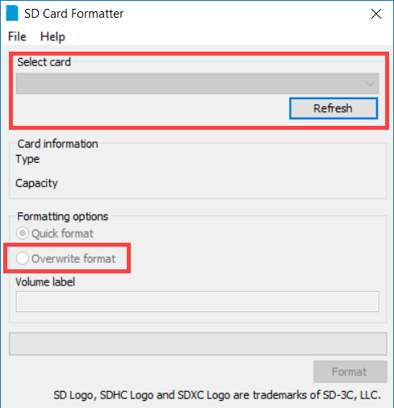
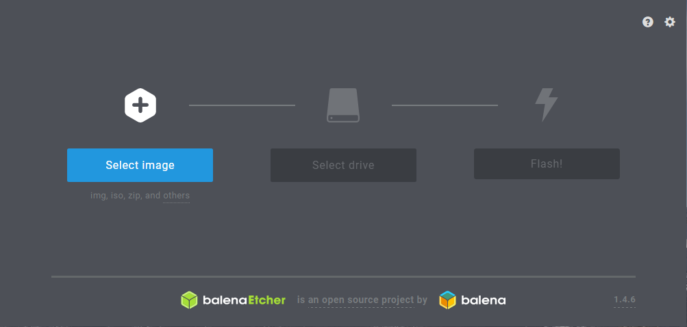
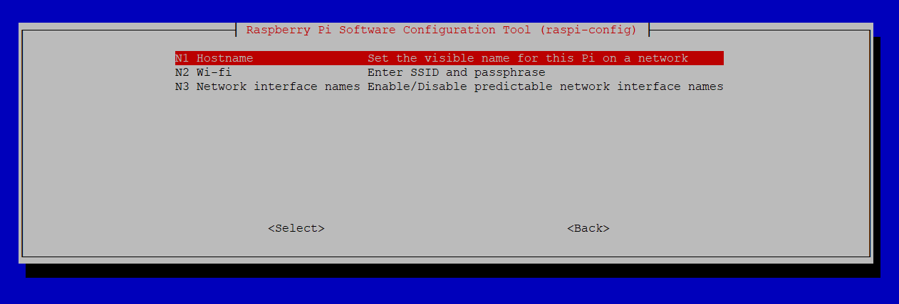
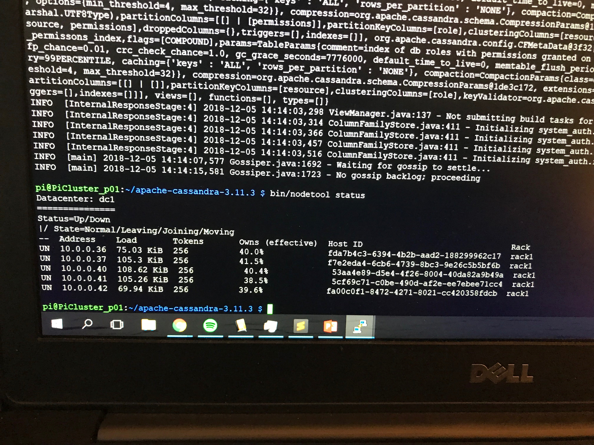
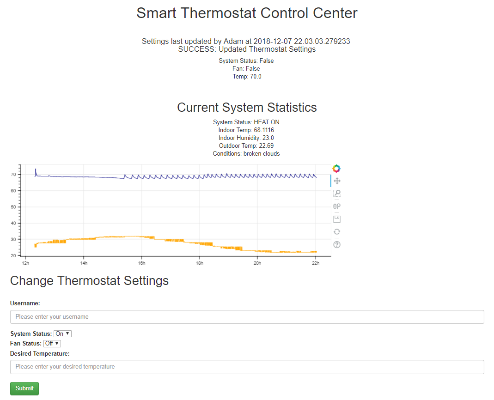

# Raspberry Pi IoT Thermostat with Cassandra and Apache Webserver :smiley: fa18-523-84

TODO: See where this fits into the Pi book...

## Prerequisites:

  * [Assembling the Pi Cluster](https://github.com/cloudmesh-community/book/blob/master/chapters/pi/case.md#build-your-own-5-node-pi-cluster)
  * [Set up small cluster by hand](https://github.com/cloudmesh-community/book/blob/master/chapters/pi/setup-ultimate.md)
  * [Smart Thermostat Project (not IoT connected)](https://github.com/ahilgenkamp/book/blob/master/chapters/iot/sensors.md)
  
### Setting up a Small Pi Cluster by Hand 

:warning: Step 1 should probably be moved to book/chapters/pi/setup-ultimate.md.  Keeping this here until it can be combined with the other sections on initial cluster setup.

### Burning OS image to SD cards

The first step in setting up the raspberry pi cluster is to burn the OS image to the SD cards.  In this example we are using [SanDisk 32GB microSD cards.](https://www.amazon.com/Sandisk-Ultra-Micro-UHS-I-Adapter/dp/B073JWXGNT/ref=sr_1_5?s=pc&ie=UTF8&qid=1542828848&sr=1-5&keywords=32+gb+micro+sd+card)  If your computer does not have an SD card reader you may need to [purchase one](https://www.amazon.com/Anker-Portable-Reader-RS-MMC-Micro/dp/B006T9B6R2/ref=sr_1_3?s=electronics&ie=UTF8&qid=1542828941&sr=1-3&keywords=sd+card+reader) for this step.  The first part of this step is to download the required software / files.

  * [Raspbian Stretch Lite](https://www.raspberrypi.org/downloads/raspbian/) - The OS we will be using for the nodes in our pi cluster.
  * [SD Formatter](https://www.sdcard.org/downloads/formatter_4/) - This will be used to ensure the SD card is formatted correctly.
  * [Etcher](https://www.balena.io/etcher/) - Software used to burn the OS image to the SD card.

Once you have the required software and OS image file we can set up each SD card.  In order to ensure the SD card is formatted correctly we will want to run the SD Card Formatter tool.  Ensure that you don't have any other drives connected to you computer and carefully select the drive that corresponds to your SD card.  Then select overwrite format and click format.  This step can take a few minutes but it is good practice to ensure the correct formatting.

{#fig:sd_format}

While the SD card is formatting you will want to extract the Raspbian Lite image from the zipfle it was downloaded in.  Extract this to your desktop so that it can be used in the next step.  Once the SD card is formatted you can open Etcher.  Select the Raspbian Lite image we saved to the desktop and then check to make sure the correct SD drive is selected by Etcher.  Then click "Flash!".  Once this is done you should have the Raspbian Lite image burned to the SD card.

{#fig:etcher}

Before pluging the SD card into the Raspberry Pi we will want to add a file to the boot partition.  Open notepad or another editor and save a blank file as "ssh" with no file extension.  When the raspberry pi boots up it will see this file and enable SSH connections.  At this point we will also edit the **config.txt** file.  In the file we need to uncomment this line: ```hdmi_force_hotplug=1```.  This will ensure that your monitor will work correctly should you need to plug it in to a monitor to trouble shoot during the next steps.

**Optional:** For this example we will be connecting the cluster to a router through an ethernet connection.  However, you could also configure the parent node to connect to WiFi and then share an internet connection with the worker nodes.  This can be done by setting up a [WiFi to Ethernet bridge.](https://www.raspberrypi.org/forums/viewtopic.php?t=132674) If you will be setting up the parent node or any of the other nodes to work with WiFi you can do this by automatically by adding a file to the boot partition of the SD card (same location as the ssh file).  To do this open up a text editor and add the following code to the file [@Headless setup].  Once WiFi is enabled you will need to follow the steps included in the [WiFi to Ethernet bridge tutorial.](https://www.raspberrypi.org/forums/viewtopic.php?t=132674)

```
country=US
ctrl_interface=DIR=/var/run/wpa_supplicant GROUP=netdev
update_config=1

network={
    ssid="your_real_wifi_ssid"
    scan_ssid=1
    psk="your_real_password"
    key_mgmt=WPA-PSK
}
```

Once the code has been added save the file as **wpa_supplicant.conf** in the boot partition.

Another great resource for the initial set is a [youtube video](https://www.youtube.com/watch?v=H2rTecSO0gk) put together by Davy Wybiral [@Youtube Cluster Setup].

Once you have completed the initial setup and are connected to the network ensure you are able to SSH to the parent node and the worker nodes.  Use ```ifconfig``` in the terminal to get the IP address for the nodes and you can use a tool such as [PuTTY](https://www.chiark.greenend.org.uk/~sgtatham/putty/latest.html) to connect.  You can also scan your network with a tool such as ```nmap``` to get the ip addresses connected to your network.  **You will need to keep track of the ip addresses of each node for use in the next steps so it is a good idea to write them down.**

## Step 1: Setting up the parent node

To get started we need to set up the parent node.  This node will be hosting a web page which allows users on the network to view and change the settings of the smart thermostat.  This node will also be part of the cassandra cluster.

**Initial Configuration:**

First, SSH into the parent node. We are using the first Raspberry Pi in the cluster but this can be any node. The reason is that the "parent" will also host the website as well as be a part of the cassandra cluster. If you have not changed the password when initially setting up the Raspberry Pi you should change it before going any further. This can be done by selecting the change password option after running ```sudo raspi-config```.  Once the password is updated we will update the hostname. This can be done in the "Network Options" section by selecting "Hostname" +@fig:raspi-config.  In this example we rename our parent node to **PiCluster_p01**.

{#fig:raspi-config}

**Install git:**

 1. To install git run the following command: ```sudo apt-get update and sudo apt-get install git```
 2. Once you have configured git you will need to clone the following repository in order to use the setup scripts and application code.
  * First create a directory to store git repositories: ```mkdir git-repos```
  * Then run ```cd git-repos && git clone https://github.com/cloudmesh-community/fa18-523-84.git``` to clone the repository.
 3. **Optional:** Set up git to link with your account
  * Run ```git config --global user.email "you@example.com"``` to add your user email.
  * Run ```git config --global user.name "Your Name"``` to add your username.
 
**Run Shell Script:**
 
Before we run the shell script we will need to update some of the files contained in the git-repo that you have cloned in the previous step. The first file is the [cassandra_custom.yaml](https://github.com/cloudmesh-community/fa18-523-84/blob/master/project-code/cassandra_custom.yaml) file.  The sections listed below need to be updated with the ip addresses that you noted when setting up the Pi's.  The other settings can remain as is.  More information about configuration options can be found on the [apache cassandra site.](https://cassandra.apache.org/doc/latest/configuration/cassandra_config_file.html)

```yaml
seed_provider:
    # Addresses of hosts that are deemed contact points. 
    # Cassandra nodes use this list of hosts to find each other and learn
    # the topology of the ring.  You must change this if you are running
    # multiple nodes!
    - class_name: org.apache.cassandra.locator.SimpleSeedProvider
      parameters:
          # seeds is actually a comma-delimited list of addresses.
          # Ex: "<ip1>,<ip2>,<ip3>"
          - seeds: "10.0.0.42,10.0.0.40" #one address should be the parent node and the other should be another node in the cluster
          
listen_address: 10.0.0.42 #should be the ip address of the parent node
rpc_address: 10.0.0.42 #should be the ip address of the parent node
```

Next we need to update the [Flask_App.conf](https://github.com/cloudmesh-community/fa18-523-84/blob/master/project-code/FlaskApp.conf) file.  In this file you will need to up date the ServerName with the ip address of the parent node and the ServerAdmin with your email address.  Also update the last Allow from variable for each directory to allow ip addresses from your local network.

The last manual update is to edit the [__init__.py](https://github.com/cloudmesh-community/fa18-523-84/blob/master/project-code/FlaskApp/FlaskApp/__init__.py) file.  You will need to update the variable at the beginning of the file with the ip address of one or both of the cassandra seed nodes that you have set up in the previous step.

```cassandra_contact_points = ['10.0.0.42']```

Now run the parent_node shell script to set up the necessary dependencies for the parent node (running this step can take some time).  This step will upgrade the node, install the necessary python modules, complete the setup for cassandra and will configure the apache webserver.

 ```bash
 cd ~/git-repos/fa18-523-84/project-code
 chmod u+x parent_node.sh
 ./parent_node.sh
 ```
 
## Step 2: Configure the worker nodes
 
To set up the worker nodes in the cluster you will need to run the [cluster_setup.py](https://github.com/cloudmesh-community/fa18-523-84/blob/master/project-code/cluster_setup.py) script from a machine on your network.  Before running the script you will need to update the workers dictionary at the beginning of the script.  You can also change the password that is set for each of the nodes.  If you have already setup the password for each of the nodes then you will comment these lines out of the code. When this script completes it will reboot each node.

```python
workers = {
	'PiCluster_w01': '10.0.0.36',
	'PiCluster_w02': '10.0.0.37',
	'PiCluster_w03': '10.0.0.41',
	'PiCluster_w04': '10.0.0.40'
	}
 
for key, value in workers.items():
	#print(key+': '+value)
	c = Connection(value, connect_timeout=60)
	c.connect_kwargs.password = 'raspberry'
	
	result = c.run('uname -s')
	print("{}: {}".format(value, result.stdout.strip()))
	
	#change password and hostname
	print('INFO: changing password')
	c.run('echo pi:Weather_Center01 | sudo chpasswd') #change password to your choice
	print('INFO: password changed')
```

After the setup has completed for each of the nodes you will need to ssh into each node individually to update the cassandra.yaml file with the ip address of that node.  You will just need to update the listen_address and the rpc_address.

```bash
sudo nano ~/apache-cassandra-3.11.3/conf/cassandra.yaml
```

```yaml
listen_address: 10.0.0.42 #should be the ip address of the node
rpc_address: 10.0.0.42 #should be the ip address of the node
```

Once you have updated all of the cassandra.yaml files we can start the cassandra cluster.  They should automatically join the cassandra instance running on the parent node creating a single rack datacenter.  This means that the data can be replicated across nodes preventing a single point of failure and faster read / write operations.  To start the rest of the nodes in the cluster you will first need to update the [cluster_start.py](https://github.com/cloudmesh-community/fa18-523-84/blob/master/project-code/cluster_start.py) script with the ip addresses of each of the nodes.  Once the script has been updated you can run it to start cassandra on each of the nodes.  Once the script has finished running SSH into the parent node and run ```cd ~/apache-cassandra-3.11.3 && bin/nodetool status``` to check the status of each node.  You should see something similar to +@fig:nodetool_status.

{#fig:nodetool_status}

## Step 3: Final Configuration and Starting the Connected Smart Thermostat

The next step is to set up the cassandra keyspace that will be used by the smart thermostat and the web interface.  The [cassandra_keyspace_setup.py](https://github.com/cloudmesh-community/fa18-523-84/blob/master/project-code/cassandra_keyspace_setup.py) script will set up the "smart_therm" keyspace and will create two tables in this keyspace. The therm_data table will be used to collect data from the thermostat and display the most recent readings and a trend of the temperature in a chart on the website.  The therm_status table has one record for each device key and is updated when the user enters new settings from the web app.  Before running this script be sure to update the contact points with the seed node ip addresses that were set in the cassandra.yaml file.  If you would like to confirm that the set up happened correctly you can run ```cd ~/apache-cassandra-3.11.3 && bin/cqlsh [replace with seed ip address]```.  Once in the cqlsh shell you can enter ```use smart_therm``` and ```describe keyspace``` to see if the tables are set up.

Now that we have finished setting up the webserver and the cassandra database we will want to start the **smart_thermostat.py** script on the Raspberry Pi being used as the smart thermostat that was put together in the [smart thermostat project](https://github.com/cloudmesh-community/book/blob/master/chapters/iot/sensors.md) found in this book.  To start the connected smart thermostat make sure that your clone of the git repository is up to date.  Then run ```cd ~/git-repos/fa18-523-84/paper/code``` to navigate to the directory where the code is located. Once you have moved to the directory you will need to update this file to use the ip addresses of your cassandra seed nodes.  Run ```sudo nano smart_thermostat.py``` and find ```cassandra_contact_points = ['10.0.0.42']
``` as the beginning of the file.  Now that the file has been updated run ```nohup python3 smart_thermostat.py &``` which will run the smart thermostat code in the background.  This allows you to close the SSH connection.

At this point everything should be working appropriately.  You should now be able to navigate to the ServerName address that you defined when setting up the apache webserver.  This should take you to a site that looks like what is shown in +@fig:therm_website.  You can now view your settings, the current statistics and also change the settings of your smart thermostat.

{#fig:therm_website}

## Sources:

Additional sources included in the code needed for this project.

* OS Install guide: https://www.raspberrypi.org/documentation/installation/installing-images/README.md
* Youtube Cluster Setup: https://www.youtube.com/watch?v=H2rTecSO0gk
* Headless setup: https://www.raspberrypi.org/forums/viewtopic.php?t=191252
* HDMI Monitor Signal issue: https://www.raspberrypi.org/forums/viewtopic.php?t=34061
* Fabric documentation: http://docs.fabfile.org/en/latest/getting-started.html
* Git Setup: https://www.atlassian.com/git/tutorials/install-git
