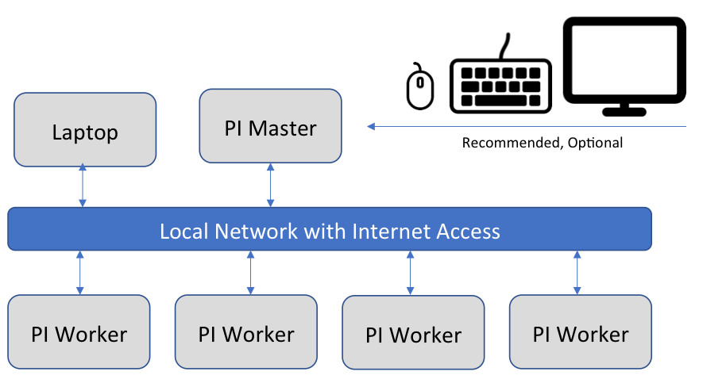
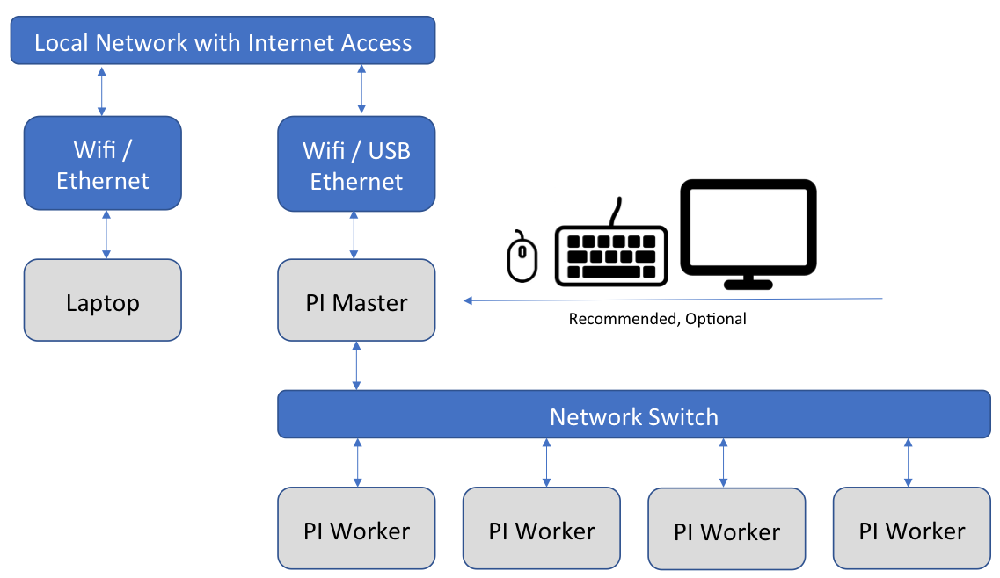

# Network of Pis (NOW) {#pi-now-main}

The purpose of setting up a cluster of Raspberry Pi computers is to be able to
experiment with different server and cluster technologies on a small scale. To
this end we want to be able to use a network configuration that mirrors a large
scale cloud configuration. This section will explain how to setup several
Raspberry Pis in a cluster configuration to run experiments on them.

## Network of Pis Configurations {#pi-now-configs}

There are several possible configurations for a network of Pis. One possibility
is to connect each of the Pis to your local network so that you can
directly connect to each of the Pis in the cluster from your laptop. This
option can be easy to setup but it may have problems scaling up to several
hundred Raspberry Pis. The second option is to use one of the Pi computers as a
master or router and for the other Pis in the cluster to access the Internet
through this master Pi's connection. Note that in most situations each Pi will
need to be able to access the Internet to download packages and interact with
public services. In the second option, however, the worker Pis will be separated
from the main network by the master Pi and it may not be possible to directly
access them, for example, over `ssh` from your laptop.

In the first option we can directly connect each Raspberry Pi to your local
network using either the Ethernet adapter on the Pi or using the Wireless
adapter on the Pi. If using the Ethernet adapter and intermediary router or
switch can also be used to connect the Pis to the local network. The network can
be visualized in +@fig:pi-cluster-network-direct. To setup this kind of cluster
please follow the instructions in
[Direct Network Cluster](#pi-direct-network-cluster).

{#fig:pi-cluster-network-direct}

In the second option we will need to configure the master Pi to have two network
interfaces enabled. One of the interfaces will connect to the local network and
have direct internet access and will accessible to the other computers on the
network. The second interface will be attached to the private network that the
worker Pis are connected to and will serve as the DHCP server and router for
that private network. Since the Raspberry Pi comes with an Ethernet adapter and
a wireless network adapter, you can use the built-in Ethernet adapter on all of
the Pis to connect to a switch and form a private network this way. The master
Pi can then connect to your local network using its wireless adapter. Another
possibility is to use a USB Ethernet adapter (purchased from this list of
[Raspberry Pi compatible USB Ethernet adapters](https://elinux.org/RPi_USB_Ethernet_adapters))
on the master Pi so that it can have a stable, wired connection to both
networks. In either case the network setup is illustrated in
+@fig:pi-cluster-network-private. The steps to setup this kind of private
network cluster can be found in
[Private Network Cluster](#pi-private-network-cluster).

{#fig:pi-cluster-network-private}

## Network of Pis Hostnames {#pi-network-hostnames}

When setting up a cluster of Pis it is necessary to assign a hostname to each Pi
in the cluster. These names are important because they must not be repeated
across Pi clusters and they must not conflict with other devices on the same
network. If you are setting up a small network, almost any hostname will be
fine, but for larger networks you should come up with a naming scheme to avoid
conflicts. For a small cluster you may pick a designation such as a color or
name and then assign a number to each Pi. For example, if you have three Pis you
could call them `red01`, `red02`, and `red03`.

For a large cluster we recommend giving each cluster a unique id, for example, a
number from 1 to 100, and then giving each node in the cluster an id that is
based on the cluster that it is assigned to. For example, if each cluster is
named `clusterNN` where `NN` is a zero-padded number from `01` to `99` then we
would have clusters named `cluster01`, `cluster02`, ...,  `cluster11`, etc. The
cluster name will not be assigned to any particular Pi. Each Pi will be given a
name that is based on the cluster it is assigned to. If each of your clusters
are made of 5 Pis then you can number your individual Pis with the following
formula:

```
node number = (cluster number - 1) * 5 + pi number in cluster
```

Our `cluster01` cluster would then have the Pis `node001` to `node005` and
`cluster02` would have the Pis `node006` to `node010`. Our `cluster11` would
have nodes `node051` to `node055`. We assume the lowest numbered node in each
cluster is the master node. If you have more than 999 Pis or clusters with more
than 5 Pis per cluster then you will have to adjust the naming scheme
accordingly.

## Pi Cluster Preparation {#pi-cluster-prep}

To prepare to setup a Pi cluster you will need to choose whether you will be
setting up each Raspberry Pi by hand or by using the tools and scripts that we
have developed to make this task easier and less error prone. The primary tool
that will save time in setting up a Pi cluster is
[cm-burn](https://github.com/cloudmesh-community/cm-burn) which was
introduced in the section [Burn an SD Card with cm-burn](#pi-cm-burn-sd-card).
The installation and setup instructions for cm-burn can be found in the
[cm-burn README.md](https://github.com/cloudmesh-community/cm-burn/blob/master/README.md).
Once you have `cm-burn` successfully installed you can use the instructions here
to setup your cluster. We have also developed some scripts to help setup a Pi
cluster in the
[cloudmesh-community/pi](https://github.com/cloudmesh-community/pi)
project. These scripts can be copied to the Pi after it is running to help
complete various setup tasks easily. Use of these scripts will be covered in the
following sections.

If you choose not to use `cm-burn` or to use our scripts we will provide the
manual setup steps for you to complete. In most cases the manual steps are the
exact same as the operations the scripts perform, so you can also check the
manual steps if you are curious about what the scripts are doing. Before
beginning the manual steps below we assume you are able to burn an image to an
SD card, to login to the Pi, and to complete the locale and hostname setup at a
minimum. If you have not completed these steps, please see the following
sections for details:

* [Install Raspbian on a SD card](#s-install-raspbian)
* [Password](#s-pi-setup-password)
* [Set the hostname](#s-pi-set-hostname)

We also recommend using ssh keys to connect to your Raspberry Pis rather than
using password authentication. Please see the [SSH keygen](#pi-ssh-keygen)
section for details on generating a key on your laptop.

Any other required steps will be explained in the following sections.

## Direct Network Cluster Setup {#pi-direct-network-cluster}

An overview of this cluster setup is included in the
[Network of Pis Configurations](#pi-now-configs) section. To complete this setup
you will need to select a set of hostnames for the PIs in your cluster. Please
see the [Network of Pis Hostnames](#pi-network-hostnames) section for our
recommendation on setting hostnames. Since each Pi in the cluster will directly
connect to the local network each Pi will have the same network setup. This
makes using this option easier for initial setup and experimentation with a
cluster of Pis. You will need to choose whether the Pis will connect to your
network through a wired Ethernet connection or through a WiFi connection. In
either case you can choose to statically assign an IP address or to let each Pi
get a dynamic IP address using DHCP. Using DHCP may be easier at first but it
can also be a problem if you do not have a monitor connected to the Pi because
you then will not know in advance the IP address that is assigned to each Pi.
Please see the section
[Discover Pi DHCP Network Addresses](#pi-find-dhcp-ip-address)
for details on how to find the IP address of a device assigned by DHCP.

### Direct Network Cluster Setup with cm-burn

The `cm-burn` tool directly supports setting up a cluster of Pis with direct
access to your local network. You can choose to use Ethernet or wireless to
connect and you can statically assign IP addresses or use DHCP. We will give
examples of each use case. First, ensure that `cm-burn` is installed following
the directions at [Burn an SD Card with cm-burn](#pi-cm-burn-sd-card). We will
assume that you have five Pis to setup with the names red01 to red05 and the IP
addresses 192.168.1.101 to 192.168.1.105 for static IPs and that your domains
submask is 255.255.255.0. Please substitute the actual values of your local
network here. We further assume that you have setup an ssh key so that you can
login to the Pi without specifying a password. Please see the
[SSH keygen](#pi-ssh-keygen) section for details. If you do not have an ssh key
then you can leave the `--key` setting out of `cm-burn` and skip the manual
sections relating to ssh keys.

#### Static IP Ethernet Setup {#pi-static-ethernet-setup}

Static Ethernet setup is one of the easiest options with cm-burn. This command
will burn 5 SD cards with the hostnames `red01` to `red05` in the 192.168.1.1
domain with IPs 192.168.1.101 to 192.168.1.105. It will copy the public ssh key
from your computer onto each of the Pis and disable password logins. After each
card is burned it can be removed and put into a Pi and booted. The Pi will
appear on your network in about one minute after booting.

```bash
$ cm-burn create --name red[01-05] \
  --ips 192.168.1.[101-105] --domain 192.168.1.1 \
  --key ~/.ssh/id_rsa.pub \
  --image 2018-11-13-raspbian-stretch-lite.img
```

You should now be able to connect to the Pi over ssh:

```bash
$ ssh pi@192.168.1.101
```

If you would like to connect to the Pi using the hostname then you will need to
setup the hosts on your host OS. On macOS and Linux this can be done by editing
the `/etc/hosts` file and adding a line at the end for each of the Pis. The
format is to start with the IP address, then have whitespace (blank spaces or
tabs) and then the hostname. The file should look like this:

```
...
192.168.1.101     red00
192.168.1.102     red01
192.168.1.103     red02
192.168.1.104     red03
192.168.1.105     red04
```

#### Static IP WiFi Setup {#pi-static-wifi-setup}

Setting up static IP addresses over Wifi is very similar to doing it over
Ethernet. The only difference is when you burn the SD card with cm-burn you will
need to specify the wireless access point's ssid and passphrase on the command.
You can use the output of `wpa_passphrase` as the `--psk-hash` parameter or you
can specify the actual passphrase for the wireless network in plain text using
the `--psk` parameter. We strongly recommend using the hashed passphrase for
some added security. For more details on the wireless setup please see the
[Wireless Network at Home](#s-wireless-at-home) section.

Using the psk hash:

```bash
$ cm-burn create --name red[01-05] \
  --ips 192.168.1.[101-105] --domain 192.168.1.1 \
  --ssid home_network --psk-hash 0617cac0a00f87d23cda5705f5ff97bbc562f5d1907b40f02c39912a7d595b0f \
  --key ~/.ssh/id_rsa.pub \
  --image 2018-11-13-raspbian-stretch-lite.img
```

Using the actual wireless passphrase:

```bash
$ cm-burn create --name red[01-05] \
  --ips 192.168.1.[101-105] --domain 192.168.1.1 \
  --ssid home_network --psk "my passphrase has spaces" \
  --key ~/.ssh/id_rsa.pub \
  --image 2018-11-13-raspbian-stretch-lite.img
```

For other details on connecting to the Pis please see the
[Static IP Ethernet Setup](#pi-static-ethernet-setup) section.

#### DHCP Ethernet Setup

To use DHCP over Ethernet the only change from static setup is to remove the
setting of the IP addresses and the domain. Since you do not specify an IP
address, cm-burn will not change the standard setup of the Pi which is to find
an address using DHCP.

```bash
$ cm-burn create --name red[01-05] \
  --key ~/.ssh/id_rsa.pub \
  --image 2018-11-13-raspbian-stretch-lite.img
```

When the SD cards are finished you can put them into the Pi and they should boot
and join the local network over DHCP in a minute or two. To find the address
assigned to the Pi see the section
[Discover Pi DHCP Network Addresses](#pi-find-dhcp-ip-address).

#### DHCP Wifi Setup

The DHCP Wifi Setup is only different from the static IP setup in that the
static IP addresses are removed from the cm-burn command. See the
[Static IP WiFi Setup](#pi-static-wifi-setup) for more details on setting the
wireless ssid and psk.

Using the psk hash:

```bash
$ cm-burn create --name red[01-05] \
  --ssid home_network --psk-hash 0617cac0a00f87d23cda5705f5ff97bbc562f5d1907b40f02c39912a7d595b0f \
  --key ~/.ssh/id_rsa.pub \
  --image 2018-11-13-raspbian-stretch-lite.img
```

Using the actual wireless passphrase:

```bash
$ cm-burn create --name red[01-05] \
  --ssid home_network --psk "my passphrase has spaces" \
  --key ~/.ssh/id_rsa.pub \
  --image 2018-11-13-raspbian-stretch-lite.img
```

### Direct Network Cluster Setup by hand :o:

TODO: manual steps for direct network setup

## Private Network Cluster Setup {#pi-private-network-cluster}

An overview the design of a private Pi cluster is included in the
[Network of Pis Configurations](#pi-now-configs) section. To complete this setup
you will need to select a set of hostnames for the PIs in your cluster. Please
see the [Network of Pis Hostnames](#pi-network-hostnames) section for our
recommendation on setting hostnames.

### Private Network Cluster Setup with cm-burn :o:

Cm-burn does not currently support setting up a private network cluster. When it
is enhanced to support this we will add the documentation here.

### Private Network Cluster Setup by hand

The master node of the cluster must use one network device to talk to the local
network and another network device to talk to the other Pis on the private
network. For these steps we will assume that `wlan0` is on the local network and
that `eth0` is on the private Pi network. These could be switched or replaced
with a USB Ethernet connection with no change to the steps. We assume for these
steps that you have already connected `wlan0` to your local network and these
steps will then complete setting up `eth0` as the bridge device to the private
Pi network.

We need the `dnsmasq` service as a simple DNS server and the convenience package
`iptables-persistent` for making changes to iptables:

```bash
$ apt-get update
$ apt-get install -qy dnsmasq iptables-persistent
```

To setup our `wlan0` as the *favored* interface for the Pi to communicate over
the Internet we need to set its metric lower than the `eth0` interface. Normally
the Pi will prefer to use the `eth0` interface since it is usually faster. This
change can be made in `/etc/dhcpcd.conf`. This file also where we setup static
IP addresses. If you are not using a static IP address for `wlan0` then you
will not have the lines beneath `interface wlan0` to set the static IP address.
We will setup our private Pi network to have the IP address range 192.168.50.1
to 192.168.50.255 which means it is 192.168.50.1/24 or, equivalently, uses the
255.255.255.0 subnet mask. You can freely change this and you must choose a
network that does not match the local network. Change `/etc/dhcpcd.conf` to
match this:

```
interface eth0
metric 300

static ip_address=192.168.50.1/24
static routers=192.168.50.1
static domain_name_servers=192.168.50.1

interface wlan0
metric 200

static ip_address=192.168.1.107/24
static routers=192.168.1.1
static domain_name_servers=192.168.1.1
```

Next you need to update `/etc/dnsmasq.conf` to include the following lines to
enable giving out DHCP addresses on the `eth0` network and to give out addresses
in the proper range:

```
interface=eth0
dhcp-range=eth0, 192.168.50.2,192.168.50.250,24h
```

We then need to enable NAT Forwarding by uncommenting (or adding) the following
line in `/etc/sysctl.conf`:

```
net.ipv4.ip_forward=1
```

The final step is to setup and save our iptables configuration to do the actual
forwarding of packets. Run these commands to set this up properly:

```bash
$ sudo iptables -t nat -A POSTROUTING -o eth0 -j MASQUERADE
$ sudo iptables -A FORWARD -i eth0 -o wlan0 -j ACCEPT
$ sudo iptables -A FORWARD -i wlan0 -o eth0 -j ACCEPT
$ sudo iptables-save | sudo tee /etc/iptables/rules.v4
```

At this point you can restart the services and everything should be working:

```bash
$ sudo service dhcpcd restart
$ sudo service dnsmasq restart
```

To find out what IP address has been assigned to each Pi you can use the
[Discover Pi DHCP Network Addresses](#pi-find-dhcp-ip-address) section or you
can manually look in the `/var/lib/misc/dnsmasq.leases` which will list each
lease and the MAC Address of the device it is leased to.

## Discover Pi DHCP Network Addresses {#pi-find-dhcp-ip-address}

If you setup your Pis using DHCP on your local network then you may not know the
IP address that has been dynamically assigned to each Pi. If you have statically
assigned IP addresses to each Pi then you will need to make node of these
assignments and add the hostname mapping to each device that needs to be aware
of the hostnames.

If you have physical access to each Pi and a compatible monitor and keyboard
then you can login to each of them in sequence and then run `ifconfig` to
determine which IP address has been assigned to each of them. If you have access
to the DHCP server that assigns IP address (for example, in your home network)
you can also usually access that device through a web browser to find out which
IP address has been assigned to each device on the network. If you have properly
configured the hostname on each Pi then it should be registered with that name
on your DHCP server.

It is not trivial to detect all of the devices on a local network. In addition,
if you use static networking then the devices will typically not register or
report their hostnames. However, if you are using DHCP and you have properly
configured the hostname on each Pi, then the following method should work.

To begin you need the `nmap` tool installed on your system. It can be installed
on Linux (on a Pi, for example) using the standard package installation tools
such as `sudo apt-get install nmap`. If you are using Windows or macOS, please
see the [Nmap installation instructions](https://nmap.org/book/install.html) or
use Homebrew on macOS as `brew install nmap`.

To find the Pis you must be on the same network as they are. If you are using
the [Direct Network Cluster](#pi-direct-network-cluster) setup then the Pis will
all be on the same network as your laptop. If you are using the
[Private Network Cluster](#pi-private-network-cluster) setup
then only the master Pi will be on your local network. If you want to discover
the IP address of the Pis on the private network then you should first login to
the master Pi node and then execute the following commands.

This works on a Pi substitute your network address range for `192.168.1.0/24`.
The first command `nmap -sn` will search your local network IP address range
for any devices attached to the network. This process is to find out which
devices are reachable from the host. As a result of the `nmap` process, the
host's [ARP table](https://en.wikipedia.org/wiki/Address_Resolution_Protocol)
will be updated with a record of every device (up to the arp cache size limit
but this is probably larger than you will need) on the local network. You can
then use the `arp -a` command to list the devices that were found. `arp` will
show all devices on any network reachable from this computer, so if you are
running this on the master Pi then it will show devices on both the local
network and the private Pi network. You can filter the `arp` results by hostname
or IP address range if you would like using `grep`. Note: if you see a lot of
results from `arp` listed as `(incomplete)` that is OK it means there is
probably not a device at that IP address but the OS is still waiting for a
response. Every OS has a different timeout for responses and any incomplete
entries should eventually disappear.

```bash
# optional: if you want to you can clear the arp cache first
$ sudo arp -a -d
# Search for devices on the local network
$ nmap -sn 192.168.1.0/24
# will list devices in arp cache and lookup hostname
$ arp -a
# only show results with hostnames starting with "red"
$ arp -a | grep '^red'
# only show results with IP addresses on the specified network
$ arp -a | grep '192.168.1.'
```

In the following example output from `arp -a`, the entry for `blue02` is a
Raspberry Pi set to DHCP. The entry for `cred` is my laptop. The entry listed
first with the IP `10.0.0.103` is a Pi set to a static IP address and the
`10.0.0.17` is another device on my network. Even though `arp` lists the fully
qualified domain name, you can directly access a host with just the first part
of the name as long as you are also on the same local network (which you must be
or `nmap` and `arp` would not list the address).

```
? (10.0.0.103) at b8:43:eb:6e:cf:b7 [ether] on wlan0
? (10.0.0.17) at 10:29:92:53:9e:1b [ether] on wlan0
cred.hsd1.in.comcast.net (10.0.0.90) at e0:f8:8e:2d:34:79 [ether] on wlan0
blue02.hsd1.in.comcast.net (10.0.0.21) at b8:27:b3:73:8d:a3 [ether] on wlan0
```

If you are trying to determine whether your DHCP server contains an entry for a
particular device you can use the `dig` tool to determine this. `dig` is not
installed by default on a Pi but can be installed with
`sudo apt-get install dnsutils` and you can lookup a host on any nameserver or
you can specify your local router with the `@` symbol:

```bash
# lookup red01 on all nameservers
$ dig red01
# lookup red01 on the local router DNS
$ dig red01 @192.168.1.1
```

If `dig` is successful you should see something like this:

```
;; ANSWER SECTION:
red01.                 0       IN      A       192.168.1.43
```
## SSH keygen :o: {#pi-ssh-keygen}

TODO: Document ssh-keygen and PuTTYgen or git's ssh-keygen on Windows.

## Parallel Shell

TODO

## Cloudmesh Parallel

TODO

## Other Parallel Execution

TODO


* <https://www.rittmanmead.com/blog/2014/12/linux-cluster-sysadmin-parallel-command-execution-with-pdsh/>
* <https://www.linux.com/news/parallel-ssh-execution-and-single-shell-control-them-all>
* <https://www.tecmint.com/using-dsh-distributed-shell-to-run-linux-commands-across-multiple-machines/>
* <https://github.com/vallard/psh>
* <https://github.com/karrick/psh/blob/master/psh>
