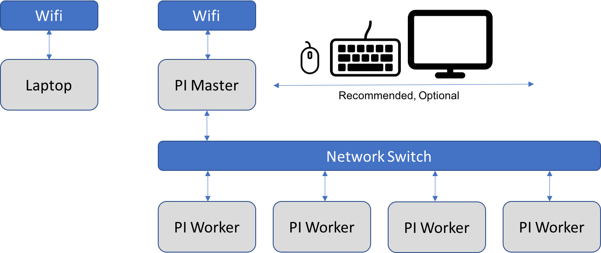
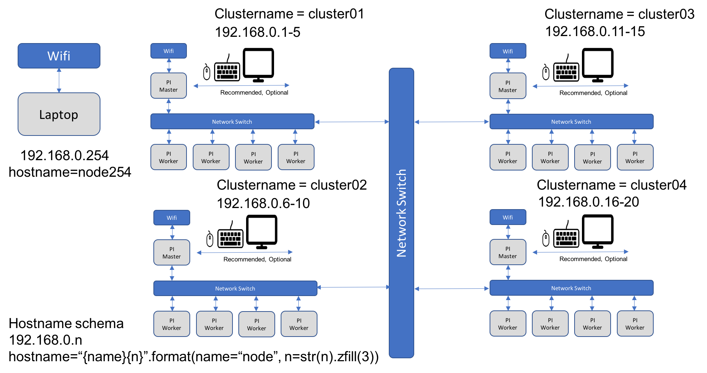
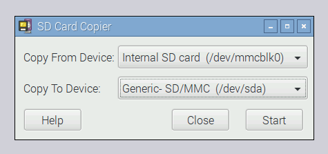

# Setting up Large PI clusters :o: :hand: fa18-516-23

## cm-burn

`cm-burn` is a program to burn many SD cards for the preparation of
building clusters with Raspberry Pi's.  The program is developed in
Python and is portable on Linux, Windows, and OSX. It allows users to
create readily bootable SD cards that have the network configured,
contain a public ssh key from your machine that you used to configure
the cards.  The unique feature is that you can burn multiple cards in
a row.

A sample command invocation looks like:

```
cm-burn —-name  red[5-7] \
        --key ~/.ssh/id_rsa.pub \
        —-ips 192.168.1.[5-7] \
        —-image 2018-06-27-raspbian-stretch
```
        
This command creates 3 SD cards where the hostnames `red5`, `red6`, `red 7`
with the network addresses `192.168.1.5`, `192.168.1.6`,
and `192.168.1.7`. The public key is added to the authorized_keys file
of the pi user.  The password login is automatically disabled and only
the ssh key authentication is enabled.

## Process

The process of the burn is as follows.

1. start the programm with the appropriate parameters the program will
   ask you to place an SD Card in the SD Card writer. Place it in
2. the specified image will be burned on the SD Card
3. next the SD Card will be mounted by the program and the appropriate
   modifications will bbe conducted.
4. after the modifications the SD Card will be unmounted
5. you will be asked to remove the card
6. if additional cards need to be burned, you will go to step 2.

In case a SD Card of a PI in the cluster goes bad, you can simply burn
it again by providing the appropriate parameters, and just print the
subset that are broken.

## Setting up a Single Large Cluster with cm-burn

`cm-burn` will setup a simple network on all cluster nodes
configured. There are different models for networking configuration we
could use.  However we have decided for one that allows you to
interface with your local Laptop to the cluster via Wifi.  The setup
is illustrated in Figure Networking.




Figure: Networking

We assume that you have used cm-burn to create all SD cards for the
Pi's. One of the Pi's is specially configured with the command

```
cm-burn --master red01
```

The SD Card in the SD Card writer will be configured as a `master`. If
the name does not match it will be configured as a worker.  Only the
`master` is connected with the Wifi network. All other nodes rout the
internet connection through the master node.  As the `master` node is
on the same Wifi network as the laptop you can login to the 'master'
node and from there log into the workers.  To simplify access you
could even setup ssh tunneled connections from the Laptop via the
master. But this is left up to you if you wish.

As a result you will be able to login on each of the machines and
execute commands such as

```
sudo apt-get update
```

Certainly you can even have a much simpler setup by just attaching a keyboard, mouse and monitor/TV to your `master`. 
This will allow you to directly work on the master node, not needing any additional hardware.

## Setting up a Cluster of Clusters with cm-burn

To integrate the clusters into a single network, we need a switch  or combination of switches to which we connect the clusters.
This is depicted in the Figure Cluster of Clusters




Each cluster is naemed cluster01-clusterNN. The hostnames are node followed by 3 zeros padded with the node number
There is a correlation between the cluster number and the node numbers in the following interval

a cluster has the nodes 

```
[(clustername - 1) * 5 + 1, (clustername - 1) * 5 + 5]
```

For convenience we will be also enabeling a cluster burn logic, that burns all images for a given cluster

cm-burn --workers=5 --name=cluster --nodes=nodes --id=3


## Prerequisits

### Raspberry Pi

We assume that you have set up a raspberry pi with the newest raspbian
OS. We assume that you have changed the default password and can log
into the pi.

We assume you have not done anything else to the OS.

The easiest way to duplicate the SD card is simply to clone it with
the build in SD Card copier. This program can be found in the menu
under Accessories.

 

Figure: SD Card Copier

This program will copy the contents of the card plugged into the PI
onto another one. The only thing you need is an USB SD Card
writer. You cn accept the defaults when the cards are plugged in which
allow you to copy the Internal SD Card onto the other one. Just be
carefull that you do not overwrite your internal one. This feature can
also be used to create backups of images that you have worked on and
want to preserve.

Thus as you can see there is not much you need to do to prepare a PI
to be used for burning the SD Card.

TODO: Python3

#### Card Burning from commandline

* Insert card and find mmcblk0, e.g. no letter p in it for partition

```sudo ls -ltr /dev/*```


```sudo dd bs=1M if=~/.cloudmesh/images/imagename.img of=mmcblk0 status=progress conv=fsync```


### OSX 

#### Card Burning

On OSX a good program is to use etcher for burning the images on disk:

* <https://etcher.io/>

To access it form the commandline you can also use

* <https://etcher.io/cli/>

#### File System Management
Unfortunately, the free versions of writing the ext file system are no
longer supported on OSX. This means that as of writing of this document
the best solution we found is to purchase and install extFS on the
MacOS computer you use for burning the SD Cards. If you find an
alternative, please let us know. (We tested ext4fuse, which
unfortunately only supports read access, see Appendix)

To easily read and write ext file systems, please install extFS which
can be downloaded from

* <https://www.paragon-software.com/home/extfs-mac/>

The purchase price of the software is $39.95.

If you like to not spend any money we recommend that you conduct the
burning on a raspberry pi.

TODO: PYTHON3 use pyenv

Tip: An alternative would be using virtualbox and using a virtual machine 
to avoid purchasing extFS.

## Windows


#### Elevate permissions for Python.exe in Windows

* Create a shortcut for python.exe
* Change the shortcut target into something like C:\xxx\...\python.exe  
* Click "advance..." in the property panel of the shortcut, and click
  the option "run as administrator"

#### Executable needed to burn the image on SD Card:

Download CommandLineDiskImager from the following url

* <https://github.com/davidferguson/CommandLineDiskImager>

The above executable will be used by cm-burn script.

It's necessary to burn the raspbian image to the SD card with this executable manually or thru Etcher in order to continue with next step.

```CommandLineDiskImager.exe C:\Users\John\Downloads\raspbian.img G```

#### File System Management

Download the Open source ext3/4 file system driver for Windows installer from

* <http://www.ext2fsd.com/>
* Open Ext2fsd exe
* The burned image in the previous step in SD card will have 2 partition
* FAT32 partition will be assigned with the Drive letter - Boot Drive
* Assign Drive Letter for EXT4 (Right click on the EXT4, 
  Assign letter.  
  The drive letter will be used while running cm-burn) - Root Drive
* Setting Automount of this EXT4
* F3 or Tools->Ext2 Volume Management
* Check-> Automatically mount via Ext2Mgr
* The instructions above needed for the Ext2fsd to reserve the Drive Letters and any raspbian image burned to SD will be auto mounted to the specific reserved drive letters. These drive letters need to be specified while using cm-burn


## Installation 

### Install on your OS

Once you have decided which Computer system (MacOS, Linux, or Windows)
you like to use for using the cm-burn program you need to install
it. The program is written in python3 which we assume you have
installed and is your default python in your terminal.

To install cm-burn, please execute 
```
git clone https://github.com/cloudmesh-community/cm-burn.git
cd cm-burn
pip install .
```

In future it will also be hosted on pypi and you will be able to
install it with

```
pip install git+https://github.com/cloudmesh-community/cm-burn
```
To check if the program works please issue the command

```cm-burn check install```

It will check if you have installed all prerequisites and are able to
run the command as on some OSes you must be in the sudo list to runi
it and access the SD card burner as well as mounting some file systems.


### Usage

#### cmburn.yaml

```
cloudmesh:
    burn:
       image: None
```

#### Manual page

TODO: This section has to be updated with the newest cm-burn -h 

The manual page is as follows:

```
cm-burn -h
Cloudmesh Raspberry Pi Mass Image Burner.

Usage:
  cm-burn create --group GROUP --names HOSTS --image IMAGE [--key=KEY]  [--ips=IPS]
  cm-burn gregor --group GROUP --names HOSTS --image IMAGE [--key=KEY]  [--ips=IPS]
  cm-burn ls
  cm-burn rm IMAGE
  cm-burn get [URL]
  cm-burn update
  cm-burn check install
  cm-burn (-h | --help)
  cm-burn --version

Options:
  -h --help     Show this screen.
  --version     Show version.
  --key=KEY     the path of the public key [default: ~/.ssh/id_rsa.pub].
  --ips=IPS     th ips in hostlist format

Files:
  This is not fully thought through and needs to be documented
  ~/.cloudmesh/images
  ~/.cloudmesh/inventory
  Location where the images will be stored for reuse

Description:
  cm-burn create --names HOSTS [--key KEY] --image IMAGE --bootdrive BOOTDRIVE --rootdrive ROOTDRIVE --ssid SSID --psk PSK
  cm-burn update
        updates the downloaded images if new once are available
  cm-burn ls
        lists the downloaded images
  cm-burn rm IMAGE
        remove the image
  cm-burn get URL
        downloads the image at the given URL
  cm-burn get jessie
        abbreviation to download a specific version of an image.
        Identify what would be useful.

Example:
  cm-burn create --names red[000-010] ips --image rasbian_latest
```

## Appendix

### OSX ext4fuse

Unfortunately ext4fuse only supports read access. To install it please
use the following steps. However it will not allow you to use the
cm-burn program. It may be useful for inspection of SD Cards

On OSX you will need brew and install osxfuse and ext4fuse

```
brew cask install osxfuse
brew install ext4fuse
```

To run it, your account must be in the sudoers list. Than you can do the following

```
mkdir linux
mkdir boot
cp  ../*.img 00.img
brew cask install osxfuse
brew install ext4fuse
hdiutil mount 00.img 
```

This will return 
```
/dev/disk3          	FDisk_partition_scheme         	
/dev/disk3s1        	Windows_FAT_32                 	/Volumes/boot
/dev/disk3s2        	Linux          
```

We can now access the boot partition with 

```
ls /Volumes/boot/
```

This partition is writable as it is not in ext format.

However to access the Linux partition in read only form we need to mount it with fuse

```
sudo mkdir /Volumes/Linux
sudo ext4fuse /dev/disk2s2 /Volumes/Linux -o allow_other
ext4fuse /dev/disk2s2 linux
less linux/etc/hosts
sudo umount /Volumes/Linux 
```

### Activate SSH

see method 3 in <https://www.raspberrypi.org/documentation/remote-access/ssh/>

Draft:

Set up ssh key on windows (use and document the ubuntu on windows thing)

you will have ~/.ssh/id_rsa.pub and ~/.ssh/id_rsa

copy the content of the file ~/.ssh/id_rsa.pub into ???/.ssh/authorized_keys
??? is the location of the admin user i think the username is pi

enable ssh on the other partition while creating the fike to activate ssh

### Hostname

change /etc/hostname

### Activate Network

see <https://www.raspberrypi.org/learning/networking-lessons/rpi-static-ip-address/>

### Change default password

From the net (wrong method):

Mount the SD card, go into the file system, and edit /etc/passwd. Find the line starting with "pi" that begins like this:

```pi:x:1000:1000...```

Get rid of the x; leave the colons on either side. This will eliminate the need for a password.

You probably then want to create a new password by using the passwd command after you log in.

The right thing to do is to create a new hash and store it in place of x.
not yet sure how that can be done a previous student from the class may have been aboe to do that 
Bertholt is firstname.

could this work? <https://unix.stackexchange.com/questions/81240/manually-generate-password-for-etc-shadow>

```python3 -c "from getpass import getpass; from crypt import *; p=getpass(); print('\n'+crypt(p, METHOD_SHA512)) if p==getpass('Please repeat: ') else print('\nFailed repeating.')"```

## Unmount Drives on Windows

RemoveDrive.exe needs to be downloaded to c:\Tools from the following path and to have the Administrator rights (Right Click on the exe -> Properties -> Compatibility Tab -> Run this program as an Administrator

* <https://www.uwe-sieber.de/drivetools_e.html>

See also 

* <https://docs.microsoft.com/en-us/powershell/module/microsoft.powershell.management/remove-psdrive?view=powershell-6>

Gregor thinks that unmounting is much easier in an aelevated command prompt using 

```
mountvol <Drive Letter>: /d
```

# Links

* <https://github.com/cloudmesh-community/hid-sp18-419/blob/master/cluster/headless_setup.md>
* <https://medium.com/@viveks3th/how-to-bootstrap-a-headless-raspberry-pi-with-a-mac-6eba3be20b26>
  * network setup is not good as it requires additional step, we want to preconfigure on sd card and plug in multiple pis at once not a single one.
* https://github.com/cloudmesh/cloudmesh.pi/blob/dev/bin/cm-burn
* http://www.microhowto.info/howto/mount_a_partition_located_inside_a_file_or_logical_volume.html
* http://www.janosgyerik.com/mounting-a-raspberry-pi-image-on-osx/
* https://github.com/Hitabis/pibakery
* http://osxdaily.com/2014/03/20/mount-ext-linux-file-system-mac/
* https://linuxconfig.org/how-to-mount-rasberry-pi-filesystem-image
* https://www.jeffgeerling.com/blogs/jeff-geerling/mounting-raspberry-pis-ext4-sd
* https://blog.hypriot.com/post/cloud-init-cloud-on-hypriot-x64/
* https://www.paragon-software.com/home/extfs-mac/


# OSX during burning

```
/dev/disk0 (internal):
   #:                       TYPE NAME                    SIZE       IDENTIFIER
   0:      GUID_partition_scheme                         2.0 TB     disk0
   1:                        EFI EFI                     314.6 MB   disk0s1
   2:                 Apple_APFS Container disk1         2.0 TB     disk0s2

/dev/disk1 (synthesized):
   #:                       TYPE NAME                    SIZE       IDENTIFIER
   0:      APFS Container Scheme -                      +2.0 TB     disk1
                                 Physical Store disk0s2
   1:                APFS Volume Macintosh HD            811.4 GB   disk1s1
   2:                APFS Volume Preboot                 26.8 MB    disk1s2
   3:                APFS Volume Recovery                519.0 MB   disk1s3
   4:                APFS Volume VM                      9.7 GB     disk1s4

/dev/disk2 (external, physical):
   #:                       TYPE NAME                    SIZE       IDENTIFIER
   0:     FDisk_partition_scheme                        *31.9 GB    disk2

/dev/disk3 (external, physical):
   #:                       TYPE NAME                    SIZE       IDENTIFIER
   0:     FDisk_partition_scheme                        *31.9 GB    disk3
   
   
 ```
 
 
 ## Experiment DIY multiSDCard writer
 
We intend to experiment to build a multiSD card writer via USB. 
We will attempt to do this for OSX initially, therefore we like to order the following product

* [USB Hub 3.0 Splitter, LYFNLOVE 7 Port USB Data](https://www.amazon.com/Splitter-LYFNLOVE-Charging-Individual-Switches/dp/B072LW1RGG/ref=sr_1_9?ie=UTF8&qid=1534418434&sr=8-9&keywords=usb+3.0+hub)

We will use multiple USB card readers (possibly just USB2 till we replacethem with USB3)

Than we will rewrite our program to attempt using the SDcard writers


```


