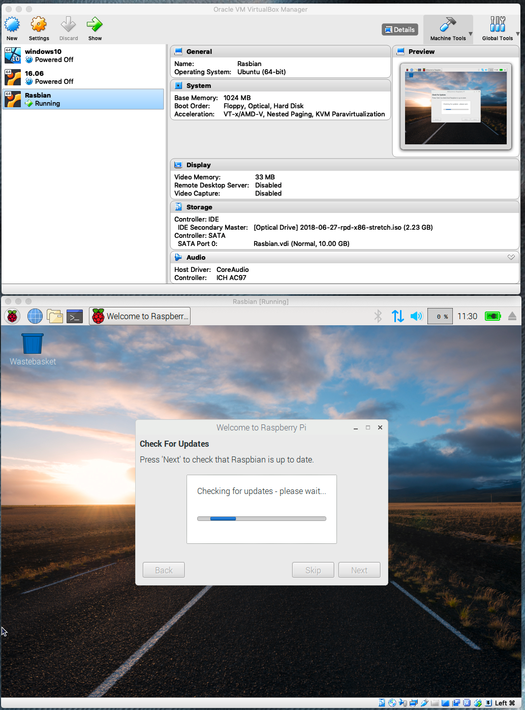

# Raspberry PI Setup (Small Number of PIs) :o: :hand: fa18-516-03

This section will be the start for the replacement for all previous setup
instructions. I think we want ultimately the section "PI Network of
Workstations" to also use this or be the final section.

Once the content has either been integrated here or it is determined that the
previous file is no longer needed, we will move the other file into a deprecated
directory, and remove the file from chapter.yaml.

We will also need to manage a second documentation just for CM-burn in the
cm-burn repo that just focuses on cm-burn as this is also a stand-alone
program.

The duplicated sections we are aware of include:

If its integrated mark the check mark. We need to be careful not to lose info

* [ ] <https://github.com/cloudmesh-community/cm-burn/blob/master/README.md>
* [ ] <https://github.com/cloudmesh-community/book/blob/master/chapters/pi/setup.md>
* [x] <https://github.com/cloudmesh-community/book/blob/master/chapters/pi/setup-dev.md>
  Now only contains information for a development environment. It needs to be
  renamed. Stays in this file for now.
* [ ] <https://github.com/cloudmesh-community/book/blob/master/chapters/pi/pi-passwordreset.md>
* [ ] <https://github.com/cloudmesh-community/book/blob/master/chapters/pi/run-at-boot.md>
* [x] deleted <https://github.com/cloudmesh-community/book/blob/master/chapters/pi/sd-card.md>
  integrated in setup-ultimate
* [ ] <https://github.com/cloudmesh-community/book/blob/master/chapters/pi/clusters/pi-configure-cluster.md>
* [ ] <https://github.com/cloudmesh-community/book/blob/master/chapters/pi/clusters/pi-setup.md>
 
There may even be more such documentation as part of student projects. No
student that does a PI project MUST DESCRIBE HOW THEY SET UP THE CLUSTER IN
THEIR REPORT. THEY ALL MUST IMPROVE OR USE THIS SECTION.

I also see that portions of other files include or can leverage what we do in
cm-burn and thus we can replace that info or merge portions of it such as in and
than these sections need to be fixed while using our ultimate guide, e.g. make a
pointer to it

* [ ] <https://github.com/cloudmesh-community/book/blob/master/chapters/pi/kubernetes/pi-kubernetes.md>
* [ ] <https://github.com/cloudmesh-community/book/blob/master/chapters/pi/kubernetes/526/readme-kube.md>
* [ ] <https://github.com/cloudmesh-community/book/blob/master/chapters/pi/kubernetes/417/pi-kubernetes.md>
 

As you see everyone duplicated in part the steps. So what we need is a
single section that describes the cm-burn procedure, but also the
steps needed by hand for those that can not afford the $50 investment
of the mount prg.

Next we propose an outline. Help improving the outline than contribute
here to this single document while not replicating sections but refer
to sections if needed. IF difference between windows osx and linux,
aslo include the differences.

## Image Choice

When it comes to the operating system install, we have multiple options. One of
the options you will find is the installation of what is called NOOBS. NOOBS is
actually not an operating system, but it installs an operating system. NOOBS has
the feature to install an operating system of choice on the Raspberry. It also
supports recovering from a faulty OS. A good introduction that showcases some of
the features of NOOBS is available at:

* <https://www.raspberrypi.org/blog/introducing-noobs/>

It also provides the necessary tools to modify the `config.txt` file
that is used at boot time.

However, as we at this time only intend to use Raspbian as the OS,
there is no need to install NOOBS. If the OS breaks, we simply burn a
new SD card. Hence the features we gain from NOOBS are not as
beneficial to us.

Instead we will directly install Raspbian on our SD card and configure
it appropriately.

* <https://www.raspberrypi.org/downloads/>

## Simulating a Raspberry PI on a Computer

In case you do not have a computer available, you can also install a
Raspberry Pi in a virtual machine.

* [Raspberry Pi Desktop Downloads](https://www.raspberrypi.org/downloads/raspberry-pi-desktop/)
* [Raspberry Pi Desktop image direct link](https://downloads.raspberrypi.org/rpd_x86_latest)

You can download the image and start it via
[VirtualBox](https://www.virtualbox.org/). As we work with newer PIs we
recommend that you set up under Linux virtual machine with 64 bit with Other.

Once completed, you will see that it looks something like



## Setting up a Single Raspberry PI

We discuss here the steps to set up a single Raspberry Pi while installing
Raspbian on an SD Card. For this we will use the
[Etcher](https://www.etcher.io/) SD card burning tool for Windows and
macOS. Other solutions such as using command line scripts are also available and
are demonstrated in the section about burning SD Cards in Linux.


### Burn an SD Card with cm-burn :o: {#pi-cm-burn-sd-card}

A very convenient program to create an SD card for a Raspberry Pi is
using the program `cm-burn`. The program is available from

* <https://github.com/cloudmesh-community/cm-burn>

It can be installed with

```console
mkdir -p cloudmesh-community
cd cloudmesh-community
git clone https://github.com/cloudmesh-community/cm-burn.git
cd cm-burn
pip install .
```

You will now have the program `cm-burn` available. Please note that
`cm-burn` is provided without any warranties to work and that if you
damage your system we do not have any liability.

The command sets up the Raspberry Pi directly on the SD Card without the need
for rebooting it. The downside is that you need to have an OS that can mount the
[ext file system](https://en.wikipedia.org/wiki/Extended_file_system). The ext
file system is native to Linux but it is not currently natively supported on
Windows 10 or macOS. A third party file system driver is available from
[Paragon Software](https://www.paragon-software.com/)
that supports ext. The Windows version called
[Linux File Systems for Windows](https://www.paragon-software.com/home/linuxfs-windows/)
costs about $20 USD and the macOS version called
[extFS for Mac](https://www.paragon-software.com/us/home/extfs-mac/)
costs about $40 USD. Linux supports ext natively and is fully supported by
cm-burn. Detailed information on how to use cm-burn is provided at

* <https://github.com/cloudmesh-community/cm-burn/blob/master/README.md>

In order to provide an option to setup an SD card without purchasing any
software we have included the manual setup steps in this document. Please read
and follow the steps in the following sections:

* [Install Raspbian on a SD card](#s-install-raspbian)
* [Password](#s-pi-setup-password)
* [Set the hostname](#s-pi-set-hostname)
* [Wireless Network at Home](#s-wireless-at-home)
* [Wireless Network at IU](#s-wireless-at-iu)
* [Update the system](#s-pi-update-system)


### Install Raspbian on a SD card {#s-install-raspbian}

For many Raspberry Pi related projects we need to install an Operating
system on an SD card. We use **Raspbian** as the OS as it is widely
supported. Other OS have recently been added to the available list of
operating systems for the PI, but we will at this time not consider
them here.

To install the OS on an SD Card you will need another computer. We
describe next the process if you have either a MAC or an Linux Ubuntu
machine.  If you have other OSes and like to contribute, please add
your suggestions.

The processes described in this section only work for a few SD cards and is not
suitable for burning hundreds of SD cards as we would need for a
cluster consisting out of many PI's.

#### Download Raspbian

No matter which OS you create the SD Cards on, you will need to
download the Raspbian OS.

Next, you need to download the Raspbian image and place it in a
directory. As you may reuse the image multiple times, we recommend to
place it in a location you remember. Let us assume you place it in
`~/Download` directory.
Visit the link

* <https://downloads.raspberrypi.org/raspbian_latest>

and download the image into the folder of your choice (we assume
`~/Download`).

#### Etcher from Windows and macOS, Linux

An easy way to burn a SD Cards on Windows, macOS, and Linux is with a
program called Etcher. Etcher can be downloaded from

* <https://etcher.io/>

Chose the download suitable for your OS. On Windows you have a couple
of options. We recommend that you use the 64 bit Installer version if
your OS supports it. If you have a Windows 32bit OS, it may be time to
upgrade your computer and/or OS. Also on Linux you need to make sure
you distinguish between 32bit and 64bit.

#### Windows 10

Once you download it, start Etcher and select the
unzipped Raspbian image file. Now select the drive of the SD
card. Click Burn and your image will be written to the SD card. You
can monitor the progress and once it is completed the SD card will
automatically unmount. Use it now in your Raspberry Pi.

The process is the same as the one on macOS

#### macOS

Once the image is downloaded you copy it with Etcher onto the SD-card.

1. Place an SD Card into a SD card reader. We recommend a 32GB card.
2. Attach the card reader to the computer
3. Open Etcher and select the downloaded `.img` or `.zip`
   file which you will likely find in the `~/Download` folder if you
   followed our previous steps
4. Select the SD card to write the image to. Be careful, to chose the
   right location as otherwise you could create unexpected data loss
5. Hence, review selections carefully and click *Flash!* to begin
   writing data to the SD card.


#### Ubuntu from Etcher

The process is the same as on macOS.

#### Ubuntu from Commandline

In Ubuntu we can use the advanced Linux commands to burn the SD Cards.
In the file explorer, right click on the SD card and format the SD
card. This is done as follows:

1. Run

   ```bash
   $ df -h
   ```

   to list all the drives in the computer
2. Insert the SD card and run the command again
3. Now a new entry will be listed which is the SD card
4. The left column of the results from `df -h` command gives the device
   name of your SD card.  It will be listed as something like
   `/dev/mmcblk0p1` or `/dev/sdX1`, where X is a lower case letter
   indicating the device.  The last part (p1 or 1 respectively) is the
   partition number.
5. Write down the name of the SD card (without the partition)
6. Unmount the card so that the card can not be read from or written
   to with the following command: 

   ```bash
   $ unmount dev/mmcblk0p1
   ```

   Make sure to use correct name for the card. If your card has
   multiple partitions unmount all partitions
7. Next write the image to the SD card by running the command:


   ```bash
   $ dd bs=4M if=<path to .img> of=/dev/mmcblk0 status=progress conv=fsunc
   ```

   Make sure `if=` contains the path to image and `of=` contains the name 
   of the SD card otherwise you may ruin your hard disk

To check, if the image was properly written you can do the following:

1. Create an image again from the SD card by running the following command:

   ```bash
   $ dd bs=4M if=/dev/sdX of=from-sd-card.img
   ```

2. Truncate the image to be the same size as that of the Raspbian image

   ```bash
   $ truncate --reference <original raspbian image> from-sd-card.img
   ```

3. Run `diff` to see if the two files are same by running the following
    command:

   ```bash
   $ diff -s from-sd-card.img <original raspbian image>
   ```

   If everything is OK, `diff` should say that the two files are the same.

In most cases the verification step will not be needed.

### Password {#s-pi-setup-password}

Before you bring your Raspberry Pi on the network, you need to reset
the password. This can be done by starting the terminal and typing in
it the command

    pi$ passwd

The original password is `raspberrypi` and everyone knows it. So if
you put your pi on the network it is easily compromised. Hence, change
your password first.

### Locale

You want to also set your system to use your language settings for the
keyboard. You can do this from the terminal with

```bash
    pi$ sudo raspi-config
```

or

```bash
    pi$ sudo dpkg-reconfigure locales
```

or using the GUI.

### Set the Hostname {#s-pi-set-hostname}

The hostname is stored in `/etc/hostname`. Edit the file and change it
to a name such as green00, green01, green02, green03, green04, green05.
Be consistent with the names. The 00 host should be the topmost host in
the cluster.

edit

    pi$ sudo nano /etc/hostname

after you edited the hostname

    pi$ sudo /etc/init.d/hostname.sh start

The Pi can also give an error if the hostname set in `/etc/hostname` does not
also have an entry in `/etc/hosts` as the local loopback. To fix this, edit
`/etc/hosts` and on the last line you should see:

```
127.0.1.1       raspberrypi
```

This should be changed to the new host name set in `/etc/hostname`.

```bash
    pi$ sudo nano /etc/hosts
```


### Wireless Network at Home {#s-wireless-at-home}

The easiest way to get internet access and to continue the setup is using a
wireless network. You can configure it either via the GUI or command line. The
`raspi-config` utility can also setup a WiFi connection. The steps below
were taken from the
[Offical Raspberry Pi Wireless setup](https://www.raspberrypi.org/documentation/configuration/wireless/wireless-cli.md).

The Raspberry Pi is already configured to connect to a WiFi network, all you
need to do is set your network name (ssid) and passphrase. Additionally, you
should set the current country since some locations have different restrictions
on the available WiFi radio bands. The file
`/etc/wpa_supplicant/wpa_supplicant.conf` contains details about network names
and passwords and you can add your details directly to the bottom of this file
for any wireless networks you would like to connect to. You can directly add the
plain text of your wireless passphrase but it is much better to add the hash of
the passphrase since this will not expose your passphrase. (Please note, however,
that the hash can be used by any computer to connect to the network and a brute
force search could recover your password, but it still better than plain text).

To find the WiFi networks that your Pi can currently detect run this command:

```bash
$ sudo iwlist wlan0 scan
```

The proper format for a wireless network definition is:

```
...
country=US
network={
        ssid="network_name"
        psk="WiFi passphrase or hash
}
...
```

The Pi comes with a utility that can automatically generate your WiFi passphrase
hash called `wpa_passphrase`. You can execute this command to hash your
passphrase and append it to the correct file:

```bash
$ wpa_passphrase "network_name" "passphrase" | sudo tee -a /etc/wpa_supplicant/wpa_supplicant.conf
```

Or you can run this command and type your pass phrase at the prompt followed by
Enter:

```bash
$ wpa_passphrase "network_name" | sudo tee -a /etc/wpa_supplicant/wpa_supplicant.conf
```

Unfortunately, `wpa_passphrase` includes the original passphrase in plain text
so you will need to edit the file by hand to remove it. Use your favorite editor
and remove the commented out line with the plain text passphrase. At this time
you should also add the country designation as this may be necessary in some
cases.

```bash
$ sudo nano /etc/wpa_supplicant/wpa_supplicant.conf
```

The original file should be changed from this:

```
ctrl_interface=DIR=/var/run/wpa_supplicant GROUP=netdev
update_config=1
network={
        ssid="network_name"
        #psk="my plaintext passphrase"
        psk=0617cac0927403beefda5705f5ff97bbc562f5d1907b40f02c39912a7d595b0f
}
```

to this:

```
ctrl_interface=DIR=/var/run/wpa_supplicant GROUP=netdev
update_config=1
country=US
network={
        ssid="network_name"
        psk=0617cac0927403beefda5705f5ff97bbc562f5d1907b40f02c39912a7d595b0f
}
```

You can then reconfigure the wireless adapter and it should get an IP address.
You can complete this and see the current setup with the following commands.

```bash
$ wpa_cli -i wlan0 reconfigure
$ ifconfig wlan0
$ iwgetid
```

Note that if you have configured your `wlan0` interface with a static IP address
then it will only use this static address. Also, if you configure the same
static IP address for both `eth0` and `wlan0` (this is the default if you
use `cm-burn`) then only one of the interfaces will be assigned an IP address.
This is not a problem and if you disconnect either of the interfaces then the
other one will immediately be assigned the IP address.

If you need to renew your DHCP lease you can use the following command. If you
want to renew the lease for the Ethernet adapter then replace `wlan0` with
`eth0`. Note that you will lose your connection to the Pi during this process if
you are connected using the same interface, but the Pi should come back online
after 20 seconds:

```bash
$ sudo dhclient -r wlan0; sleep 10; sudo dhclient wlan0
```

### Wireless Network at IU {#s-wireless-at-iu}

:o: TODO: Update with new IU public wireless information

IU runs several different networks. This includes IUSecure, Eduroam,
and ATT Wifi.  The first two would require you to use your IU username
and password to be entered in the configuration. Although technically
possible we find the method :warning: **HIGHLY** insecure and
:warning: **STRONGLY** advice against doing so. Let us assume you put
your information on a PI and than someone takes the SD Card from
it. They can than look into the card and steal your
password. Obviously this is not advisable. In other cases you may have
configured your software wrong and someone could login remotely and
lift your password remotely. Obviously this is not advisable.

Regardless, we have seen from instructors the advice to use
IUSecure. This is :warning: **WRONG**! Do not listen to them about
this particular issue and advise them to use an alternative setup.

One such alternative (which is also not ideal) is to use the free wifi
offered by ATT Wifi. It is a bit complex to setup as you need to go to
the Web browser to the address <http:\\iu.edu> and click on the
connect button. Sometimes that button is not visible so you need to
scroll down to see it.

We also have an internal network that we will not discuss here, but
can be used upon consultation with Dr. von Laszewski.

### Update {#s-pi-update-system}

We want to update the software and make sure
everything is up to date. This is done with 

    pi$ sudo apt-get update

To develop easily we need a number of programs on our Pi. Additional programs can
be installed with the command

```bash
pi$ apt-get install PACKAGE
```

where `PACKAGE` is the name of the software we like to install.
A good example is emacs which can be installed with

```bash
pi$ apt-get install emacs
```

### Remote access via ssh

In the latest Raspbian OS ssh is enabled by default. However, if you discover
that it is not enabled, the following commands should enable it.

    pi$ sudo systemctl enable ssh
    pi$ sudo systemctl start ssh

Naturally you need to do a bit more such as placing your public key in
the `authorized_keys` file explained later, but for now we will just
activate ssh.

To access the machine using public keys we recommend that you add your
public key to the `~pi/.ssh/authorized_keys` file

## Setting up a Small Cluster by Hand

If you would like to setup a Raspberry Pi cluster please refer to the section
[Network of Pis](#pi-now-main) for details on configuring a cluster by hand or
with our convenient tools and scripts such as `cm-burn`.

:o: This explains how to set up a small cluster by hand discussing how to
burn multiple cards. It uses the method of booting the pi and using a
monitor to set up each of them. Starting with passwd.

The process described above can be replicated fairly easily for a
small number of Pis. Just make sure you have a different hostname for
each Pi. More complex setups are discussed next while for example
using static IP addresses.


### Wireless network addresses by hand

:o:

### Static network addresses by hand

:o:

### Mixed wireless and static network

:o:


:o: JPB fa18-516-03 reviewed to here :o:

System Preparation without Monitor
----------------------------------

:o: there is lots of duplication here to the ultimate setup

### hostname

Find a way on how to name the host as each of the cluster nodes will
need its own unique name. We simple use color01, where color is the
color of the USB cables you have and the number is the ith PI starting
from the top

### SSH

Describe how you enable SSH without a monitor

### key

Describe how you can generate a private key at the right location on the
SD Card. Place your own public key on the SD Card

Write python programs for this.

### password

Describe how you can change the password on the SD Card


## Post configuration

### Network Addresses

Some online guides recommend sending a ping to the broadcast address of your
network but Raspbian ignores broadcast pings by default so the Raspberry Pis
will not respond to this and then will not show up in arp tables. `nmap` will
work, however.

This works on a Pi substitute your network submask for `192.168.1.0/24`:

```bash
$ sudo apt-get install -y nmap
$ nmap -sn 192.168.1.0/24
# will list all devices on the network
$ arp -a
# will list devices in arp cache and lookup hostname
$ arp -a -n
# Same as previous but skips hostname lookup
```

`nmap` is also available on Windows and macOS. It can be downloaded directly from 
[Nmap installation instructions](https://nmap.org/book/install.html) or
using Homebrew on macOS as `brew install nmap`. Usage is as above.


### key

Write a python program that does the following:

1. login with ssh on each PI and call ssh-keygen to generate a
   unique key on each PI.

2. copy this .pub keys to your computer and store them into a file
   called `authorized_keys`

3. copy that file to all Pis

4. you may also have to copy your authorized key file to

### VNC

find out how to set up vnc so you can login into the PI and see its GUI

* <https://www.raspberrypi.org/forums/viewtopic.php?t=74176>

* <https://www.raspberrypi.org/documentation/remote-access/vnc/>

```bash
host$ alias IP=<IPADDRESSOFPI>
host$ sh pi@$IP

pi@IP's password: 
Linux raspberrypi 3.10.25+ #622 PREEMPT Fri Feb 3 20:00:00 GMT 2018 armv6l
pi@raspberrypi ~ $ sudo apt-get tightvncserver   # download the VNC server
pi@raspberrypi ~ $ tightvncserver                # start the VNC server
pi@raspberrypi ~ $ vncserver :0 -geometry 1920x1080 -depth 24  #start a VNC session
```


Now, back on your Mac:
In the Finder, select Go => Connect To Server...
Type `vnc://xxx.xxx.xxx.xxx` (where `xxx.xxx.xxx.xxx` is the IP address that you discovered in step 2.
Click [Connect]. This will launch the Screen Sharing application, and
with a little luck, you should see this image.


## Setting up a Small Cluster with cm-burn

This discusses how to set things up for many PIs with `cm-burn`

## Setting up a large cluster with cm-burn

## DHCP setup

### Configure Head Node (port forwarding and DNS)

Install Dependencies:

    $ apt-get update
    $ apt-get install -qy dnsmasq clusterssh iptables-persistent

#### Create Static IP

TODO: Verify: This should already be done by `cm-burn`

Copy old config (-n flag prevents overwrite):

    $ \cp -n /etc/dhcpcd.conf /etc/dhcpcd.conf.old
    
To update DHCP configuration, add the following to **/etc/dhcpd.conf**:
 
    interface wlan0
    metric 200

    interface eth0
    metric 300
    static ip_address=192.168.50.1/24
    static routers=192.168.50.1
    static domain_name_servers=192.168.50.1

#### Configure DHCP Server:

Copy old config (-n flag prevents overwrite):

    $ \cp -n /etc/dnsmasq.conf /etc/dnsmasq.conf.old
    
To update DNS configuration, add the following to **/etc/dhcpd.conf**
    
    interface=eth0
    interface=wlan0

    dhcp-range=eth0, 192.168.50.1, 192.168.50.250, 24h
    
#### NAT Forwarding

To Setup NAT Forwarding, uncomment the following line in **/etc/sysctl.conf**:

    net.ipv4.ip_forward=1
    
#### IP Tables

Create IP Tables:

    $ sudo iptables -t nat -A POSTROUTING -o wlan0 -j MASQUERADE
    $ sudo iptables -t nat -A POSTROUTING -o eth0 -j MASQUERADE
    $ sudo iptables -A FORWARD -i $INTERNAL -o wlan0 -j ACCEPT
    $ sudo iptables -A FORWARD -i $EXTERNAL -o eth0 -j ACCEPT

Make rules permanent:

    $ iptables-save > /etc/iptables/rules.v4


### SSH Configuration

Generate SSH keys:

    $ ssh-keygen -t rsa
    
Copy key to each compute node:

    $ ssh-copy-id <hostname>
    
For hostnames rp1-4 (final node names will be: rp0, rp1, rp2, rp3, rp4).

### Configure Cluster SSH

To update Cluster SSH configuration, add the following to **/etc/clusters**:

    $ rpcluster rp1 rp2 rp3 rp4

Now you can run commands to all clusters by:

    $ cssh rpcluster

NOTE: This seems to be related to using `cssh` 
[Cluster SSH](https://github.com/duncs/clusterssh/wiki) to update all the nodes
together. I would suggest this is better down by using Docker or Ansible.

### PXE Boot

:o:


## Using Advanced setups with Ansible


## Change Password on the SD-Card

It is possible to reset the password for a PI SD Card. This comesin
handy when you did forget it or the team that worked on a Pi has left
the project but valuable information may still be on the PI. To do so,
You need tou unplug the raspberry pi and remove the SD card from the
slot.  Next you need to have the ability to mount the file systems. On
macOS and Windows you can use extFS. Naturally if you have a linux
machine or another PI, you can use an SD Card reader/writer and mount
it directly. You will need root access on the machine where you
execute the password reset.

After you inserted the card, please Locate and edit the `etc/shadow`
file on the SD card. To create a new password use the command 

```bash
$ openssl passwd -1 -salt <unique string>
```

Next, we e must find the line that starts with pi and replace the text
  between the first and second with the output from the above command
  we had executed in the `etc/shadow` file

Now you can Eject the SD card from the computer, and insert it into
the Pi. Boot the raspberry pi and log in to it while using the new
password. This naturally only works if you allow password login. ON
many systems we however disable it and use public key authentication
only. In this case you need to just replace the public key in the
`authorized_keys` file. Using just keys is obviously more convenient.

Naturally mounting the SD Card and looking in the filesystem would also
allow you to look at the network setup. That is certainly not good and
before a PI is returned sensitive information should be cleaned from
the SD Card. 

## Creating Backup :question:

:question: In this section we will explain how to create a backup of
the image from the SD Card in a PI.

## Duplication :question:

Let us assume you have installed a lot of great programs on the SD Card.
In a cluster, we need to duplicate this card for each PI in the cluster.
Is there a way for us to duplicate the software


## Exercises

SD-Card.1

: Improve the Ubuntu SD-card documentation

SD-Card.2

: Could a script be written that does the entire process via a python
  or shell command in Ubuntu.

SD-Card.2

: Could a script be written that does the entire process via a python
  or shell command in macOS?

SD-Card.3

: could a script be written that does the entire process via a python
  or shell command in gitbash for Windows?

SD-Card.4

: In general the Ubuntu documentation is complex, how can it be
  simplified? Maybe through automation?

