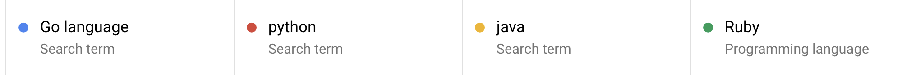
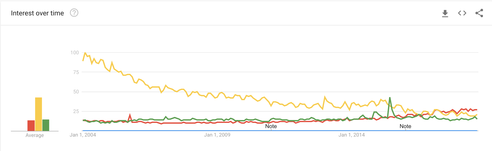

# Introduction to Go for Cloud Computing {#s-go-intro}

---

**:mortar_board: Learning Objectives**

* Learn quickly Go under the assumption you know a programming language
* Work with Go modules modules
* Contuct some Go examples
* Learn about REST services in Go
* Learn how access virtual machines from Go
* Learn hos to interface with kubernetes in Go

---

* :construction: TODO: add the [?] as bibtex entries in bib/references-go.bib
* :construction: TODO: add md section links where needed to place holder sections

Go is a programming language that has been introduced by Google to
replace the C++ language. Portions of this section have been adapted
from the [official Go Documentation](https://golang.org/doc/) [?].

The language Go has at its goal to be expressive, concise, clean, and
efficient. It includes concurrency mechanisms with the goal to make it
easy to write programs that can utilize multicore and networked
features of modern computer systems and infrastructure easily with
language features. However in contrast to languages such as python and
ruby, it introduces in addition to static types explicitly types
supporting concurrent programming such as channels that have already
been used in the early days of programming for example as part of CSP
[?] and OCCAM [?]

Go is compiled to machine code yet has the convenience of garbage
collection and the power of run-time reflection. It is designed to
provide the programmer a fast, statically typed, compiled language
that feels like a dynamically typed, interpreted language.

Here is an example article discussing
[Why should you learn Go?](https://medium.com/exploring-code/why-should-you-learn-go-f607681fad65)[?]. However,
this article may be a bit biased towards Go and you may want to
evaluate some of the provided arguments more carefully yourself.

Regarding the design philosophy behind the Go language, the following
is
[an excerpt from the designers](https://golang.org/doc/faq#principles):

> *"When Go was designed, Java and C++ were the most commonly used
> languages for writing servers, at least at Google. We felt that
> these languages required too much bookkeeping and repetition. Some
> programmers reacted by moving towards more dynamic, fluid languages
> like Python, at the cost of efficiency and type safety. We felt it
> should be possible to have the efficiency, the safety, and the
> fluidity in a single language"* [?].

According to the [TIOBE](https://www.tiobe.com/tiobe-index/) [?] index
for programming languages Go has reached for November 2018 the 16th
spot. However it is rated only with 1.081% with a declining rating but
increase in the ranking. This trend is even more prominently depicted
when looking at google trends in +@fig:go-trend.

{#fig:go-trend}

## Organization of the chapter

The material presented in this chapter introduces the reader first to
the basic concepts and features of the Go language and system.  This
includes compiling (see Section ?), have a basic understanding of the
programming language (see Section ?), use standard library and become
familiar with package management (see Section ?). Next we will focus
on aspects of the Go language that are especially useful for Cloud
computing. This includes the review of how to develop REST services
with various frameworks such as Gorilla (see Section ?) and OpenAPI
(see Section ?). You will than be introduced on how to access virtual
machines (see Section ?) and containers (see Section ?).

In order to to use Go we recommend that you have a computer fulfilling
the following requirements:

- Have the most up to date version of Go installed
- Be familiar with the Linux command line as showcased in Section ?
- Familiarity with a text editor such as emacs, which we prefer as it
  supports nicely not only Go but any other language or document
  format we typically use in our activities. Alternatives are
  discussed in Section ?

References
----------

The following references may be useful for you to find out more about
go. We have not gone to the list in detail, but want to make you aare
of some of them that we found through simple searches in Google
search. IF you find others or you have a favourite, let us know and we
will add them and mark them appropriately.

  * [golang.org](http://golang.org/doc/#learning) [?].
  * [Go cheat sheet](https://github.com/a8m/go-lang-cheat-sheet) [?].
  * [The Little Go Book](http://openmymind.net/The-Little-Go-Book/) [?].
  * [Learn Go in an Hour - Video](https://www.youtube.com/watch?v=CF9S4QZuV30) _2015-02-15_
  *
    [Learning to Program in Go](https://www.youtube.com/playlist?list=PLei96ZX_m9sVSEXWwZi8uwd2vqCpEm4m6), a multi-part video training class [?].
  * [Go By Example](http://gobyexample.com/) provides a series of
    annotated code snippets [?].
  * [Learn Go in Y minutes](http://learnxinyminutes.com/docs/go/) is a
    top-to-bottom walk-through of the language [?].
  * [Workshop-Go](https://github.com/sendwithus/workshop-go) - Startup
    Slam Go Workshop - examples and slides [?].
  * [Go Fragments](http://www.gofragments.net/) - A collection of
    annotated Go code examples [?].
  *
    [50 Shades of Go: Traps, Gotchas, Common Mistakes for New Golang Devs](http://devs.cloudimmunity.com/gotchas-and-common-mistakes-in-go-golang/index.html) [?]
  *
    [Free Go Language Workshop](https://www.frameworktraining.co.uk/go-language-free-training-workshop/) Framework Training is running regular free BYOD workshops in London, UK [?]
  *
    [Golang Tutorials](http://golangtutorials.blogspot.com/2011/05/table-of-contents.html) - A free online class [?].
  * [The Go Bridge Foundry](https://github.com/gobridge) [?] - A member of
    the [Bridge Foundry](http://bridgefoundry.org/) [?] family, offering a
    complete set of free Go training materials with the goal of
    bringing Go to under-served communities.
* [Golangbot](https://golangbot.com/learn-golang-series/) - Tutorials
  to get started with programming in Go [?].
* [Algorithms to Go](http://yourbasic.org/) - Texts about algorithms
  and Go, with plenty of code examples [?].
*
  [Go Language Tutorials](https://www.cybrhome.com/topic/go-language-tutorials) - List of popular sites, blogs and tutorials for learning Go language [?].
*
  [Golang Development Video Course](https://www.youtube.com/playlist?list=PLzUGFf4GhXBL4GHXVcMMvzgtO8-WEJIoY) - A growing list of videos focused purely on Go development [?].

