# NIST Pedestrian and Face Detection :o: {#s-face}

Pedestrian and Face Detection uses OpenCV to identify people standing in
a picture or a video and NIST use case in this document is built with
Apache Spark and Mesos clusters on multiple compute nodes.

The example in this tutorial deploys software packages on OpenStack
using Ansible with its roles. See @fig:face-image03, @fig:face-image05, @fig:face-image06, @fig:face-image04

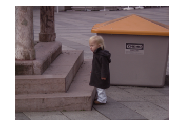{#fig:face-image03}

{#fig:face-image05}

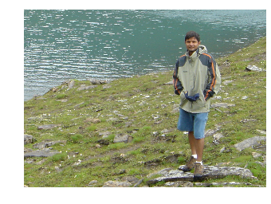{#fig:face-image06}

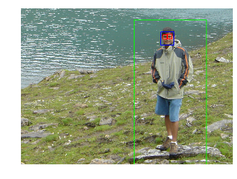{#fig:face-image04}

### Introduction

Human (pedestrian) detection and face detection have been studied during
the last several years and models for them have improved along with
Histograms of Oriented Gradients (HOG) for Human Detection \[1\]. OpenCV
is a Computer Vision library including the SVM classifier and the HOG
object detector for pedestrian detection and INRIA Person Dataset \[2\]
is one of popular samples for both training and testing purposes. In
this document, we deploy Apache Spark on Mesos clusters to train and
apply detection models from OpenCV using Python API.

#### INRIA Person Dataset

This dataset contains positive and negative images for training and test
purposes with annotation files for upright persons in each image. 288
positive test images, 453 negative test images, 614 positive training
images and 1218 negative training images are included along with
normalized 64x128 pixel formats. 970MB dataset is available to download
\[3\].

#### HOG with SVM model

Histogram of Oriented Gradient (HOG) and Support Vector Machine (SVM)
are used as object detectors and classifiers and built-in python
libraries from OpenCV provide these models for human detection.

#### Ansible Automation Tool

Ansible is a python tool to install/configure/manage software on
multiple machines with JSON files where system descriptions are defined.
There are reasons why we use Ansible:

-   Expandable: Leverages Python (default) but modules can be written in
    any language

-   Agentless: no setup required on managed node

-   Security: Allows deployment from user space; uses ssh for
    authentication

-   Flexibility: only requires ssh access to privileged user

-   Transparency: YAML Based script files express the steps of
    installing and configuring software

-   Modularity: Single Ansible Role (should) contain all required
    commands and variables to deploy software package independently

-   Sharing and portability: roles are available from source (github,
    bitbucket, gitlab, etc) or the Ansible Galaxy portal

We use Ansible roles to install software packages for Humand and Face
Detection which requires to run OpenCV Python libraries on Apache Mesos
with a cluster configuration. Dataset is also downloaded from the web
using an ansible role.

### Deployment by Ansible

Ansible is to deploy applications and build clusters for
batch-processing large datasets towards target machines e.g. VM
instances on OpenStack and we use ansible roles with *include* directive
to organize layers of big data software stacks (BDSS). Ansible provides
abstractions by Playbook Roles and reusability by Include statements. We
define X application in X Ansible Role, for example, and use include
statements to combine with other applications e.g. Y or Z. The layers
exist in sub directories (see below) to add modularity to your Ansible
deployment. For example, there are five roles used in this example that
are Apache Mesos in a scheduler layer, Apache Spark in a processing
layer, a OpenCV library in an application layer, INRIA Person Dataset in
a dataset layer and a python script for human and face detection in an
analytics layer. If you have an additional software package to add, you
can simply add a new role in a main ansible playbook with *include*
directive. With this, your Ansible playbook maintains simple but
flexible to add more roles without having a large single file which is
getting difficult to read when it deploys more applications on multiple
layers. The main Ansible playbook runs Ansible roles in order which look
like:

    ```
    include: sched/00-mesos.yml
    include: proc/01-spark.yml
    include: apps/02-opencv.yml
    include: data/03-inria-dataset.yml
    Include: anlys/04-human-face-detection.yml
    ```

Directory names e.g. sched, proc, data, or anlys indicate BDSS layers
like: - sched: scheduler layer - proc: data processing layer - apps:
application layer - data: dataset layer - anlys: analytics layer and two
digits in the filename indicate an order of roles to be run.

### Cloudmesh for Provisioning

It is assumed that virtual machines are created by cloudmesh, the cloud
management software. For example on OpenStack,

`cm cluster create -N=6`

command starts a set of virtual machine instances. The number of
machines and groups for clusters e.g. namenodes and datanodes are
defined in the Ansible inventory file, a list of target machines with
groups, which will be generated once machines are ready to use by
cloudmesh. Ansible roles install software and dataset on virtual
clusters after that stage.

### Roles Explained for Installation

Mesos role is installed first as a scheduler layer for masters and
slaves where mesos-master runs on the masters group and mesos-slave runs
on the slaves group. Apache Zookeeper is included in the mesos role
therefore mesos slaves find an elected mesos leader for the
coordination. Spark, as a data processing layer, provides two options
for distributed job processing, batch job processing via a cluster mode
and real-time processing via a client mode. The Mesos dispatcher runs on
a masters group to accept a batch job submission and Spark interactive
shell, which is the client mode, provides real-time processing on any
node in the cluster. Either way, Spark is installed later to detect a
master (leader) host for a job submission. Other roles for OpenCV, INRIA
Person Dataset and Human and Face Detection Python applications are
followed by.

The following software are expected in the stacks according to the
[github](https://github.com/futuresystems/pedestrian-and-face-detection):

-   mesos cluster (master, worker)

-   spark (with dispatcher for mesos cluster mode)

-   openCV

-   zookeeper

-   INRIA Person Dataset

-   Detection Analytics in Python

-   \[1\] Dalal, Navneet, and Bill Triggs. "Histograms of oriented
    gradients for human detection." 2005 IEEE Computer Society
    Conference on Computer Vision and Pattern Recognition (CVPR'05).
    Vol. 1. IEEE,

    2005\. \[pdf\]

-   \[2\] <http://pascal.inrialpes.fr/data/human/>

-   \[3\] <ftp://ftp.inrialpes.fr/pub/lear/douze/data/INRIAPerson.tar>

-   \[4\] <https://docs.python.org/2/library/configparser.html>

#### Server groups for Masters/Slaves by Ansible inventory

We may separate compute nodes in two groups: masters and workers
therefore Mesos masters and zookeeper quorums manage job requests and
leaders and workers run actual tasks. Ansible needs group definitions in
their inventory therefore software installation associated with a proper
part can be completed.

Example of Ansible Inventory file (inventory.txt)

    [masters]
    10.0.5.67
    10.0.5.68
    10.0.5.69
    [slaves]
    10.0.5.70
    10.0.5.71
    10.0.5.72

### Instructions for Deployment

The following commands complete NIST Pedestrian and Face Detection
deployment on OpenStack.

#### Cloning Pedestrian Detection Repository from Github

Roles are included as submodules which require `--recursive` option to
checkout them all.

    $ git clone --recursive https://github.com/futuresystems/pedestrian-and-face-detection.git

Change the following variable with actual ip addresses:

    sample_inventory="""[masters]
    10.0.5.67
    10.0.5.68
    10.0.5.69
    [slaves]
    10.0.5.70
    10.0.5.71
    10.0.5.72"""

Create a `inventory.txt` file with the variable in your local directory.

    !printf "$sample_inventory" > inventory.txt
    !cat inventory.txt

Add `ansible.cfg` file with options for ssh host key checking and login
name.

    ansible_config="""[defaults]
    host_key_checking=false
    remote_user=ubuntu"""
    !printf "$ansible_config" > ansible.cfg
    !cat ansible.cfg

Check accessibility by ansible ping like:

    !ansible -m ping -i inventory.txt all

Make sure that you have a correct ssh key in your account otherwise you
may encounter 'FAILURE' in the ping test above.

#### Ansible Playbook

We use a main ansible playbook to deploy software packages for NIST
Pedestrian and Face detection which includes: - mesos - spark -zookeeper
- opencv - INRIA Person dataset - Python script for the detection

    !cd pedestrian-and-face-detection/ && ansible-playbook -i ../inventory.txt site.yml

The installation may take 30 minutes or an hour to complete.

### OpenCV in Python

Before we run our code for this project, let's try OpenCV first to see
how it works.

#### Import cv2

Let's import opencv python module and we will use images from the online
database image-net.org to test OpenCV image recognition. See @fig:facedetection_46_0, @fig:facedetection_49_0

    import cv2

Let's download a mailbox image with a red color to see if opencv
identifies the shape with a color. The example file in this tutorial is:

    $ curl http://farm4.static.flickr.com/3061/2739199963_ee78af76ef.jpg > mailbox.jpg

> 100 167k 100 167k 0 0 686k 0 --:--:-- --:--:-- --:--:-- 684k

    %matplotlib inline

    from IPython.display import Image
    mailbox_image = "mailbox.jpg"
    Image(filename=mailbox_image)

{#fig:facedetection_46_0}

You can try other images. Check out the image-net.org for mailbox
images: <http://image-net.org/synset?wnid=n03710193>

#### Image Detection

Just for a test, let's try to detect a red color shaped mailbox using
opencv python functions.

There are key functions that we use: \* cvtColor: to convert a color
space of an image \* inRange: to detect a mailbox based on the range of
red color pixel values \* np.array: to define the range of red color
using a Numpy library for better calculation \* findContours: to find a
outline of the object \* bitwise\_and: to black-out the area of contours
found

```python
    import numpy as np
    import matplotlib.pyplot as plt

    # imread for loading an image
    img = cv2.imread(mailbox_image)
    # cvtColor for color conversion
    hsv = cv2.cvtColor(img,cv2.COLOR_BGR2HSV)

    # define range of red color in hsv
    lower_red1 = np.array([0, 50, 50])
    upper_red1 = np.array([10, 255, 255])
    lower_red2 = np.array([170, 50, 50])
    upper_red2 = np.array([180, 255, 255])

    # threshold the hsv image to get only red colors
    mask1 = cv2.inRange(hsv, lower_red1, upper_red1)
    mask2 = cv2.inRange(hsv, lower_red2, upper_red2)
    mask = mask1 + mask2

    # find a red color mailbox from the image
    im2, contours,hierarchy = cv2.findContours(mask, cv2.RETR_TREE, cv2.CHAIN_APPROX_SIMPLE)

    # bitwise_and to remove other areas in the image except the detected object
    res = cv2.bitwise_and(img, img, mask = mask)

    # turn off - x, y axis bar
    plt.axis("off")
    # text for the masked image
    cv2.putText(res, "masked image", (20,300), cv2.FONT_HERSHEY_SIMPLEX, 2, (255,255,255))
    # display
    plt.imshow(cv2.cvtColor(res, cv2.COLOR_BGR2RGB))
    plt.show()
```

{#fig:facedetection_49_0}

The red color mailbox is left alone in the image which we wanted to find
in this example by opencv functions. You can try other images with
different colors to detect the different shape of objects using
findContours and inRange from opencv.

For more information, see the useful links below.

-   contours features:
    <http://docs.opencv.org/3.1.0/dd/d49/tutorial/_py/_contour/_features.html>

-   contours:
    <http://docs.opencv.org/3.1.0/d4/d73/tutorial/_py/_contours/_begin.html>

-   red color in hsv:
    <http://stackoverflow.com/questions/30331944/finding-red-color-using-python-opencv>

-   inrange:
    <http://docs.opencv.org/master/da/d97/tutorial/_threshold/_inRange.html>

-   inrange:
    <http://docs.opencv.org/3.0-beta/doc/py/_tutorials/py/_imgproc/py/_colorspaces/py/_colorspaces.html>

-   numpy:
    <http://docs.opencv.org/3.0-beta/doc/py/_tutorials/py/_core/py/_basic/_ops/py/_basic/_ops.html>

### Human and Face Detection in OpenCV

#### INRIA Person Dataset

We use INRIA Person dataset to detect upright people and faces in images
in this example. Let's download it first.

    $ curl ftp://ftp.inrialpes.fr/pub/lear/douze/data/INRIAPerson.tar > INRIAPerson.tar

> 100 969M 100 969M 0 0 8480k 0 0:01:57 0:01:57 --:--:-- 12.4M

    $ tar xvf INRIAPerson.tar > logfile && tail logfile

#### Face Detection using Haar Cascades

This section is prepared based on the opencv-python tutorial:
<http://docs.opencv.org/3.1.0/d7/d8b/tutorial/_py/_face/_detection.html#gsc.tab=0>

There is a pre-trained classifier for face detection, download it from
here:

    $ curl https://raw.githubusercontent.com/opencv/opencv/master/data/haarcascades/haarcascade_frontalface_default.xml > haarcascade_frontalface_default.xml

> 100 908k 100 908k 0 0 2225k 0 --:--:-- --:--:-- --:--:-- 2259k

This classifier XML file will be used to detect faces in images. If you
like to create a new classifier, find out more information about
training from here:
<http://docs.opencv.org/3.1.0/dc/d88/tutorial/_traincascade.html>

#### Face Detection Python Code Snippet

Now, we detect faces from the first five images using the classifier. See @fig:facedetection_59_0, @fig:facedetection_59_1, @fig:facedetection_59_2, @fig:facedetection_59_3, @fig:facedetection_59_4, @fig:facedetection_59_5, @fig:facedetection_59_6, @fig:facedetection_59_7, @fig:facedetection_59_8, @fig:facedetection_59_9, @fig:facedetection_59_10

    # import the necessary packages
    from __future__ import print_function
    import numpy as np
    import cv2
    from os import listdir
    from os.path import isfile, join
    import matplotlib.pyplot as plt

    mypath = "INRIAPerson/Test/pos/"
    face_cascade = cv2.CascadeClassifier('haarcascade_frontalface_default.xml')

    onlyfiles = [join(mypath, f) for f in listdir(mypath) if isfile(join(mypath, f))]

    cnt = 0
    for filename in onlyfiles:
        image = cv2.imread(filename)
        image_grayscale = cv2.cvtColor(image, cv2.COLOR_BGR2GRAY)
        faces = face_cascade.detectMultiScale(image_grayscale, 1.3, 5)
        if len(faces) == 0:
            continue

        cnt_faces = 1
        for (x,y,w,h) in faces:
            cv2.rectangle(image,(x,y),(x+w,y+h),(255,0,0),2)
            cv2.putText(image, "face" + str(cnt_faces), (x,y-10), cv2.FONT_HERSHEY_SIMPLEX, 1, (0,0,0), 2)
            plt.figure()
            plt.axis("off")
            plt.imshow(cv2.cvtColor(image[y:y+h, x:x+w], cv2.COLOR_BGR2RGB))
            cnt_faces += 1
        plt.figure()
        plt.axis("off")
        plt.imshow(cv2.cvtColor(image, cv2.COLOR_BGR2RGB))
        cnt = cnt + 1
        if cnt == 5:
            break

{#fig:facedetection_59_0}

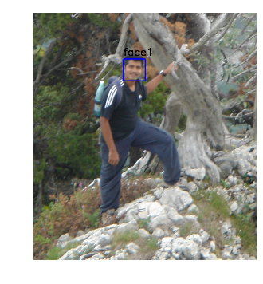{#fig:facedetection_59_1}

{#fig:facedetection_59_2}

{#fig:facedetection_59_3}

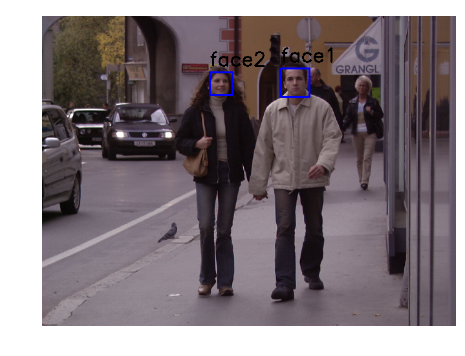{#fig:facedetection_59_4}

{#fig:facedetection_59_5}

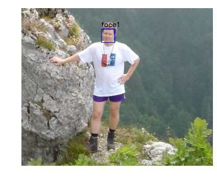{#fig:facedetection_59_6}

{#fig:facedetection_59_7}

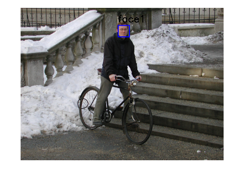{#fig:facedetection_59_8}

{#fig:facedetection_59_9}

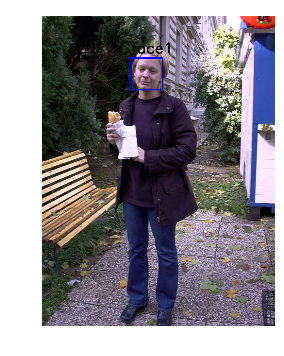{#fig:facedetection_59_10}

### Pedestrian Detection using HOG Descriptor

We will use Histogram of Oriented Gradients (HOG) to detect a upright
person from images. See @fig:facedetection_62_0, @fig:facedetection_62_1, @fig:facedetection_62_2, @fig:facedetection_62_3, @fig:facedetection_62_4, @fig:facedetection_62_5, @fig:facedetection_62_6, @fig:facedetection_62_7, @fig:facedetection_62_8, @fig:facedetection_62_9

#### Python Code Snippet

    # initialize the HOG descriptor/person detector
    hog = cv2.HOGDescriptor()
    hog.setSVMDetector(cv2.HOGDescriptor_getDefaultPeopleDetector())

    cnt = 0
    for filename in onlyfiles:
        img = cv2.imread(filename)
        orig = img.copy()
        gray = cv2.cvtColor(img, cv2.COLOR_BGR2GRAY)

        # detect people in the image
        (rects, weights) = hog.detectMultiScale(img, winStride=(8, 8),
        padding=(16, 16), scale=1.05)

        # draw the final bounding boxes
        for (x, y, w, h) in rects:
            cv2.rectangle(img, (x, y), (x + w, y + h), (0, 255, 0), 2)

        plt.figure()
        plt.axis("off")
        plt.imshow(cv2.cvtColor(orig, cv2.COLOR_BGR2RGB))
        plt.figure()
        plt.axis("off")
        plt.imshow(cv2.cvtColor(img, cv2.COLOR_BGR2RGB))
        cnt = cnt + 1
        if cnt == 5:
            break

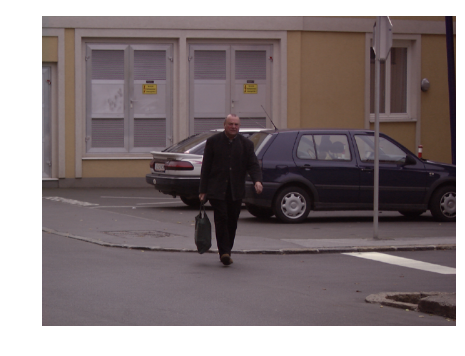{#fig:facedetection_62_0}

{#fig:facedetection_62_1}

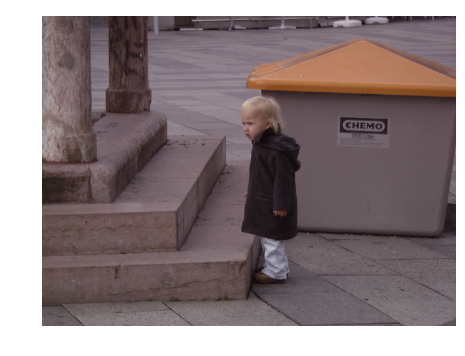{#fig:facedetection_62_2}

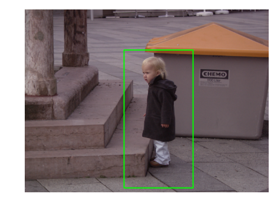{#fig:facedetection_62_3}

{#fig:facedetection_62_4}

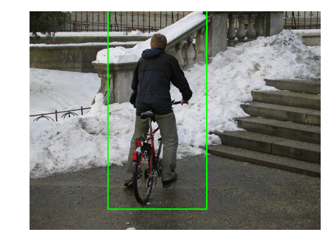{#fig:facedetection_62_5}

{#fig:facedetection_62_6}

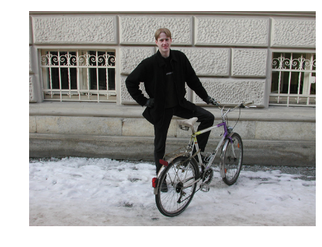{#fig:facedetection_62_7}

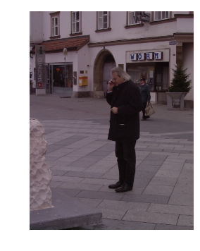{#fig:facedetection_62_8}

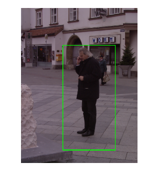{#fig:facedetection_62_9}

### Processing by Apache Spark

INRIA Person dataset provides 100+ images and Spark can be used for
image processing in parallel. We load 288 images from "Test/pos"
directory.

Spark provides a special object 'sc' to connect between a spark cluster
and functions in python code. Therefore, we can run python functions in
parallel to detet objects in this example.

-   *map* function is used to process pedestrian and face detection per
    image from the parallelize() function of 'sc' spark context.

-   *collect* fonction merges results in an array.


    def apply_batch(imagePath):
            import cv2
            import numpy as np
            # initialize the HOG descriptor/person detector
            hog = cv2.HOGDescriptor()
            hog.setSVMDetector(cv2.HOGDescriptor_getDefaultPeopleDetector())
            image = cv2.imread(imagePath)
            # detect people in the image
            (rects, weights) = hog.detectMultiScale(image, winStride=(8, 8),
                padding=(16, 16), scale=1.05)
            # draw the final bounding boxes
            for (x, y, w, h) in rects:
                cv2.rectangle(image, (x, y), (x + w, y + h), (0, 255, 0), 2)
            return image


#### Parallelize in Spark Context

The list of image files is given to parallelize.

    pd = sc.parallelize(onlyfiles)

#### Map Function (apply\_batch)

The 'apply\_batch' function that we created above is given to map
function to process in a spark cluster.

    pdc = pd.map(apply_batch)

#### Collect Function

The result of each map process is merged to an array.

    result = pdc.collect()

### Results for 100+ images by Spark Cluster

    for image in result:
        plt.figure()
        plt.axis("off")
        plt.imshow(cv2.cvtColor(image, cv2.COLOR_BGR2RGB))
