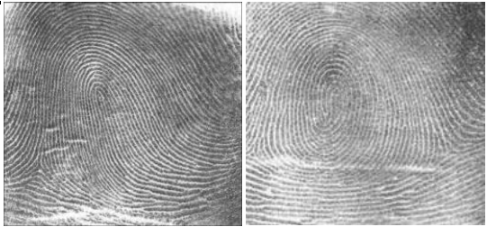
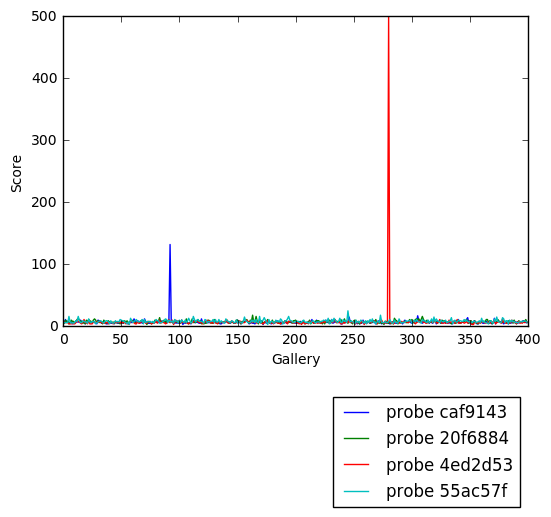

# Fingerprint Matching :o: {#s-fingerprint}

Python is a flexible and popular language for running data analysis
pipelines. In this section we will implement a solution for a
fingerprint matching.

Overview
--------

Fingerprint recognition refers to the automated method for verifying a
match between two fingerprints and that is used to identify individuals
and verify their identity. Fingerprints (@fig:fingerprints) are the most widely
used form of biometric used to identify individuals.

{#fig:fingerprints}

The automated fingerprint matching generally required the detection of
different fingerprint features (aggregate characteristics of ridges, and
minutia points) and then the use of fingerprint matching algorithm,
which can do both one-to- one and one-to- many matching operations.
Based on the number of matches a proximity score (distance or
similarity) can be calculated.

We use the following NIST dataset for the study:

Special Database 14 - NIST Mated Fingerprint Card Pairs 2.
([http://www.nist.gov/itl/iad/ig/special\\\_dbases.cfm](http://www.nist.gov/itl/iad/ig/special\_dbases.cfm))

Objectives
----------

Match the fingerprint images from a probe set to a gallery set and
report the match scores.

Prerequisites
-------------

For this work we will use the following algorithms:

-   MINDTCT: The NIST minutiae detector, which automatically locates and
    records ridge ending and bifurcations in a fingerprint image.
    (<http://www.nist.gov/itl/iad/ig/nbis.cfm>)
-   BOZORTH3: A NIST fingerprint matching algorithm, which is a minutiae
    based fingerprint-matching algorithm. It can do both one-to- one and
    one-to- many matching operations.
    (<http://www.nist.gov/itl/iad/ig/nbis.cfm>)

In order to follow along, you must have the NBIS tools which provide
`mindtct` and `bozorth3` installed. If you are on Ubuntu 16.04 Xenial,
the following steps will accomplish this:

    $ sudo apt-get update -qq
    $ sudo apt-get install -y build-essential cmake unzip
    $ wget "http://nigos.nist.gov:8080/nist/nbis/nbis_v5_0_0.zip"
    $ unzip -d nbis nbis_v5_0_0.zip
    $ cd nbis/Rel_5.0.0
    $ ./setup.sh /usr/local --without-X11
    $ sudo make

Implementation
--------------

1.  Fetch the fingerprint images from the web
2.  Call out to external programs to prepare and compute the match
    scoreds
3.  Store the results in a database
4.  Generate a plot to identify likely matches.

```python
from __future__ import print_function
```

```python
import urllib
import zipfile
import hashlib
```

We\'ll be interacting with the operating system and manipulating files
and their pathnames.

```python
import os.path
import os
import sys
import shutil
import tempfile
```

Some general usefull utilities

```python
import itertools
import functools
import types
from pprint import pprint
```

Using the `attrs` library provides some nice shortcuts to defining
objects

```python
import attr
```

```python
import sys
```

We\'ll be randomly dividing the entire dataset, based on user input,
into the probe and gallery stets

```python
import random
```

We\'ll need to call out to the NBIS software. We\'ll also be using
multiple processes to take advantage of all the cores on our machine

```python
import subprocess
import multiprocessing
```

As for plotting, we\'ll use `matplotlib`, though there are many
alternatives.

```python
import matplotlib.pyplot as plt
import pandas as pd
import numpy as np
```

Finally, we\'ll write the results to a database.

```python
import sqlite3
```

Utility functions
-----------------

Next, we\'ll define some utility functions:

```python
def take(n, iterable):
    "Returns a generator of the first **n** elements of an iterable"
    return itertools.islice(iterable, n )


def zipWith(function, *iterables):
    "Zip a set of **iterables** together and apply **function** to each tuple"
    for group in itertools.izip(*iterables):
        yield function(*group)


def uncurry(function):
    "Transforms an N-arry **function** so that it accepts a single parameter of an N-tuple"
    @functools.wraps(function)
    def wrapper(args):
        return function(*args)
    return wrapper


def fetch_url(url, sha256, prefix='.', checksum_blocksize=2**20, dryRun=False):
    """Download a url.

    :param url: the url to the file on the web
    :param sha256: the SHA-256 checksum. Used to determine if the file was previously downloaded.
    :param prefix: directory to save the file
    :param checksum_blocksize: blocksize to used when computing the checksum
    :param dryRun: boolean indicating that calling this function should do nothing
    :returns: the local path to the downloaded file
    :rtype:

    """

    if not os.path.exists(prefix):
        os.makedirs(prefix)

    local = os.path.join(prefix, os.path.basename(url))

    if dryRun: return local

    if os.path.exists(local):
        print ('Verifying checksum')
        chk = hashlib.sha256()
        with open(local, 'rb') as fd:
            while True:
                bits = fd.read(checksum_blocksize)
                if not bits: break
                chk.update(bits)
        if sha256 == chk.hexdigest():
            return local

    print ('Downloading', url)

    def report(sofar, blocksize, totalsize):
        msg = '{}%\r'.format(100 * sofar * blocksize / totalsize, 100)
        sys.stderr.write(msg)

    urllib.urlretrieve(url, local, report)

    return local
```

Dataset
-------

We\'ll now define some global parameters

First, the fingerprint dataset

```python
DATASET_URL = 'https://s3.amazonaws.com/nist-srd/SD4/NISTSpecialDatabase4GrayScaleImagesofFIGS.zip'
DATASET_SHA256 = '4db6a8f3f9dc14c504180cbf67cdf35167a109280f121c901be37a80ac13c449'
```

We'll define how to download the dataset. This function is general
enough that it could be used to retrieve most files, but we'll default
it to use the values from above.

```python
def prepare_dataset(url=None, sha256=None, prefix='.', skip=False):
    url = url or DATASET_URL
    sha256 = sha256 or DATASET_SHA256
    local = fetch_url(url, sha256=sha256, prefix=prefix, dryRun=skip)

    if not skip:
        print ('Extracting', local, 'to', prefix)
        with zipfile.ZipFile(local, 'r') as zip:
            zip.extractall(prefix)

    name, _ = os.path.splitext(local)
    return name


def locate_paths(path_md5list, prefix):
    with open(path_md5list) as fd:
        for line in itertools.imap(str.strip, fd):
            parts = line.split()
            if not len(parts) == 2: continue
            md5sum, path = parts
            chksum = Checksum(value=md5sum, kind='md5')
            filepath = os.path.join(prefix, path)
            yield Path(checksum=chksum, filepath=filepath)


def locate_images(paths):

    def predicate(path):
        _, ext = os.path.splitext(path.filepath)
        return ext in ['.png']

    for path in itertools.ifilter(predicate, paths):
        yield image(id=path.checksum.value, path=path)
```

Data Model
----------

We\'ll define some classes so we have a nice API for working with the
dataflow. We set `slots=True` so that the resulting objects will be more
space-efficient.

### Utilities

#### Checksum

The checksum consists of the actual hash value (`value`) as well as a
string representing the hashing algorithm. The validator enforces that
the algorith can only be one of the listed acceptable methods

```python
@attr.s(slots=True)
class Checksum(object):
  value = attr.ib()
  kind = attr.ib(validator=lambda o, a, v: v in 'md5 sha1 sha224 sha256 sha384 sha512'.split())
```

#### Path

`Path`s refer to an image\'s filepath and associated `Checksum`. We get
the checksum \"for \"free\" since the MD5 hash is provided for each
image in the dataset.

```python
@attr.s(slots=True)
class Path(object):
    checksum = attr.ib()
    filepath = attr.ib()
```

#### Image

The start of the data pipeline is the image. An `image` has an `id` (the
md5 hash) and the path to the image.

```python
@attr.s(slots=True)
class image(object):
    id = attr.ib()
    path = attr.ib()
```

### Mindtct

The next step in the pipeline is to apply the `mindtct` program from
NBIS. A `mindtct` object therefore represents the results of applying
`mindtct` on an `image`. The `xyt` output is needed fo r the next step,
and the `image` attribute represents the image id.

```python
@attr.s(slots=True)
class mindtct(object):
    image = attr.ib()
    xyt = attr.ib()

    def pretty(self):
        d = dict(id=self.image.id, path=self.image.path)
        return pprint(d)
```

We need a way to construct a `mindtct` object from an `image` object. A
straightforward way of doing this would be to have a `from_image`
`@staticmethod` or `@classmethod`, but that doesn\'t work well with
`multiprocessing` as top-level functions work best as they need to be
serialized.

```python
def mindtct_from_image(image):
    imgpath = os.path.abspath(image.path.filepath)
    tempdir = tempfile.mkdtemp()
    oroot = os.path.join(tempdir, 'result')

    cmd = ['mindtct', imgpath, oroot]

    try:
        subprocess.check_call(cmd)

        with open(oroot + '.xyt') as fd:
            xyt = fd.read()

        result = mindtct(image=image.id, xyt=xyt)
        return result

    finally:
        shutil.rmtree(tempdir)
```

### Bozorth3

The final step in the pipeline is running the `bozorth3` from NBIS. The
`bozorth3` class represents the match being done: tracking the ids of
the probe and gallery images as well as the match score.

Since we\'ll be writing these instance out to a database, we provide
some static methods for SQL statements. While there are many
Object-Relational-Model (ORM) libraries available for Python, this
approach keeps the current implementation simple.

```python
@attr.s(slots=True)
class bozorth3(object):
    probe = attr.ib()
    gallery = attr.ib()
    score = attr.ib()

    @staticmethod
    def sql_stmt_create_table():
        return 'CREATE TABLE IF NOT EXISTS bozorth3' \
             + '(probe TEXT, gallery TEXT, score NUMERIC)'

    @staticmethod
    def sql_prepared_stmt_insert():
        return 'INSERT INTO bozorth3 VALUES (?, ?, ?)'

    def sql_prepared_stmt_insert_values(self):
        return self.probe, self.gallery, self.score
```

In order to work well with `multiprocessing`, we define a class
representuing the input paramaters to `bozorth3` and a helper function
to run `bozorth3`. This way the pipeline definition can be kept simple
to a `map` to create the input and then a `map` to run the program.

As NBIS `bozorth3` can be called to compare one-to-one or one-to-many,
we\'ll also dynamically choose between these approaches depending on if
the gallery attribute is a list or a single object.

```python
@attr.s(slots=True)
class bozorth3_input(object):
    probe = attr.ib()
    gallery = attr.ib()

    def run(self):
        if isinstance(self.gallery, mindtct):
            return bozorth3_from_one_to_one(self.probe, self.gallery)
        elif isinstance(self.gallery, types.ListType):
            return bozorth3_from_one_to_many(self.probe, self.gallery)
        else:
            raise ValueError('Unhandled type for gallery: {}'.format(type(gallery)))
```

The next is the top-level function to running `bozorth3`. It accepts an
instance of `bozorth3_input`. The is implemented as a simple top-level
wrapper so that it can be easily passed to the `multiprocessing`
library.

```python
def run_bozorth3(input):
    return input.run()
```

#### Running Bozorth3

There are two cases to handle: 1. One-to-one probe to gallery sets 1.
One-to-many probe to gallery sets

Both approaches are implemented below. The implementations follow the
same pattern: 1. Create a temporary directory within with to work 1.
Write the probe and gallery images to files in the temporary directory
1. Call the `bozorth3` executable 1. The match score is written to
`stdout` which is captured and then parsed. 1. Return a `bozorth3`
instance for each match 1. Make sure to clean up the temporary directory

##### One-to-one

```python
def bozorth3_from_one_to_one(probe, gallery):
    tempdir = tempfile.mkdtemp()
    probeFile = os.path.join(tempdir, 'probe.xyt')
    galleryFile = os.path.join(tempdir, 'gallery.xyt')

    with open(probeFile,   'wb') as fd: fd.write(probe.xyt)
    with open(galleryFile, 'wb') as fd: fd.write(gallery.xyt)

    cmd = ['bozorth3', probeFile, galleryFile]

    try:
        result = subprocess.check_output(cmd)
        score = int(result.strip())
        return bozorth3(probe=probe.image, gallery=gallery.image, score=score)
    finally:
        shutil.rmtree(tempdir)
```

##### One-to-many

```python
def bozorth3_from_one_to_many(probe, galleryset):
    tempdir = tempfile.mkdtemp()
    probeFile = os.path.join(tempdir, 'probe.xyt')
    galleryFiles = [os.path.join(tempdir, 'gallery%d.xyt' % i)
                    for i,_ in enumerate(galleryset)]

    with open(probeFile, 'wb') as fd: fd.write(probe.xyt)
    for galleryFile, gallery in itertools.izip(galleryFiles, galleryset):
        with open(galleryFile, 'wb') as fd: fd.write(gallery.xyt)

    cmd = ['bozorth3', '-p', probeFile] + galleryFiles

    try:
        result = subprocess.check_output(cmd).strip()
        scores = map(int, result.split('\n'))
        return [bozorth3(probe=probe.image, gallery=gallery.image, score=score)
               for score, gallery in zip(scores, galleryset)]
    finally:
        shutil.rmtree(tempdir)
```

Plotting
========

For plotting we\'ll operate only on the database. We\'ll select a small
number of probe images and plot the score between them and the rest of
the gallery images.

The `mk_short_labels` helper function will be defined below.

```python
def plot(dbfile, nprobes=10):
    conn = sqlite3.connect(dbfile)
    results = pd.read_sql(
        "SELECT DISTINCT probe FROM bozorth3 ORDER BY score LIMIT '%s'" % nprobes,
        con=conn
    )
    shortlabels = mk_short_labels(results.probe)
    plt.figure()

    for i, probe in results.probe.iteritems():
        stmt = 'SELECT gallery, score FROM bozorth3 WHERE probe = ? ORDER BY gallery DESC'
        matches = pd.read_sql(stmt, params=(probe,), con=conn)
        xs = np.arange(len(matches), dtype=np.int)
        plt.plot(xs, matches.score, label='probe %s' % shortlabels[i])

    plt.ylabel('Score')
    plt.xlabel('Gallery')
    plt.legend(bbox_to_anchor=(0, 0, 1, -0.2))
    plt.show()
```

The image ids are long hash strings. In ordere to minimize the amount of
space on the figure the labels occupy, we provide a helper function to
create a short label that still uniquely identifies each probe image in
the selected sample

```python
def mk_short_labels(series, start=7):
    for size in xrange(start, len(series[0])):
        if len(series) == len(set(map(lambda s: s[:size], series))):
            break
    return map(lambda s: s[:size], series)
```

Putting it all Together
=======================

First, set up a temporary directory in which to work:

```python
pool = multiprocessing.Pool()
prefix = '/tmp/fingerprint_example/'
if not os.path.exists(prefix):
    os.makedirs(prefix)
```

Next we download and extract the fingerprint images from NIST:

```python
%%time
dataprefix = prepare_dataset(prefix=prefix)
```

```
Verifying checksum Extracting
/tmp/fingerprint_example/NISTSpecialDatabase4GrayScaleImagesofFIGS.zip
to /tmp/fingerprint_example/ CPU times: user 3.34 s, sys: 645 ms,
total: 3.99 s Wall time: 4.01 s
```

Next we\'ll configure the location of of the MD5 checksum file that
comes with the download

```python
md5listpath = os.path.join(prefix, 'NISTSpecialDatabase4GrayScaleImagesofFIGS/sd04/sd04_md5.lst')
```

Load the images from the downloaded files to start the analysis pipeline

```python
%%time
print('Loading images')
paths = locate_paths(md5listpath, dataprefix)
images = locate_images(paths)
mindtcts = pool.map(mindtct_from_image, images)
print('Done')
```

```
Loading images Done CPU times: user 187 ms, sys: 17 ms, total: 204 ms
Wall time: 1min 21s
```

We can examine one of the loaded image. Note that `image` is refers to
the MD5 checksum that came with the image and the `xyt` attribute
represents the raw image data.

```python
print(mindtcts[0].image)
print(mindtcts[0].xyt[:50])
```

```
98b15d56330cb17f1982ae79348f711d 14 146 214 6 25 238 22 37 25 51 180 20
30 332 214
```

For example purposes we\'ll only a use a small percentage of the
database, randomly selected, for pur probe and gallery datasets.

```python
perc_probe = 0.001
perc_gallery = 0.1
```

```python
%%time
print('Generating samples')
probes  = random.sample(mindtcts, int(perc_probe   * len(mindtcts)))
gallery = random.sample(mindtcts, int(perc_gallery * len(mindtcts)))
print('|Probes| =', len(probes))
print('|Gallery|=', len(gallery))
```

```
Generating samples = 4 = 400 CPU times: user 2 ms, sys: 0 ns, total: 2
ms Wall time: 993 µs
```

We can now compute the matching scores between the probe and gallery
sets. This will use all cores available on this workstation.

```python
%%time
print('Matching')
input = [bozorth3_input(probe=probe, gallery=gallery)
         for probe in probes]
bozorth3s = pool.map(run_bozorth3, input)
```

```
Matching CPU times: user 19 ms, sys: 1 ms, total: 20 ms Wall time: 1.07
s
```

`bozorth3s` is now a `list` of `lists` of `bozorth3` instances.

```python
print('|Probes|  =', len(bozorth3s))
print('|Gallery| =', len(bozorth3s[0]))
print('Result:', bozorth3s[0][0])
```

```
= 4 = 400 Result: bozorth3(probe='caf9143b268701416fbed6a9eb2eb4cf',
gallery='22fa0f24998eaea39dea152e4a73f267', score=4)
```

Now add the results to the database

```python
dbfile = os.path.join(prefix, 'scores.db')
conn = sqlite3.connect(dbfile)
cursor = conn.cursor()
cursor.execute(bozorth3.sql_stmt_create_table())
```

```
<sqlite3.Cursor at 0x7f8a2f677490>
```

```python
%%time
for group in bozorth3s:
    vals = map(bozorth3.sql_prepared_stmt_insert_values, group)
    cursor.executemany(bozorth3.sql_prepared_stmt_insert(), vals)
    conn.commit()
    print('Inserted results for probe', group[0].probe)
```

```
Inserted results for probe caf9143b268701416fbed6a9eb2eb4cf Inserted
results for probe 55ac57f711eba081b9302eab74dea88e Inserted results for
probe 4ed2d53db3b5ab7d6b216ea0314beb4f Inserted results for probe
20f68849ee2dad02b8fb33ecd3ece507 CPU times: user 2 ms, sys: 3 ms, total:
5 ms Wall time: 3.57 ms
```

We now plot the results. @fig:fingerprint_matching_74_0

```python
plot(dbfile, nprobes=len(probes))
```

{#fig:fingerprint_matching_74_0}

```python
cursor.close()
```
