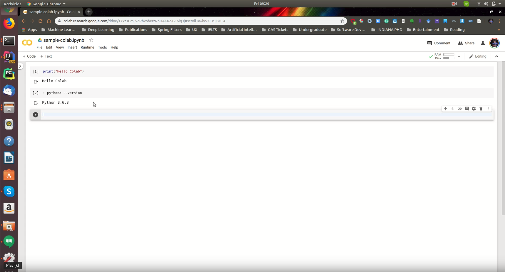
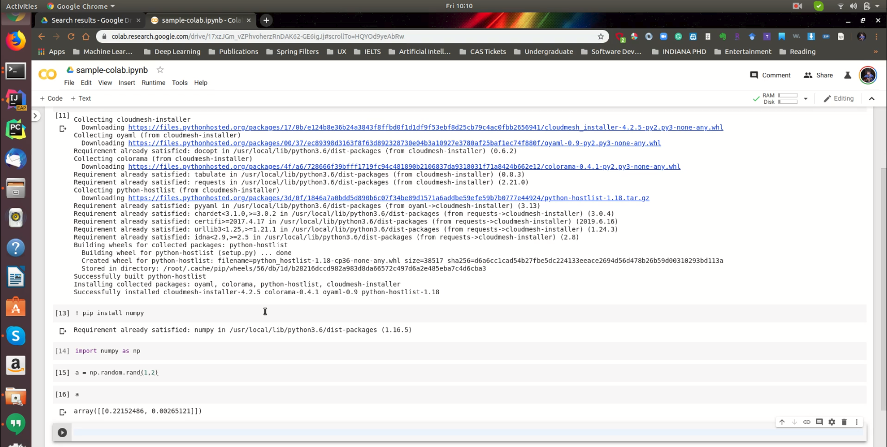
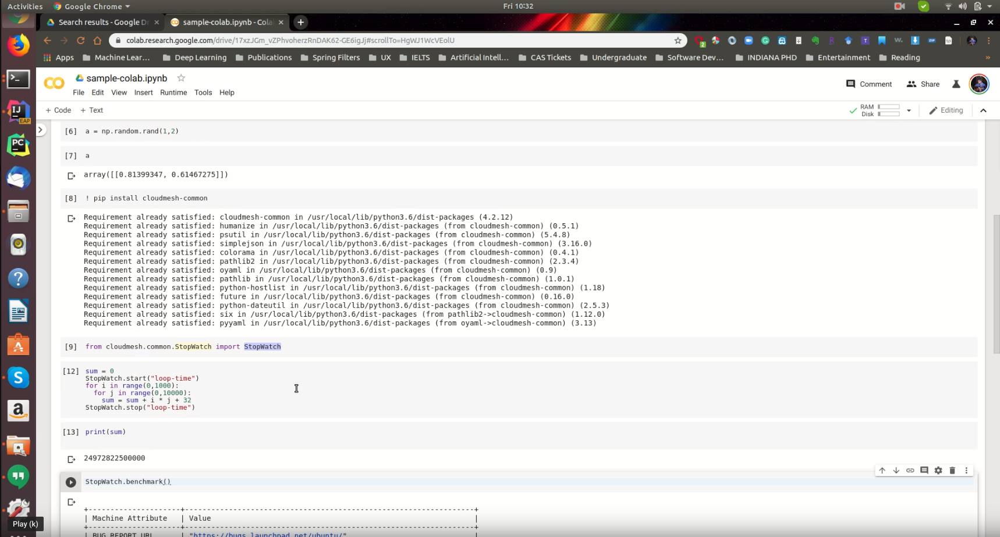

# Google Colab {#sec:google-colab}

In this section we are going to introduce you, how to use Google Colab 
to run deep learning models.

## Introduction to Google Colab

[{width=20%}](https://drive.google.com/file/d/1vz2_VaXCAae-9luzcrIuP_ugMmKJIy7w/view?usp=sharing)

In this vide we explain you ....

## Programming in Google Colab

[{width=20%}](https://drive.google.com/file/d/18mGVxgydx1TDdb4AYD8qb1To8rkSLS-H/view?usp=sharing)

## Benchamrking in Google Colab with Cloudmesh

[{width=20%}](https://drive.google.com/file/d/1Ujs0XjzCTwZgmx-ADM5zx9cS5iplXfIu/view?usp=sharing)

