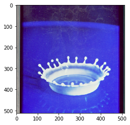
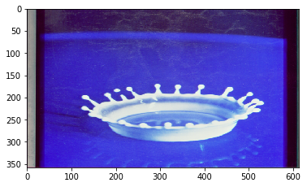
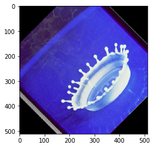
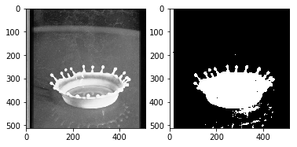
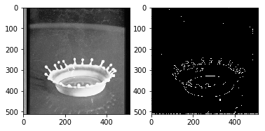

# OpenCV {#sec:opencv}

---

 **Learning Objectives**

* Provide some simple calculations so we can test cloud services.
* Showcase some elementary OpenCV functions
* Show an environmental image analysis application using Secchi disks

---

OpenCV (Open Source Computer Vision Library) is a library of thousands
of algorithms for various applications in computer vision and machine
learning. It has C++, C, Python, Java, and MATLAB interfaces and supports
Windows, Linux, Android, and Mac OS. In this section, we will explain
the basic features of this library, including the implementation of a simple
example.

## Overview

OpenCV has many functions for image and video processing. The
pipeline starts with reading the images, low-level operations on pixel
values, preprocessing e.g. denoising, and then multiple steps of
higher-level operations which vary depending on the application. OpenCV
covers the whole pipeline, especially providing a large set of library
functions for high-level operations. A simpler library for image
processing in Python is Scipy's multi-dimensional image processing
package (scipy.ndimage).

## Installation

OpenCV for Python can be installed on Linux in multiple ways, namely
PyPI(Python Package Index), Linux package manager (apt-get for Ubuntu),
Conda package manager, and also building from source.
You are
recommended to use PyPI. Here's the command that you need to run on Ubuntu:

```bash
$ sudo apt update
$ sudo apt install libopencv-dev python3-opencv
$ python3 -c "import cv2; print(cv2.__version__)"
```
The last commnd will print the version of opencv you have.
In order to test, import the module in Python command line:

```python
import cv2
```

If it does not raise an error, it is installed correctly. Otherwise, try
to solve the error.

For installation on Windows, see:

* <https://docs.opencv.org/4.x/d3/d52/tutorial_windows_install.html>


Note that building from source can take a long time and may not be
feasible for deploying to limited platforms such as Raspberry Pi.

## A Simple Example

In this example, an image is loaded. A simple processing is performed,
and the result is written to a new image.

### Loading an image

```python
import cv2

img = cv2.imread('images/opencv/4.2.01.tiff')
```

The image was downloaded from USC standard database:

<http://sipi.usc.edu/database/database.php?volume=misc&image=9>

### Displaying the image

The image is saved in a numpy array. Each pixel is represented with 3
values (R,G,B). This provides you with access to manipulate the image at
the level of single pixels. You can display the image using imshow
function as well as Matplotlib's imshow function.

You can display the image using imshow function:

```python
cv2.imshow('Original',img)
cv2.waitKey(0)
cv2.destroyAllWindows()
```

or you can use Matplotlib. If you have not installed Matplotlib before,
install it using:

```bash
$ pip install matplotlib
```

Now you can use:

```python
import matplotlib.pyplot as plt
plt.imshow(img)
```

which results in @fig:opencv-output_5_1

{#fig:opencv-output_5_1}

### Scaling and Rotation

Scaling (resizing) the image relative to different axis

```python
res = cv2.resize(img,
                 None,
                 fx=1.2,
                 fy=0.7,
                 interpolation=cv2.INTER_CUBIC)
plt.imshow(res)
```

which results in @fig:opencv-output_7_1

{#fig:opencv-output_7_1}

Rotation of the image for an angle of t

```python
rows,cols,_ = img.shape
t = 45
M = cv2.getRotationMatrix2D((cols/2,rows/2),t,1)
dst = cv2.warpAffine(img,M,(cols,rows))

plt.imshow(dst)
```

which results in @fig:opencv-output_9_1

{#fig:opencv-output_9_1}

### Gray-scaling

```python
img2 = cv2.cvtColor(img, cv2.COLOR_BGR2GRAY)
plt.imshow(img2, cmap='gray')
```

which results in +@fig:opencv-output_11_1

{#fig:opencv-output_11_1}

### Image Thresholding

```python
ret,thresh =    cv2.threshold(img2,127,255,cv2.THRESH_BINARY)
plt.subplot(1,2,1), plt.imshow(img2, cmap='gray')
plt.subplot(1,2,2), plt.imshow(thresh, cmap='gray')
```

which results in @fig:opencv-output_13_1

{#fig:opencv-output_13_1}

### Edge Detection

Edge detection using Canny edge detection algorithm

```python
edges = cv2.Canny(img2,100,200)

plt.subplot(121),plt.imshow(img2,cmap = 'gray')
plt.subplot(122),plt.imshow(edges,cmap = 'gray')
```

which results in @fig:opencv-output_15_1

{#fig:opencv-output_15_1}

## Additional Features

OpenCV has implementations of many machine learning techniques such as
KMeans and Support Vector Machines can be put into use with only a
few lines of code. It also has functions especially for video analysis,
feature detection, object recognition, and many more. You can find out
more about them on their website

[OpenCV](https://docs.opencv.org/)


