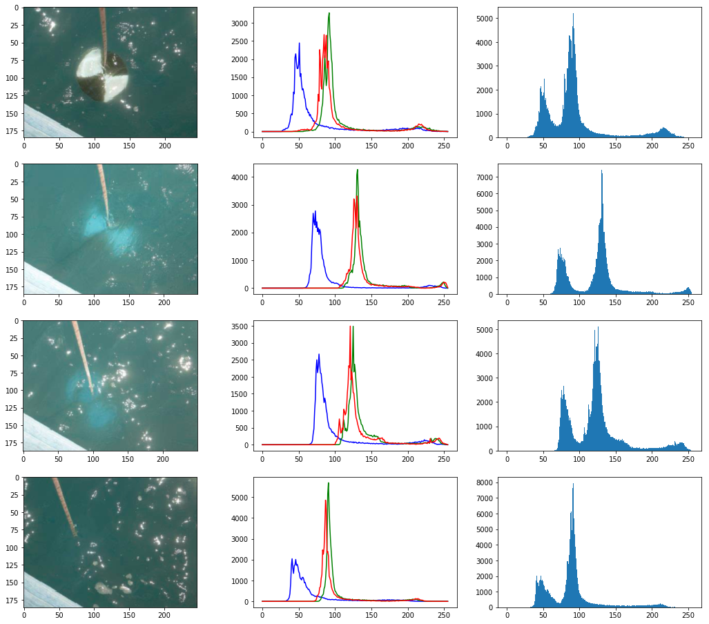
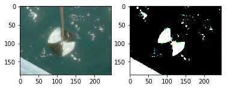
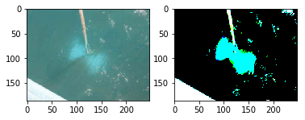
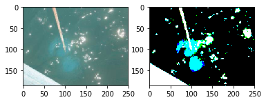
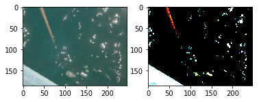
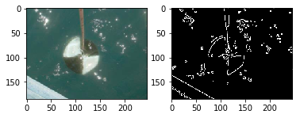
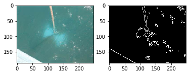
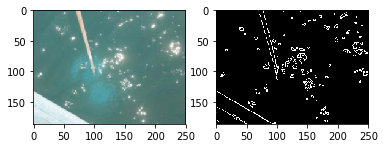
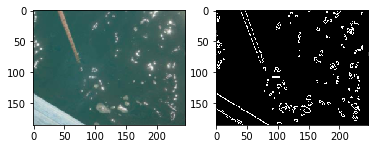
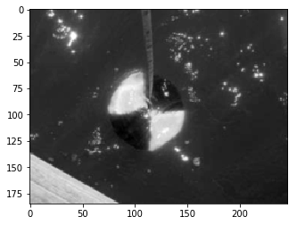

# Secchi Disk {#s-secchi-disk}

We are developing an autonomous robot boat that you can be part of
developing within this class. The robot bot is actually measuring
turbidity or water clarity. Traditionally this has been done with a
Secchi disk. The use of the Secchi disk is as follows:

1. Lower the Secchi disk into the water. 
2. Measure the point when you can no longer see it
3. Record the depth at various levels and plot in a geographical 3D
   map

One of the things we can do is take a video of the measurement instead
of a human recording them. Than we can analyse the video automatically
to see how deep a disk was lowered. THis is a classical image analysis
program. YOu are encouraged to identify algorithms that can identify
the depth. The most simplest seems to be to do a histogram at a
variety of depth steps, and measure when the histogram no longer
changes significantly. The depth at that image will be the measurement
we look for.

Thus if we analyse the images we need to look at the image and
identify the numbers on the measuring tape, as well as the visibility
of the disk.

To show case how such a disk looks like we refer to the image
showcasing different Secchi disks. For our purpose the black-white
contrast Secchi disk works well.

More information about Secchi Disk can be found at:

* <https://en.wikipedia.org/wiki/Secchi/_disk>

We have included next a couple of examples while using some obviously
useful OpenCV methods. Surprisingly, the use of the edge detection
that comes in mind first to identify if we still can see the disk,
seems to complicated to use for analysis. We at this time believe the
histogram will be sufficient.

Please inspect our examples.

## Setup for OSX

First lest setup the OpenCV environment for OSX. Naturally you will
have to update the versions based on your versions of python. When we
tried the install of OpenCV on MacOS, the setup was slightly more
complex than other packages. This may have changed by now and if you
have improved instructions, pleas elt us know. However we do not want
to install it via Anaconda out of the obvious reason that anaconda
installs to many other things.

    import os, sys
    from os.path import expanduser
    os.path
    home = expanduser("~")
    sys.path.append('/usr/local/Cellar/opencv/3.3.1_1/lib/python3.6/site-packages/')
    sys.path.append(home + '/.pyenv/versions/OPENCV/lib/python3.6/site-packages/')
    import cv2
    cv2.__version__
    ! pip install numpy > tmp.log
    ! pip install matplotlib >> tmp.log
    %matplotlib inline

## Step 1: Record the video

Record the video on the robot

We have actually done this for you and will provide you with images
and videos if you are interested in analyzing them.

## Step 2: Analyse the images from the Video

For now we just selected 4 images from the video

    import cv2
    import matplotlib.pyplot as plt

    img1 = cv2.imread('secchi/secchi1.png') 
    img2 = cv2.imread('secchi/secchi2.png') 
    img3 = cv2.imread('secchi/secchi3.png') 
    img4 = cv2.imread('secchi/secchi4.png') 

    figures = []
    fig = plt.figure(figsize=(18, 16))
    for i in range(1,13):
        figures.append(fig.add_subplot(4,3,i))
    count = 0
    for img in [img1,img2,img3,img4]:
        figures[count].imshow(img)

        color = ('b','g','r')
        for i,col in enumerate(color):
            histr = cv2.calcHist([img],[i],None,[256],[0,256])
            figures[count+1].plot(histr,color = col)

        figures[count+2].hist(img.ravel(),256,[0,256])

        count += 3

    print("Legend")
    print("First column = image of Secchi disk")
    print("Second column = histogram of colors in image")
    print("Third column = histogram of all values")

    plt.show() 

### Image Thresholding

    def threshold(img):
        ret,thresh = cv2.threshold(img,150,255,cv2.THRESH_BINARY)
        plt.subplot(1,2,1), plt.imshow(img, cmap='gray')
        plt.subplot(1,2,2), plt.imshow(thresh, cmap='gray')

    threshold(img1)

    threshold(img2)

    threshold(img3)

    threshold(img4)

### Edge Detection

Edge detection using Canny edge detection algorithm

    def find_edge(img):
        edges = cv2.Canny(img,50,200)
        plt.subplot(121),plt.imshow(img,cmap = 'gray')
        plt.subplot(122),plt.imshow(edges,cmap = 'gray')

    find_edge(img1)

    find_edge(img2)

    find_edge(img3)

    find_edge(img4)

### Black and white

    bw1 = cv2.cvtColor(img1, cv2.COLOR_BGR2GRAY)
    plt.imshow(bw1, cmap='gray')

