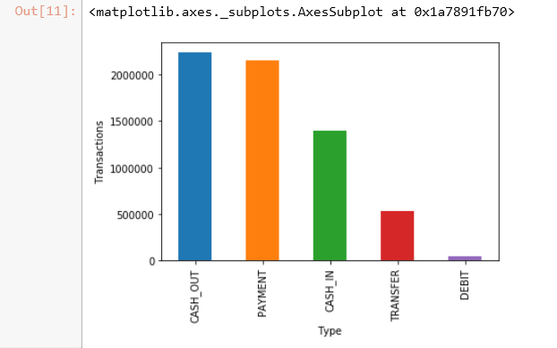
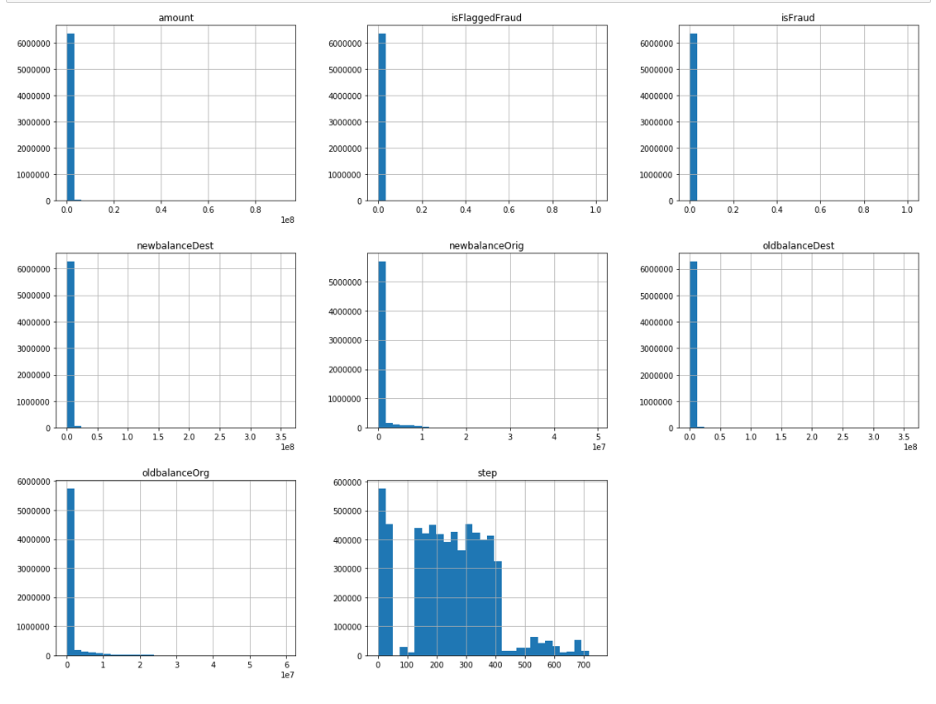
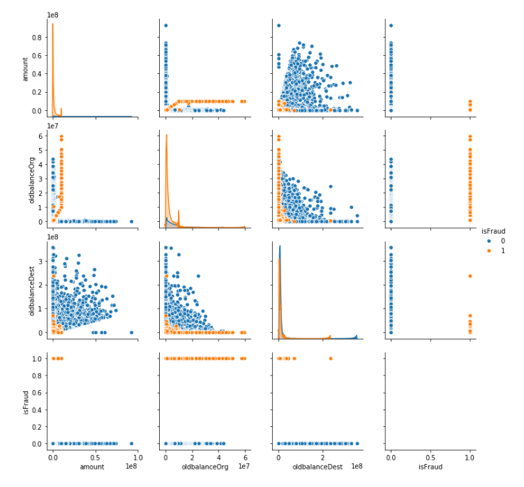

# Scikit-learn :o: {#s-sikitlearn}

## Introduction to Scikit-learn

Scikit learn is a Machine Learing specfic library used in Python. Library can be used for data mining and analysis. It is built on top of NumPy, matplotlib and SciPy. Scikit Learn features Dimensionality reduction, clustering, regression and classification algorithms. 
It also features model selection using grid search, cross validation and metrics. 

Scikit learn also enables users to preprocess the data which can then be used for machine learning using modules like preprocessing and feature extraction.

In this section we demonstrate how simple it is to use k-means in
scikit learn.

## Instalation

If you already have a working installation of numpy and scipy, the
easiest way to install scikit-learn is using pip

```python
    $ pip install numpy
    $ pip install scipy -U
    $ pip install -U scikit-learn
```
## Supervised Learning

Supervised Learning is used in machine learning when we already know a set of output predictions based on input characterstics and based on that we need to predict the target for a new input. Training data is used to train the model which then can be used to predict the output from a bounded set.

Problems can be of two types

 1. Classification : Training data belongs to three or four classes/catagories and based on the label we want to predict 
    the  class/category for the unlabeled data.
 2. Regression : Training data consists of vectors without any corresponding target values. Clustering can be used for 
    these  type of datasets to determine discover groups of similar examples. Another way is density 
    estimation  which determine the distribution of data within the input space. Histogram is the most basic form.

## Unsupervised Learning

Unspervised Learning is used in machine learning when we have the training set available but without any corresponding target. The outcome of the problesm is to discover groups within the provided input. It can be done in many ways.

Few of them are listed here

 1. Clustering : Discover groups of similar characterstics.
 2. Density Estimation : Finding the distribution of data within the provided input or changing the data from a high 
    deminsional  space to two or three dimension.
    
# Building a end to end pipeline for Supervised machine learning using Scikit-learn - 
### Example project  = Fraud detection system.
---
**:mortar_board: Learning Objectives**
---
* Exploratory data analysis
* Pipeline to prepare data
* Full learning pipeline
* Fine tune the model
* Significance tests

A data pipeline is a set of processing componennts that are sequenced to 
produce meaningfull data. Pipelines are commonly used in Machine learning, 
since there is lot of data tranformation and manupulation that needs to be 
applied to make data usefull for machine learning. All components are sequenced 
in a way that the output of one component becomes input for the next and each of 
the component is self contained. Components interact with each other using data.

Even if a component breaks, the downstream component can run normally using 
the last output. Sklearn provide the ability to build pipelines that can be 
transformed and modelled for machine learning.


## Steps for developing a machine learning model

  1. Explore the domain space
  2. Extract the problem definition
  3. Get the data that can be used to make the system learn to solve the problem definition.
  4. Discover and Visualize the data to gain insights
  5. Feature engineering and prepare the data 
  6. Fine tune your model
  7. Evaluate your solution using metrics
  8. Once proven launch and maintain the model.

## Explorartory Data Analysis

First step is to load the data into a dataframe in order for a proper analysis to be done on the attributes.

```python
data = pd.read_csv('dataset/PS_20174392719_1491204439457_log.csv')
data.head()
```

Perform the basic analysis on the data shape and null value information.

```python
print(data.shape)
print(data.info())
data.isnull().values.any()
```
Here is the example of few of the visual data analysis methods.

### Bar plot 

```python

plt.ylabel('Transactions')
plt.xlabel('Type')
data.type.value_counts().plot.bar()

```

{#fig:scikit-learn-barplot}

### Correlation between attrbutes

```python

# compute the correlation matrix
corr = data.corr()

# generate a mask for the lower triangle
mask = np.zeros_like(corr, dtype=np.bool)
mask[np.triu_indices_from(mask)] = True

# set up the matplotlib figure
f, ax = plt.subplots(figsize=(18, 18))

# generate a custom diverging colormap
cmap = sns.diverging_palette(220, 10, as_cmap=True)

# draw the heatmap with the mask and correct aspect ratio
sns.heatmap(corr, mask=mask, cmap=cmap, vmax=.3,
            square=True, 
            linewidths=.5, cbar_kws={"shrink": .5}, ax=ax);

```

{#fig:scikit-learn-correlationanalysis}

### Histogram Analysis of dataset attrbutes

```python

%matplotlib inline
data.hist(bins=30, figsize=(20,15))
plt.show()

```

{#fig:scikit-learn-histograms}

### Box plot Analysis

```python

fig, axs = plt.subplots(2, 2, figsize=(10, 10))
tmp = data.loc[(data.type == 'TRANSFER'), :]

a = sns.boxplot(x = 'isFlaggedFraud', y = 'amount', data = tmp, ax=axs[0][0])
axs[0][0].set_yscale('log')
b = sns.boxplot(x = 'isFlaggedFraud', y = 'oldbalanceDest', data = tmp, ax=axs[0][1])
axs[0][1].set(ylim=(0, 0.5e8))
c = sns.boxplot(x = 'isFlaggedFraud', y = 'oldbalanceOrg', data=tmp, ax=axs[1][0])
axs[1][0].set(ylim=(0, 3e7))
d = sns.regplot(x = 'oldbalanceOrg', y = 'amount', data=tmp.loc[(tmp.isFlaggedFraud ==1), :], ax=axs[1][1])
plt.show()

```

{#fig:scikit-learn-boxplot}

### Scatter plot Analysis

```python

plt.figure(figsize=(12,8))
sns.pairplot(data[['amount', 'oldbalanceOrg', 'oldbalanceDest', 'isFraud']], hue='isFraud')

```

{#fig:scikit-learn-scatterplot}

## Data Cleansing - Removing Outliers

If the transaction amount is lower than 5 percent of the all the transactions AND does not exceed USD 3000, we will exclude it from our analysis to reduce Type 1 costs
If the transaction amount is higher than 95 percent of all the transactions AND exceeds USD 500000, we will exclude it from our analysis, and use a blanket review process for such transactions (similar to isFlaggedFraud column in original dataset) to reduce Type 2 costs

```
low_exclude = np.round(np.minimum(fin_samp_data.amount.quantile(0.05), 3000), 2)
high_exclude = np.round(np.maximum(fin_samp_data.amount.quantile(0.95), 500000), 2)

###Updating Data to exclude records prone to Type 1 and Type 2 costs
low_data = fin_samp_data[fin_samp_data.amount > low_exclude]
data = low_data[low_data.amount < high_exclude]

```
## Pipeline Creation
### Defining DataFrameSelector to separate Numerical and Categorical attributes

```
from sklearn.base import BaseEstimator, TransformerMixin

# Create a class to select numerical or categorical columns 
# since Scikit-Learn doesn't handle DataFrames yet
class DataFrameSelector(BaseEstimator, TransformerMixin):
    def __init__(self, attribute_names):
        self.attribute_names = attribute_names
    def fit(self, X, y=None):
        return self
    def transform(self, X):
        return X[self.attribute_names].values
```

### Feature Creation / Additional Feature Engineering
During EDA we identified that there are transactions where there are transactions where the balances do not tally after the transaction is completed. We believe this could potentially be cases where fraud is occurring. To account for this error in the transactions, we define two new features "errorBalanceOrig" and "errorBalanceDest", calculated by adjusting the amount with the before and after balances for the Originator and Destination accounts.

Below, we create a function that allows us to create these features in a pipeline.

```
from sklearn.base import BaseEstimator, TransformerMixin

# column index
amount_ix, oldbalanceOrg_ix, newbalanceOrig_ix, oldbalanceDest_ix, newbalanceDest_ix = 0, 1, 2, 3, 4 

class CombinedAttributesAdder(BaseEstimator, TransformerMixin):
    def __init__(self): # no *args or **kargs
        pass
    def fit(self, X, y=None):
        return self  # nothing else to do
    def transform(self, X, y=None):
        errorBalanceOrig = X[:,newbalanceOrig_ix] +  X[:,amount_ix] -  X[:,oldbalanceOrg_ix]
        errorBalanceDest = X[:,oldbalanceDest_ix] +  X[:,amount_ix]-  X[:,newbalanceDest_ix] 
        
        return np.c_[X, errorBalanceOrig, errorBalanceDest]
```

## Creating Training and Testing datasets

```
from sklearn.model_selection import train_test_split
X_train, X_test, y_train, y_test = train_test_split(X,y,test_size=0.30, random_state=42, stratify=y)
```

## Creating pipeline for numerical and categorical attributes

Identifying columns with Numerical and Categorical characterstics.

```
X_train_num = X_train[["amount","oldbalanceOrg", "newbalanceOrig", "oldbalanceDest", "newbalanceDest"]]
X_train_cat = X_train[["type"]]
X_model_col = ["amount","oldbalanceOrg", "newbalanceOrig", "oldbalanceDest", "newbalanceDest","type"]
```

```
from sklearn.pipeline import Pipeline
from sklearn.preprocessing import StandardScaler
from sklearn.preprocessing import Imputer

num_attribs = list(X_train_num)
cat_attribs = list(X_train_cat)

num_pipeline = Pipeline([
        ('selector', DataFrameSelector(num_attribs)),        
        ('attribs_adder', CombinedAttributesAdder()),       
        ('std_scaler', StandardScaler())
    ])

cat_pipeline = Pipeline([
        ('selector', DataFrameSelector(cat_attribs)),
        ('cat_encoder', CategoricalEncoder(encoding="onehot-dense"))            
    ])
from sklearn.pipeline import FeatureUnion

full_pipeline = FeatureUnion(transformer_list=[
        ("num_pipeline", num_pipeline),
        ("cat_pipeline", cat_pipeline),        
    ])
from sklearn.linear_model import LogisticRegression
from sklearn.linear_model import LinearRegression
from sklearn.ensemble import RandomForestRegressor

logreg = LogisticRegression()

full_pipeline_with_predictor = Pipeline([
        ("preparation", full_pipeline),  # combination of numerical and categorical pipelines
        #('get_feature', feature()),   
        ("model", logreg)  # replace with whatever estimator(s) you are using
    ])
full_pipeline_with_predictor.fit(X_train[X_model_col], y_train) 
```

Pipeline(memory=None,
     steps=[('preparation', FeatureUnion(n_jobs=None,
       transformer_list=[('num_pipeline', Pipeline(memory=None,
     steps=[('selector', DataFrameSelector(attribute_names=['amount', 'oldbalanceOrg', 'newbalanceOrig', 'oldbalanceDest', 'newbalanceDest'])), ('attribs_adder', CombinedAttributesAdder()...penalty='l2', random_state=None, solver='warn',
          tol=0.0001, verbose=0, warm_start=False))])

```
cat_encoder = cat_pipeline.named_steps["cat_encoder"]
new_feature = num_pipeline.named_steps["attribs_adder"]
cat_one_hot_attribs = list(cat_encoder.categories_[0])
attributes = num_attribs + ['errorBalanceOrig','errorBalanceDest'] + cat_one_hot_attribs 
attributes
```

['amount',
 'oldbalanceOrg',
 'newbalanceOrig',
 'oldbalanceDest',
 'newbalanceDest',
 'errorBalanceOrig',
 'errorBalanceDest',
 'CASH_IN',
 'CASH_OUT',
 'DEBIT',
 'PAYMENT',
 'TRANSFER']
 

### K-means in scikit learn.

## Import


```python

    from time import time
    import numpy as np
    import matplotlib.pyplot as plt
    from sklearn import metrics
    from sklearn.cluster import KMeans
    from sklearn.datasets import load_digits
    from sklearn.decomposition import PCA
    from sklearn.preprocessing import scale
```
## Create samples

```python

    np.random.seed(42)
    
    digits = load_digits()
    data = scale(digits.data)
    n_samples, n_features = data.shape
    n_digits = len(np.unique(digits.target))
    labels = digits.target

    sample_size = 300

    print("n_digits: %d, \t n_samples %d, \t n_features %d" % (n_digits, n_samples, n_features))
    print(79 * '_')
    print('% 9s' % 'init' '    time  inertia    homo   compl  v-meas     ARI AMI  silhouette')


    def bench_k_means(estimator, name, data):
        t0 = time()
        estimator.fit(data)
        print('% 9s   %.2fs    %i   %.3f   %.3f   %.3f   %.3f   %.3f    %.3f'
              % (name, (time() - t0), estimator.inertia_,
                 metrics.homogeneity_score(labels, estimator.labels_),
                 metrics.completeness_score(labels, estimator.labels_),
                 metrics.v_measure_score(labels, estimator.labels_),
                 metrics.adjusted_rand_score(labels, estimator.labels_),
                 metrics.adjusted_mutual_info_score(labels,  estimator.labels_),
                 metrics.silhouette_score(data, estimator.labels_,metric='euclidean',sample_size=sample_size)))

    bench_k_means(KMeans(init='k-means++', n_clusters=n_digits, n_init=10), name="k-means++", data=data)

    bench_k_means(KMeans(init='random', n_clusters=n_digits, n_init=10), name="random", data=data)

    # in this case the seeding of the centers is deterministic, hence we run the
    # kmeans algorithm only once with n_init=1
    pca = PCA(n_components=n_digits).fit(data)
    bench_k_means(KMeans(init=pca.components_,n_clusters=n_digits, n_init=1),name="PCA-based", data=data)
    print(79 * '_')
```
## Visualize

See @fig:scikit-learn-k-means_10_0

```python

    reduced_data = PCA(n_components=2).fit_transform(data)
    kmeans = KMeans(init='k-means++', n_clusters=n_digits, n_init=10)
    kmeans.fit(reduced_data)

    # Step size of the mesh. Decrease to increase the quality of the VQ.
    h = .02     # point in the mesh [x_min, x_max]x[y_min, y_max].

    # Plot the decision boundary. For that, we will assign a color to each
    x_min, x_max = reduced_data[:, 0].min() - 1, reduced_data[:, 0].max() + 1
    y_min, y_max = reduced_data[:, 1].min() - 1, reduced_data[:, 1].max() + 1
    xx, yy = np.meshgrid(np.arange(x_min, x_max, h), np.arange(y_min, y_max, h))

    # Obtain labels for each point in mesh. Use last trained model.
    Z = kmeans.predict(np.c_[xx.ravel(), yy.ravel()])

    # Put the result into a color plot
    Z = Z.reshape(xx.shape)
    plt.figure(1)
    plt.clf()
    plt.imshow(Z, interpolation='nearest',
               extent=(xx.min(), xx.max(), yy.min(), yy.max()),
               cmap=plt.cm.Paired,
               aspect='auto', origin='lower')

    plt.plot(reduced_data[:, 0], reduced_data[:, 1], 'k.', markersize=2)
    # Plot the centroids as a white X
    centroids = kmeans.cluster_centers_
    plt.scatter(centroids[:, 0], centroids[:, 1],
                marker='x', s=169, linewidths=3,
                color='w', zorder=10)
    plt.title('K-means clustering on the digits dataset (PCA-reduced data)\n'
              'Centroids are marked with white cross')
    plt.xlim(x_min, x_max)
    plt.ylim(y_min, y_max)
    plt.xticks(())
    plt.yticks(())
    plt.show()
```
{#fig:scikit-learn-k-means_10_0}
