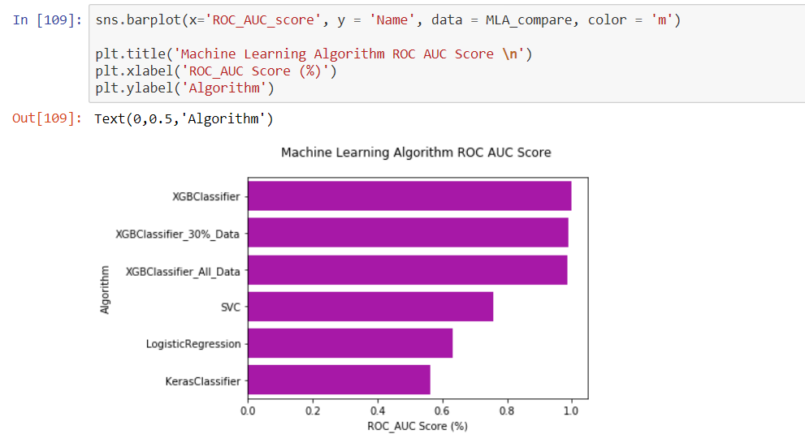

# Scikit-learn {#s-scikitlearn}

---

**:mortar_board: Learning Objectives**


* Exploratory data analysis
* Pipeline to prepare data
* Full learning pipeline
* Fine tune the model
* Significance tests

---

## Introduction to Scikit-learn

Scikit learn is a Machine Learning specific library used in Python. Library can be used for data mining and analysis. It is built on top of NumPy, matplotlib and SciPy. Scikit Learn features Dimensionality reduction, clustering, regression and classification algorithms. 
It also features model selection using grid search, cross validation and metrics. 

Scikit learn also enables users to preprocess the data which can then be used for machine learning using modules like preprocessing and feature extraction.

In this section we demonstrate how simple it is to use k-means in
scikit learn.

## Installation

If you already have a working installation of numpy and scipy, the
easiest way to install scikit-learn is using pip

```python
$ pip install numpy
$ pip install scipy -U
$ pip install -U scikit-learn
```

## Supervised Learning

Supervised Learning is used in machine learning when we already know a set of output predictions based on input characteristics and based on that we need to predict the target for a new input. Training data is used to train the model which then can be used to predict the output from a bounded set.

Problems can be of two types

1. Classification : Training data belongs to three or four classes/categories and based on the label we want to predict 
   the  class/category for the unlabeled data.
2. Regression : Training data consists of vectors without any corresponding target values. Clustering can be used for 
   these  type of datasets to determine discover groups of similar examples. Another way is density 
   estimation  which determine the distribution of data within the input space. Histogram is the most basic form.

## Unsupervised Learning

Unsupervised Learning is used in machine learning when we have the training set available but without any corresponding target. The outcome of the problem is to discover groups within the provided input. It can be done in many ways.

Few of them are listed here

1. Clustering : Discover groups of similar characteristics.
2. Density Estimation : Finding the distribution of data within the provided input or changing the data from a high 
   dimensional  space to two or three dimension.

## Building a end to end pipeline for Supervised machine learning using Scikit-learn 

A data pipeline is a set of processing components that are sequenced to produce
meaningful data. Pipelines are commonly used in Machine learning, since there is
lot of data transformation and manipulation that needs to be applied to make
data useful for machine learning. All components are sequenced in a way that the
output of one component becomes input for the next and each of the component is
self contained. Components interact with each other using data.

Even if a component breaks, the downstream component can run normally using the
last output. Sklearn provide the ability to build pipelines that can be
transformed and modeled for machine learning.

## Steps for developing a machine learning model

1. Explore the domain space
2. Extract the problem definition
3. Get the data that can be used to make the system learn to solve the problem
   definition.
4. Discover and Visualize the data to gain insights
5. Feature engineering and prepare the data 
6. Fine tune your model
7. Evaluate your solution using metrics
8. Once proven launch and maintain the model.

## Exploratory Data Analysis

Example project  = Fraud detection system

First step is to load the data into a dataframe in order for a proper analysis
to be done on the attributes.

```python
data = pd.read_csv('dataset/data_file.csv')
data.head()
```

Perform the basic analysis on the data shape and null value information.

```python
print(data.shape)
print(data.info())
data.isnull().values.any()
```

Here is the example of few of the visual data analysis methods.

### Bar plot 

A bar chart or graph is a graph with rectangular bars or bins that are used to plot 
categorical values. Each bar in the graph represents a categorical variable and the 
height of the bar is proportional to the value represented by it.

Bar graphs are used:

To make comparisons between variables
To visualize any trend in the data, i.e., they show the dependence of one variable on another
Estimate values of a variable

```python
plt.ylabel('Transactions')
plt.xlabel('Type')
data.type.value_counts().plot.bar()
```

{#fig:scikit-learn-barplot}

### Correlation between attributes

Attributes in a dataset can be related based on differnt aspects.

Examples include attributes dependent on another or could be loosely or tightly coupled. Also example includes two variables can be associated with a third one.

In order to understand the relationship between attributes, correlation represents the best visual way to get an insight. Positive correlation meaning both attributes moving into the same direction. Negative correlation refers to opposte directions. One attributes values increase results in value decrease for other. Zero correlation is when the attributes are unrelated.

```python
# compute the correlation matrix
corr = data.corr()

# generate a mask for the lower triangle
mask = np.zeros_like(corr, dtype=np.bool)
mask[np.triu_indices_from(mask)] = True

# set up the matplotlib figure
f, ax = plt.subplots(figsize=(18, 18))

# generate a custom diverging color map
cmap = sns.diverging_palette(220, 10, as_cmap=True)

# draw the heatmap with the mask and correct aspect ratio
sns.heatmap(corr, mask=mask, cmap=cmap, vmax=.3,
            square=True, 
            linewidths=.5, cbar_kws={"shrink": .5}, ax=ax);
```

{#fig:scikit-learn-correlationanalysis}

### Histogram Analysis of dataset attributes

A histogram consists of a set of counts that represent the number of times some event occurred.

```python
%matplotlib inline
data.hist(bins=30, figsize=(20,15))
plt.show()
```

{#fig:scikit-learn-histograms}

### Box plot Analysis

Box plot analysis is useful in detecting whether a distribution is skewed and detect outliers in the data.

```python
fig, axs = plt.subplots(2, 2, figsize=(10, 10))
tmp = data.loc[(data.type == 'TRANSFER'), :]

a = sns.boxplot(x = 'isFlaggedFraud', y = 'amount', data = tmp, ax=axs[0][0])
axs[0][0].set_yscale('log')
b = sns.boxplot(x = 'isFlaggedFraud', y = 'oldbalanceDest', data = tmp, ax=axs[0][1])
axs[0][1].set(ylim=(0, 0.5e8))
c = sns.boxplot(x = 'isFlaggedFraud', y = 'oldbalanceOrg', data=tmp, ax=axs[1][0])
axs[1][0].set(ylim=(0, 3e7))
d = sns.regplot(x = 'oldbalanceOrg', y = 'amount', data=tmp.loc[(tmp.isFlaggedFraud ==1), :], ax=axs[1][1])
plt.show()
```

{#fig:scikit-learn-boxplot}

### Scatter plot Analysis

The scatter plot displays values of two numerical variables as Cartesian coordinates.

```python
plt.figure(figsize=(12,8))
sns.pairplot(data[['amount', 'oldbalanceOrg', 'oldbalanceDest', 'isFraud']], hue='isFraud')
```

{#fig:scikit-learn-scatterplot}

## Data Cleansing - Removing Outliers

If the transaction amount is lower than 5 percent of the all the transactions
AND does not exceed USD 3000, we will exclude it from our analysis to reduce
Type 1 costs If the transaction amount is higher than 95 percent of all the
transactions AND exceeds USD 500000, we will exclude it from our analysis, and
use a blanket review process for such transactions (similar to isFlaggedFraud
column in original dataset) to reduce Type 2 costs

```python
low_exclude = np.round(np.minimum(fin_samp_data.amount.quantile(0.05), 3000), 2)
high_exclude = np.round(np.maximum(fin_samp_data.amount.quantile(0.95), 500000), 2)

###Updating Data to exclude records prone to Type 1 and Type 2 costs
low_data = fin_samp_data[fin_samp_data.amount > low_exclude]
data = low_data[low_data.amount < high_exclude]
```

## Pipeline Creation

 Machine learning pipeline is used to help automate machine learning workflows. They operate by enabling a sequence of data to be transformed and correlated together in a model that can be tested and evaluated to achieve an outcome, whether positive or negative.

### Defining DataFrameSelector to separate Numerical and Categorical attributes

Sample function to seperate out Numerical and categorical attributes.

```python
from sklearn.base import BaseEstimator, TransformerMixin

# Create a class to select numerical or categorical columns 
# since Scikit-Learn doesn't handle DataFrames yet
class DataFrameSelector(BaseEstimator, TransformerMixin):
    def __init__(self, attribute_names):
        self.attribute_names = attribute_names
    def fit(self, X, y=None):
        return self
    def transform(self, X):
        return X[self.attribute_names].values
```

### Feature Creation / Additional Feature Engineering


During EDA we identified that there are transactions where the balances do not 
tally after the transaction is completed.We believe this could potentially be 
cases where fraud is occurring. To account for this error in the transactions, 
we define two new features"errorBalanceOrig" and "errorBalanceDest", calculated 
by adjusting the amount with the before and after balances for the Originator 
and Destination accounts.


Below, we create a function that allows us to create these features in a
pipeline.

```python
from sklearn.base import BaseEstimator, TransformerMixin

# column index
amount_ix, oldbalanceOrg_ix, newbalanceOrig_ix, oldbalanceDest_ix, newbalanceDest_ix = 0, 1, 2, 3, 4 

class CombinedAttributesAdder(BaseEstimator, TransformerMixin):
    def __init__(self): # no *args or **kargs
        pass
    def fit(self, X, y=None):
        return self  # nothing else to do
    def transform(self, X, y=None):
        errorBalanceOrig = X[:,newbalanceOrig_ix] +  X[:,amount_ix] -  X[:,oldbalanceOrg_ix]
        errorBalanceDest = X[:,oldbalanceDest_ix] +  X[:,amount_ix]-  X[:,newbalanceDest_ix] 
        
        return np.c_[X, errorBalanceOrig, errorBalanceDest]
```

## Creating Training and Testing datasets

Training set includes the set of input examples that the model will be fit into or trained on by adjusting the parameters.
Testing dataset is critical to test the generalizability of the model . By using this set, we can get the working accuracy of our model.

Testing set should not be exposed to model unless model training has not been completed. This way the results from testing will be more reliable.

```python
from sklearn.model_selection import train_test_split
X_train, X_test, y_train, y_test = train_test_split(X,y,test_size=0.30, random_state=42, stratify=y)
```

## Creating pipeline for numerical and categorical attributes

Identifying columns with Numerical and Categorical characteristics.

```python
X_train_num = X_train[["amount","oldbalanceOrg", "newbalanceOrig", "oldbalanceDest", "newbalanceDest"]]
X_train_cat = X_train[["type"]]
X_model_col = ["amount","oldbalanceOrg", "newbalanceOrig", "oldbalanceDest", "newbalanceDest","type"]
```

```python
from sklearn.pipeline import Pipeline
from sklearn.preprocessing import StandardScaler
from sklearn.preprocessing import Imputer

num_attribs = list(X_train_num)
cat_attribs = list(X_train_cat)

num_pipeline = Pipeline([
        ('selector', DataFrameSelector(num_attribs)),        
        ('attribs_adder', CombinedAttributesAdder()),       
        ('std_scaler', StandardScaler())
    ])

cat_pipeline = Pipeline([
        ('selector', DataFrameSelector(cat_attribs)),
        ('cat_encoder', CategoricalEncoder(encoding="onehot-dense"))            
    ])

```

## Selecting the algorithm to be applied

Algorithim selection primarily depends on the objective you are trying to solve and what kind of dataset is available. There are differnt type of algorithms which can be applied and we will look into few of them here.

### Linear Regression

This algorithm can be applied when you want to compute some continuous value. To predict some future value of a process which is currently running, you can go with regression algorithm.

Examples where linear regression can used are :

1. Predict the time taken to go from one place to another
2. Predict the sales for a future month
3. Predict sales data and improve yearly projections.

### Logistic Regression

This algorithm can be used to perform binary classification. It can be used if you want a probabilistic framework.
Also in case you expect to receive more training data in the future that you want to be able to quickly incorporate into your model.

1. Customer churn prediction.
2. Credit Scoring & Fraud Detection which is our example problem which we are trying to solve in this chapter.
3. Calculating the effectiveness of marketing campaigns.

### Decision trees

Decision trees handle feature interactions and they’re non-parametric. Doesnt support online learning and the entire tree needs to be rebuild when new traning dataset comes in. Memory consumption is very high.

Can be used for the following cases

1. Investment decisions
2. Customer churn
3. Banks loan defaulters
4. Build vs Buy decisions
5. Sales lead qualifications

### K Means

This algorithm is used when we are not aware of the labels and one needs to be created based on the features of objects. Example will be to divide a group of people into differnt subgroups based on common theme or attribute. 

The main disadvantage of K-mean is that you need to know exactly the number of clusters or groups which is required. It takes a lot of iteration to come up with the best K.

### Support Vector Machines

SVM is a supervised ML technique and used for pattern recognition and classification problems when your data has exactly two classes.
Its popular in text classification problems.

Few cases where SVM can be used is

1. Detecting persons with common diseases.
2. Hand-written character recognition
3. Text categorization
4. Stock market price prediction

### Naive Bayes

Naive Bayes is used for large datasets.This algoritm works well even when we have a limited CPU and memory available. This works by calculating bunch of counts. It requires less training data. The algorthim cant learn interation between features.

Naive Bayes can be used in real-world applications such as:

1. Sentiment analysis and text classification
2. Recommendation systems like Netflix, Amazon
3. To mark an email as spam or not spam
4. Face recognition

### Random Forest

Ranmdon forest is similar to Decision tree. Can be used for both regression and classification problems with large data sets.

Few case where it can be applied.

1. Predict patients for high risks.
2. Predict parts failures in manufacturing.
3. Predict loan defaulters.

### Neural networks

Neural network works based on weights of connections between neurons.  Weights are trained and based on that the neural network can be utilized to predict the class or a quantity. They are resource and memory intensive. 

Few cases where it can be applied.

1. Applied to unsupervised learning tasks, such as feature extraction. 
2. Extracts features from raw images or speech with much less human intervention

### Deep Learning using Keras

Keras is most powerful and easy-to-use Python libraries for developing and evaluating deep learning models. It has the efficient numerical computation libraries Theano and TensorFlow.

### XGBoost

XGBoost stands for eXtreme Gradient Boosting.
XGBoost is an implementation of gradient boosted decision trees designed for speed and performance. It is engineered for efficiency of compute time and memory resources.

## Scikit Cheat Sheet

Scikit learning has put a very indepth and well explained flow chart to help you choose the right algorithm that I find very handy.

{#fig:scikit-learn-cheatsheet}

## Parameter Optimization

 Machine learning models are parameterized so that their behavior can be tuned for a given problem. These models can have many parameters and finding the best combination of parameters can be treated as a search problem.

A parameter is a configurationthat is part of the model and values can be derived from the given data.

1. Required by the model when making predictions.
2. Values define the skill of the model on your problem.
3. Estimated or learned from data.
4. Often not set manually by the practitioner.
5. Often saved as part of the learned model.

### Hyperparameter optimization/tuning algorithms

Grid search is an approach to hyperparameter tuning that will methodically build and evaluate a model for each combination of algorithm parameters specified in a grid.

Random search provide a statistical distribution for each hyperparameter from which values may be randomly sampled.


## Experiments with Keras (deep learning), XGBoost, and SVM (SVC) compared to Logistic Regression(Baseline)

### Creating a parameter grid

```python
grid_param = [
                [{   #LogisticRegression
                   'model__penalty':['l1','l2'], 
                   'model__C': [0.01, 1.0, 100]
                }],
       
                [{#keras
                    'model__optimizer': optimizer,
                    'model__loss': loss
                }],
    
                [{  #SVM
                   'model__C' :[0.01, 1.0, 100],
                   'model__gamma': [0.5, 1],
                   'model__max_iter':[-1]
                }],
            
                [{   #XGBClassifier 
                    'model__min_child_weight': [1, 3, 5],
                    'model__gamma': [0.5],
                    'model__subsample': [0.6, 0.8],
                    'model__colsample_bytree': [0.6],
                    'model__max_depth': [3]
                
                }]
            ]
```


### Implementing Grid search with models and also creating metrics from each of the model.
=======
```python
Pipeline(memory=None,
     steps=[('preparation', FeatureUnion(n_jobs=None,
       transformer_list=[('num_pipeline', Pipeline(memory=None,
     steps=[('selector', DataFrameSelector(attribute_names=['amount', 'oldbalanceOrg', 'newbalanceOrig', 'oldbalanceDest', 'newbalanceDest'])), ('attribs_adder', CombinedAttributesAdder()...penalty='l2', random_state=None, solver='warn',
          tol=0.0001, verbose=0, warm_start=False))])
```


```python

from sklearn.metrics import mean_squared_error
from sklearn.metrics import classification_report
from sklearn.metrics import f1_score
from xgboost.sklearn import XGBClassifier
from sklearn.svm import SVC

test_scores = []
#Machine Learning Algorithm (MLA) Selection and Initialization
MLA = [
        linear_model.LogisticRegression(),
        keras_model,
        SVC(),
        XGBClassifier()
        
      ]

#create table to compare MLA metrics
MLA_columns = ['Name', 'Score', 'Accuracy_Score','ROC_AUC_score','final_rmse','Classification_error','Recall_Score','Precision_Score', 'mean_test_score', 'mean_fit_time', 'F1_Score']
MLA_compare = pd.DataFrame(columns = MLA_columns)
Model_Scores = pd.DataFrame(columns = ['Name','Score'])

row_index = 0
for alg in MLA:

    #set name and parameters
    MLA_name = alg.__class__.__name__
    MLA_compare.loc[row_index, 'Name'] = MLA_name
    #MLA_compare.loc[row_index, 'Parameters'] = str(alg.get_params())
    
  
    full_pipeline_with_predictor = Pipeline([
        ("preparation", full_pipeline),  # combination of numerical and categorical pipelines
        ("model", alg)  
    ])
    
    grid_search = GridSearchCV(full_pipeline_with_predictor, grid_param[row_index], cv=4, verbose=2, scoring='f1', return_train_score=True)
       
    grid_search.fit(X_train[X_model_col], y_train)
    y_pred = grid_search.predict(X_test)
     
    MLA_compare.loc[row_index, 'Accuracy_Score'] = np.round(accuracy_score(y_pred, y_test), 3)
    MLA_compare.loc[row_index, 'ROC_AUC_score'] = np.round(metrics.roc_auc_score(y_test, y_pred),3)
    MLA_compare.loc[row_index,'Score'] = np.round(grid_search.score(X_test, y_test),3)
    
    negative_mse = grid_search.best_score_ 
    scores = np.sqrt(-negative_mse)
    final_mse = mean_squared_error(y_test, y_pred)
    final_rmse = np.sqrt(final_mse)    
    MLA_compare.loc[row_index, 'final_rmse'] = final_rmse
    
    confusion_matrix_var = confusion_matrix(y_test, y_pred)
    TP = confusion_matrix_var[1, 1]
    TN = confusion_matrix_var[0, 0]
    FP = confusion_matrix_var[0, 1]
    FN = confusion_matrix_var[1, 0]
    MLA_compare.loc[row_index,'Classification_error'] = np.round(((FP + FN) / float(TP + TN + FP + FN)), 5)
    MLA_compare.loc[row_index,'Recall_Score'] = np.round(metrics.recall_score(y_test, y_pred), 5)
    MLA_compare.loc[row_index,'Precision_Score'] = np.round(metrics.precision_score(y_test, y_pred), 5)
    MLA_compare.loc[row_index,'F1_Score'] = np.round(f1_score(y_test,y_pred), 5)
   
    
    MLA_compare.loc[row_index, 'mean_test_score'] = grid_search.cv_results_['mean_test_score'].mean()
    MLA_compare.loc[row_index, 'mean_fit_time'] = grid_search.cv_results_['mean_fit_time'].mean()
    
    Model_Scores.loc[row_index,'MLA Name'] = MLA_name    
    Model_Scores.loc[row_index,'ML Score'] = np.round(metrics.roc_auc_score(y_test, y_pred),3)
    
    #Collect Mean Test scores for statistical significance test
    test_scores.append(grid_search.cv_results_['mean_test_score'])
    row_index+=1
```

### Results table from the Model evaluation with metrics.

{#fig:scikit-learn-results}

### ROC AUC Score

AUC - ROC curve is a performance measurement for classification problem at various thresholds settings. ROC is a probability curve and AUC represents degree or measure of separability. It tells how much model is capable of distinguishing between classes. Higher the AUC, better the model is at predicting 0s as 0s and 1s as 1s. 

{#fig:scikit-learn-rocauccurve}

{#fig:scikit-learn-rocauc}


## K-means in scikit learn.

### Import


## K-means Algorithm

In this section we demonstrate how simple it is to use k-means in scikit learn.

### Import

```python

    from time import time
    import numpy as np
    import matplotlib.pyplot as plt
    from sklearn import metrics
    from sklearn.cluster import KMeans
    from sklearn.datasets import load_digits
    from sklearn.decomposition import PCA
    from sklearn.preprocessing import scale
```

### Create samples

```python
    np.random.seed(42)
    
    digits = load_digits()
    data = scale(digits.data)
```

### Create samples

```python
    np.random.seed(42)

    digits = load_digits()
    data = scale(digits.data)

    n_samples, n_features = data.shape
    n_digits = len(np.unique(digits.target))
    labels = digits.target

    sample_size = 300

    print("n_digits: %d, \t n_samples %d, \t n_features %d" % (n_digits, n_samples, n_features))
    print(79 * '_')
    print('% 9s' % 'init' '    time  inertia    homo   compl  v-meas     ARI AMI  silhouette')
    print("n_digits: %d, \t n_samples %d, \t n_features %d"
          % (n_digits, n_samples, n_features))


    print(79 * '_')
    print('% 9s' % 'init'
          '    time  inertia    homo   compl  v-meas     ARI AMI  silhouette')


    def bench_k_means(estimator, name, data):
        t0 = time()
        estimator.fit(data)
        print('% 9s   %.2fs    %i   %.3f   %.3f   %.3f   %.3f   %.3f    %.3f'
              % (name, (time() - t0), estimator.inertia_,
                 metrics.homogeneity_score(labels, estimator.labels_),
                 metrics.completeness_score(labels, estimator.labels_),
                 metrics.v_measure_score(labels, estimator.labels_),
                 metrics.adjusted_rand_score(labels, estimator.labels_),
                 metrics.adjusted_mutual_info_score(labels,  estimator.labels_),

                 metrics.silhouette_score(data, estimator.labels_,metric='euclidean',sample_size=sample_size)))

    bench_k_means(KMeans(init='k-means++', n_clusters=n_digits, n_init=10), name="k-means++", data=data)

    bench_k_means(KMeans(init='random', n_clusters=n_digits, n_init=10), name="random", data=data)

                 metrics.silhouette_score(data, estimator.labels_,
                                          metric='euclidean',
                                          sample_size=sample_size)))

    bench_k_means(KMeans(init='k-means++', n_clusters=n_digits, n_init=10),
                  name="k-means++", data=data)

    bench_k_means(KMeans(init='random', n_clusters=n_digits, n_init=10),
                  name="random", data=data)


    # in this case the seeding of the centers is deterministic, hence we run the
    # kmeans algorithm only once with n_init=1
    pca = PCA(n_components=n_digits).fit(data)

    bench_k_means(KMeans(init=pca.components_,n_clusters=n_digits, n_init=1),name="PCA-based", data=data)
    print(79 * '_')
```

### Visualize

See @fig:scikit-learn-k-means_10_0

```python
    bench_k_means(KMeans(init=pca.components_,
                         n_clusters=n_digits, n_init=1),
                  name="PCA-based",
                  data=data)
    print(79 * '_')
```


### Visualize

See @fig:scikit-learn-k-means_10_0

```python
    reduced_data = PCA(n_components=2).fit_transform(data)
    kmeans = KMeans(init='k-means++', n_clusters=n_digits, n_init=10)
    kmeans.fit(reduced_data)

    # Step size of the mesh. Decrease to increase the quality of the VQ.
    h = .02     # point in the mesh [x_min, x_max]x[y_min, y_max].

    # Plot the decision boundary. For that, we will assign a color to each
    x_min, x_max = reduced_data[:, 0].min() - 1, reduced_data[:, 0].max() + 1
    y_min, y_max = reduced_data[:, 1].min() - 1, reduced_data[:, 1].max() + 1
    xx, yy = np.meshgrid(np.arange(x_min, x_max, h), np.arange(y_min, y_max, h))

    # Obtain labels for each point in mesh. Use last trained model.
    Z = kmeans.predict(np.c_[xx.ravel(), yy.ravel()])

    # Put the result into a color plot
    Z = Z.reshape(xx.shape)
    plt.figure(1)
    plt.clf()
    plt.imshow(Z, interpolation='nearest',
               extent=(xx.min(), xx.max(), yy.min(), yy.max()),
               cmap=plt.cm.Paired,
               aspect='auto', origin='lower')

    plt.plot(reduced_data[:, 0], reduced_data[:, 1], 'k.', markersize=2)
    # Plot the centroids as a white X
    centroids = kmeans.cluster_centers_
    plt.scatter(centroids[:, 0], centroids[:, 1],
                marker='x', s=169, linewidths=3,
                color='w', zorder=10)
    plt.title('K-means clustering on the digits dataset (PCA-reduced data)\n'
              'Centroids are marked with white cross')
    plt.xlim(x_min, x_max)
    plt.ylim(y_min, y_max)
    plt.xticks(())
    plt.yticks(())
    plt.show()
```


{#fig:scikit-learn-k-means_10_0}
